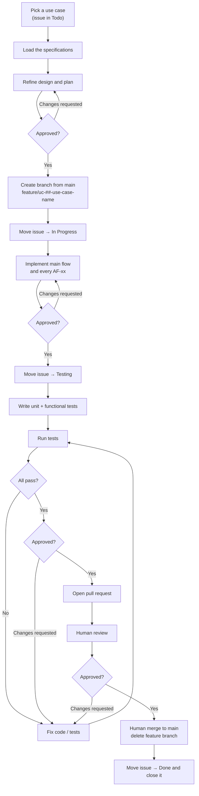

# Development Workflow Document — Fortuna API

## 1. Purpose

This document defines **how a use case moves from backlog to merged** — the branch, the issue status
transitions, the testing gate, and the pull request. It is the standard every contributor, human or
agent, follows so that each use case (UC-01 … UC-74 in the
[Use Case Specification Document](Use%20Case%20Specification%20Document.md), plus UC-75 in the
[Operations & Infrastructure Document](Operations%20%26%20Infrastructure%20Document.md)) is
delivered the same way.

It complements the [Testing Specification Document](Testing%20Specification%20Document.md), which
defines *how* the tests themselves are written; this document defines *when* they happen in the
delivery flow. Its operational counterpart, written for the implementer to follow step by step, is
[`initial/Workflow.md`](../initial/Workflow.md) — the two agree, and where they could ever disagree,
that document is the one that was approved and this one is corrected to match it.

The process is the same one the [Heimdall API](https://github.com/artur-rios/heimdall-api) uses.
That is deliberate: one delivery process across both repositories means a contributor learns it once.

> **One use case = one branch = one issue = one pull request.**

## 2. Workflow at a glance



> The diagram shows the default flow, where a human reviews and merges. In an authorized batch run
> the agent merges its own pull request instead — every other step, including the testing gate, is
> identical. See [Step 7.1](#step-71--authorized-batch-runs).

## 3. Issue status lifecycle

Each use case is tracked by its GitHub issue on the project board. The `Status` field moves through
these columns, in order:

| Order | Status | Set when |
| --- | --- | --- |
| 1 | **Todo** | The use case has not been started (default). |
| 2 | **In Progress** | A feature branch has been created and implementation has begun. |
| 3 | **Testing** | Implementation is finished; unit and functional tests are being written, run, and fixed until green. |
| 4 | **Done** | The pull request has been reviewed and merged to `main`; the issue is then **closed**. |

An issue only ever moves **forward** during normal flow. If review requests changes, work continues
on the same branch — still linked to the same issue — until the suite is green again and the pull
request is re-reviewed.

`Todo → In Progress` is the **only** transition an agent performs without asking. Every other one
follows an explicit approval.

## 4. Step-by-step

### Step 0 — Load the specifications and refine the plan

Before any code, read the specifics for this use case rather than working from memory: its entry in
the [Use Case Specification Document](Use%20Case%20Specification%20Document.md) with every `AF-xx`;
the `FR-<AREA>-xx` requirements traced to it in the
[System Requirements Document](System%20Requirements%20Document.md), plus the data model,
endpoint surface and authorization matrix; and the patterns and libraries in the
[Technology Stack Document](Technology%20Stack%20Document.md).

Then produce a design for this codebase — which commands, queries, handlers, validators, entity maps
and controllers are needed, and how each alternative flow maps to a failure response — and a
written, test-first implementation plan.

**This is the first approval gate.** The plan is reviewed before the branch exists.

### Step 1 — Branch from `main`

Every use case is implemented on its own branch, created from an up-to-date `main`:

```bash
git switch main
git pull
git switch -c feature/uc-30-record-a-transaction
```

**Branch naming pattern:**

```
feature/uc-##-use-case-name
```

- `##` — the zero-padded use case number (`01` … `75`).
- `use-case-name` — the use case name in lower-case kebab-case.

| Use case | Branch |
| --- | --- |
| UC-11: Create a Financial Account | `feature/uc-11-create-a-financial-account` |
| UC-30: Record a Transaction | `feature/uc-30-record-a-transaction` |
| UC-60: Import a Nubank Credit Card Invoice PDF | `feature/uc-60-import-a-nubank-credit-card-invoice-pdf` |

### Step 2 — Move the issue to **In Progress**

As soon as the branch exists and work starts, set the issue `Status` to **In Progress**. This is the
one status change made without asking.

### Step 3 — Implement

Implement the use case per its specification — the main flow **and every alternative flow** — and the
project's architecture and technology stack. All commits for the use case go on its feature branch.

**This is the second approval gate.** When the implementation is code-complete, stop and present what
was built before advancing.

### Step 4 — Move the issue to **Testing**

Once the implementation is approved, set the issue `Status` to **Testing**. This signals that the
feature is code-complete and the testing gate is now in progress.

### Step 5 — Test until green

Following the [Testing Specification Document](Testing%20Specification%20Document.md):

1. Write the **unit tests** for every command and query handler, every validator, and any domain
   behavior the use case added — main flow plus each applicable `AF-xx`.
2. Write the **functional tests** for each endpoint the use case exposes — main flow plus every
   `AF-xx`, including the authorization and cross-user isolation flows — end to end against a
   Testcontainers PostgreSQL instance.
3. **Run the tests:**

   ```bash
   dotnet test
   ```

   or one category at a time with `dotnet test --filter "Category=Unit"` and
   `dotnet test --filter "Category=Functional"`.
4. **Fix** any failure, in the implementation or in the test.
5. **Re-run**, and repeat steps 3–4 **until every test passes**.

A use case does not leave the Testing stage until the full suite is green and the coverage floor
holds.

**This is the third approval gate.** Report the passing results and stop before opening a pull
request.

### Step 6 — Open a pull request

With all tests passing and the gate cleared, push the branch and open a pull request from
`feature/uc-##-…` into `main`. The description references the use case and its issue — e.g.
`Closes #<issue-number>` — so the merge closes it.

### Step 7 — Human review and merge

- The pull request is **reviewed by a human**. Requested changes are addressed on the same branch,
  returning to Step 5 whenever code changes so the suite stays green.
- Once approved, a human **merges the pull request into `main`**.
- The **feature branch is deleted** after the merge.

> Review and merge are **human actions**. An agent may prepare and push the pull request, but must
> not self-approve or merge it. The single exception is an authorized batch run.

### Step 7.1 — Authorized batch runs

When several use cases are delivered in one unattended run, the approval gates would stop the run at
every use case, which defeats the point of batching them. For a **batch run only**, an agent may
merge its own pull requests, subject to all of the following:

- **The batch was authorized up front.** A human agreed to the specific use cases, in order, and was
  told explicitly that the agent would merge, close the issues and delete the branches. A general
  instruction to work autonomously is not this authorization.
- **The invariant still holds.** One use case = one branch = one issue = one pull request. Use cases
  are never batched into a shared branch or a shared pull request, so the run stays reviewable after
  the fact.
- **The testing gate is unchanged.** The full suite is run and read for every use case, per Step 5.
  A merge on an unread or failing suite is never permitted.
- **No protection is bypassed.** No administrative override merge, no self-approval to satisfy a
  required review, no force-push, and no disabling or filtering of a test to make the suite green.
- **A failure stops the whole run.** A red suite, a merge conflict, an ambiguous specification, or a
  requirement that does not exist ends the batch. Already-merged use cases stay merged; the failing
  branch and its pull request are left in place as evidence.

Outside an authorized batch run, Step 7 applies as written: a human reviews and a human merges.

### Step 8 — Close the issue

After the merge, set the issue `Status` to **Done** and **close** it. If the pull request used a
`Closes #<issue-number>` reference the merge closes it automatically — still confirm the board shows
it in **Done**.

## 5. Definition of Done

A use case is done only when **all** of the following hold:

- [ ] Implemented on a `feature/uc-##-use-case-name` branch created from `main`.
- [ ] Main flow and every alternative flow from the use case specification are implemented.
- [ ] Unit tests cover each handler, each validator and any new domain behavior — main plus each
      applicable `AF-xx`.
- [ ] Functional tests cover each endpoint — main plus every `AF-xx`, including the authorization
      and cross-user isolation flows.
- [ ] The full test suite passes (`Category=Unit` and `Category=Functional`), and merged line
      coverage holds at or above the floor.
- [ ] A pull request was merged to `main` — reviewed by a human, or merged by an agent under an
      authorized batch run (Step 7.1).
- [ ] The feature branch was deleted.
- [ ] The issue is in **Done** and closed.

## 6. References

- [`initial/Workflow.md`](../initial/Workflow.md) — the operational form of this process, written for
  the implementer. Authoritative where the two could differ.
- [Use Case Specification Document](Use%20Case%20Specification%20Document.md) — the use cases and
  their flows.
- [Testing Specification Document](Testing%20Specification%20Document.md) — how the tests are written.
- [System Requirements Document](System%20Requirements%20Document.md) — functional and
  non-functional requirements.
- [Technology Stack Document](Technology%20Stack%20Document.md) — technologies and versions used.
- [Operations & Infrastructure Document](Operations%20%26%20Infrastructure%20Document.md) — the
  platform requirements the foundation work is measured against.
