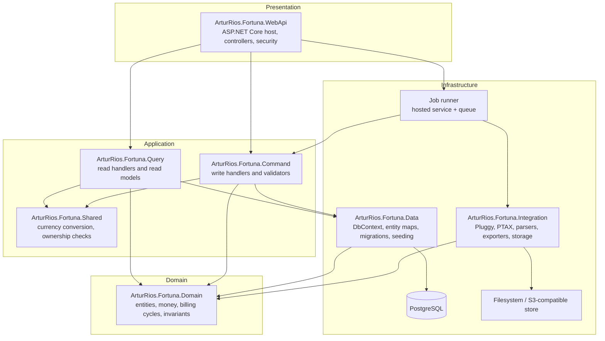
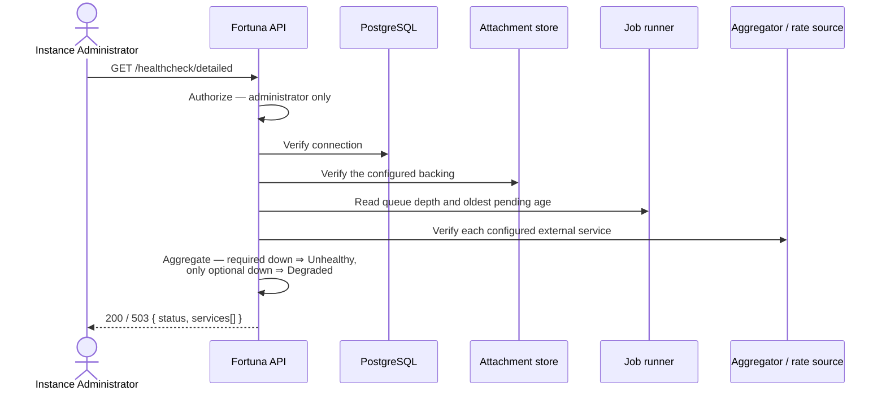

# Operations & Infrastructure Document — Fortuna API

## 1. Introduction

### 1.1 Purpose

This document captures **cross-cutting platform concerns** for the **Fortuna API** that fall outside
the financial domain modeled in the [Vision Document](Vision%20Document.md),
[System Requirements Document](System%20Requirements%20Document.md), and
[Use Case Specification Document](Use%20Case%20Specification%20Document.md).

These are functional capabilities of the *platform* rather than of the domain, so they are documented
here to keep the domain documents focused while still tracking the work formally. The specific
technologies and versions this platform is built on are defined once in the
[Technology Stack Document](Technology%20Stack%20Document.md) and referenced from here rather than
duplicated.

Platform requirements carry their own identifier space, **`IR-xx`**, so they never collide with the
domain's `FR-<AREA>-xx`. The health check is the one platform capability with a user-facing surface,
so it carries `FR-HC-xx` requirements and **UC-75**, continuing the numbering of the Use Case
Specification Document rather than restarting.

### 1.2 Scope

- The **technical foundation** — solution layout, layering, package management, the data layer and
  its migrations, seeding, and the job runner every asynchronous operation depends on.
- The **extension points** — the ingestion source registry and the attachment storage abstraction.
- **Configuration** — how every setting reaches the process, and which of them are secrets.
- **Logging and monitoring** — what is recorded, and what is deliberately never recorded.
- **Health endpoints** — liveness and a detailed dependency check.
- **Environments** — the three this project must run on, and what differs between them.
- **Build and delivery** — the container image, the compose deployment, and continuous integration.

---

## 2. Technical Foundation

### 2.1 Overview

The solution is a **layered, DDD-style .NET Web API** using a CQRS split in the application layer,
structured exactly as the [Heimdall API](https://github.com/artur-rios/heimdall-api) is, with one
addition: a dedicated `Integration` project under `Infrastructure`. Fortuna's external surface —
an open-banking aggregator, an exchange rate service, statement parsers, export renderers and two
attachment stores — is substantial enough that folding it into the data project would bury the
persistence code. Everything else follows Heimdall's shape.

The foundational scaffolding establishes the project structure, the Entity Framework Core data layer
with its initial migration, startup seeding, the background job runner, the two extension points,
and the test harness that every use case is then built on.

### 2.2 Solution Architecture



The dependency that is deliberately absent: **`Integration` does not reference `Data`**. A parser or
an aggregator client produces domain-shaped results and hands them to a command handler, which is
what persists them. Keeping the arrow out is what stops a statement parser from growing the ability
to write a row.

### 2.3 Repository Layout

```
fortuna-api/
├── .github/workflows/            tests.yml, check-openapi.yml
├── docker/                       local.env.example, development.env.example, production.env.example
├── docs/
│   ├── initial/                  Brainstorm, Project Overview, Technology Stack, Workflow, Business Rules
│   └── requirements/             this document and the six beside it
├── scripts/                      coverage.py, migrations.py, vulnerabilities.py, openapi.py
├── src/
│   ├── ArturRios.Fortuna.sln
│   ├── Domain/ArturRios.Fortuna.Domain/
│   ├── Application/
│   │   ├── ArturRios.Fortuna.Command/
│   │   ├── ArturRios.Fortuna.Query/
│   │   └── ArturRios.Fortuna.Shared/
│   ├── Infrastructure/
│   │   ├── ArturRios.Fortuna.Data/
│   │   └── ArturRios.Fortuna.Integration/
│   └── Presentation/ArturRios.Fortuna.WebApi/
├── tests/                        mirrors src/, plus Fixtures/
├── Directory.Packages.props
├── Dockerfile
├── docker-compose.yml
├── LICENSE
└── README.md
```

### 2.4 Platform Requirements

| ID | Requirement |
| --- | --- |
| IR-01 | The solution shall be organized into `Domain`, `Application` (`Command` / `Query` / `Shared`), `Infrastructure` (`Data` / `Integration`), and `Presentation` (`WebApi`) layers, with `Integration` holding no reference to `Data` |
| IR-02 | Package versions shall be managed centrally in `Directory.Packages.props`, with transitive pinning enabled, so every project in the build resolves one version of each dependency |
| IR-03 | The data layer shall use Entity Framework Core code-first, with a design-time factory and an initial migration, the `Data` project acting as its own startup project |
| IR-04 | Database tables and columns shall use `snake_case`, singular naming, and EF sensitive-data logging and detailed errors shall be enabled only outside Production |
| IR-05 | The schema shall be `fortuna`, and the connection's `Search Path` shall be pinned to it so the migrations history table resolves to the same schema on every run |
| IR-06 | Monetary columns shall be `numeric(19,4)` and exchange rate columns `numeric(19,8)`; no monetary or rate column shall use a floating-point type |
| IR-07 | The ISO 4217 currency reference set shall be seeded on startup, and seeding shall be idempotent |
| IR-08 | The application shall resolve its entire configuration from environment variables prefixed `FORTUNA_`, and shall refuse to start when a required setting is absent |
| IR-09 | Environment files shall be copied to the build output and shall never be baked into the container image |
| IR-10 | The application shall run a background job runner as a hosted service, backed by a bounded in-process queue and a durable job table |
| IR-11 | The job runner shall re-queue every job left `Pending` or `Running` when the process starts, and re-running a job shall import no duplicate |
| IR-12 | Ingestion sources shall be registered through one contract in a source registry, so adding a source requires no change to any existing source or consumer |
| IR-13 | Attachment storage shall be reached through one abstraction with a filesystem implementation and an S3-compatible implementation, selected by configuration |
| IR-14 | The API shall serve a Swagger/OpenAPI document, and the committed document shall be verified against the code in continuous integration |
| IR-15 | A migration helper script shall be provided under `scripts/`, and shall never print a connection string containing a password |
| IR-16 | Test projects shall mirror the `src/` layer folders one-for-one, and the functional harness shall apply migrations to a real PostgreSQL container and assert the resulting schema |
| IR-17 | Continuous integration shall, on every pull request and every commit to `main`, restore, scan for vulnerable dependencies, build, run the unit suite, run the functional suite, enforce the coverage floor, and build the container image |
| IR-18 | A single `docker-compose.yml` shall bring the instance up on Docker Desktop for Windows, on Docker in WSL Ubuntu, and on a Linux VPS, differing only in the environment file supplied |
| IR-19 | The container shall declare a health check against the liveness endpoint |
| IR-20 | The instance shall run without a Heimdall connection on the request path, and a desktop installation shall run with no network at all |

---

## 3. Configuration

Every setting is read from the environment. Nothing is read from a file baked into the image, and no
setting has a production-safe default that hides its absence — a missing required value stops the
process at startup rather than surfacing as a failure later (IR-08).

| Concern | Keys | Notes |
| --- | --- | --- |
| Runtime | `ASPNETCORE_ENVIRONMENT` | `Development` locally and in the WSL environment; `Production` on the server. Governs Swagger, the developer exception page and EF diagnostics. |
| Database | `FORTUNA_DATA_CONNECTIONSTRING`, `FORTUNA_DATA_DATABASETYPE` | Assembled in the compose file from host, port, database, credentials and a pinned `Search Path`. **Secret.** |
| Migrations | `FORTUNA_RUN_MIGRATIONS` | Whether the entrypoint applies pending migrations before starting. `false` when they are applied out of band. |
| Token validation | `FORTUNA_AUTH_TOKEN_SECRET`, `FORTUNA_AUTH_TOKEN_SECRET_PREVIOUS`, `FORTUNA_AUTH_TOKEN_ISSUER`, `FORTUNA_AUTH_TOKEN_AUDIENCE` | The signing configuration Heimdall issues with and Fortuna validates against. The `PREVIOUS` key is set during a rotation so tokens signed with the retired key keep working. **Secret.** |
| Token lifetime | `FORTUNA_AUTH_TOKEN_EXPIRATION_IN_SECONDS` | Bounds the window in which a token revoked at Heimdall is still accepted here (NFR-14). |
| User profile defaults | `FORTUNA_DEFAULT_DISPLAY_CURRENCY`, `FORTUNA_LOCALE` | The optional ISO 4217 currency is assigned to newly provisioned profiles. When it is unset, the required specific locale (for example `pt-BR`) supplies an inferred currency that the client must ask the user to confirm. |
| Local authentication | `FORTUNA_LOCAL_AUTH_ENABLED`, `FORTUNA_LOCAL_AUTH_RECOVERY_CODE_COUNT` | Desktop mode. When disabled, the local account endpoints respond `404`. Ten recovery codes are generated by default. The portable host supports `InMemory`; a host must replace the availability service when it supplies an operating-system credential-store adapter. |
| Aggregator | `FORTUNA_PLUGGY_CLIENT_ID`, `FORTUNA_PLUGGY_CLIENT_SECRET`, `FORTUNA_PLUGGY_BASE_URL` | Unset, the Pluggy source is listed as unavailable rather than failing at call time. **Secret.** |
| Exchange rates | `FORTUNA_RATES_SOURCE_BASE_URL`, `FORTUNA_RATES_SYNC_CRON`, `FORTUNA_RATES_CURRENCIES` | The PTAX service needs no key. |
| Attachment storage | `FORTUNA_STORAGE_PROVIDER`, `FORTUNA_STORAGE_PATH`, `FORTUNA_STORAGE_S3_ENDPOINT`, `FORTUNA_STORAGE_S3_BUCKET`, `FORTUNA_STORAGE_S3_ACCESS_KEY`, `FORTUNA_STORAGE_S3_SECRET_KEY` | `Filesystem` or `S3`. The S3 keys are **secret**. |
| Upload limits | `FORTUNA_UPLOAD_MAX_BYTES`, `FORTUNA_UPLOAD_ALLOWED_CONTENT_TYPES` | Enforced for attachments and for import files. |
| Export | `FORTUNA_EXPORT_SYNC_THRESHOLD_ROWS`, `FORTUNA_EXPORT_RETENTION_HOURS` | Above the threshold an export becomes a job; retention bounds how long a produced file is kept. |
| Reporting bounds | `FORTUNA_REPORT_MAX_RANGE_DAYS`, `FORTUNA_PROJECTION_MAX_HORIZON_DAYS`, `FORTUNA_PAGE_SIZE_MAX` | The limits the endpoints validate against. |
| Reconciliation | `FORTUNA_RECONCILIATION_AMOUNT_TOLERANCE`, `FORTUNA_RECONCILIATION_DATE_TOLERANCE_DAYS` | Differences beyond these non-negative amount and day tolerances are accepted but flagged. Defaults to `0.01` and `1`. |
| CORS | `FORTUNA_CORS_ALLOWED_ORIGINS` | Empty by default, which refuses every cross-origin request; a browser client does not reach the API until its origin is listed. |
| Logging | `FORTUNA_LOG_DIRECTORY`, `FORTUNA_LOG_LEVEL` | The log directory is a mounted volume in a container. |

No secret value appears in this document, in the repository, or in a log line. The `docker/*.env.example`
files carry keys with empty or placeholder values only.

---

## 4. Logging & Monitoring

| Concern | Approach |
| --- | --- |
| Format | Structured JSON, through Serilog, wired with `Host.UseSerilog()`. |
| Destination | Console, plus a rolling file in the configured log directory, which is a named volume in a container. |
| Correlation | Every request carries a correlation identifier, propagated into any job it starts, so a job's log lines can be traced back to the request that queued it. |
| Levels | `Information` for request completion, job state transitions and startup decisions; `Warning` for a degraded external dependency; `Error` for an unhandled failure. |
| Job logging | Each job logs its acceptance, its start, its per-outcome counts and its completion — never the content of a row it processed. |
| **Never logged** | A monetary amount. An account, card or investment identifier or name. A token, a signing key, an aggregator secret, an access token, a recovery code or its hash. Attachment content. The contents of an imported file. A connection string with its password. |

The exclusion list is longer than most services need, and deliberately so: a log aggregator is a
second copy of whatever reaches it, held under weaker controls than the database. A support engineer
reading a log should be able to tell **that** an import processed 412 rows and rejected 3, and
**why** those 3 were rejected in the system's own words — without learning what anybody spent.

---

## 5. Health & Monitoring Endpoints

### 5.1 Endpoints

| Endpoint | Purpose | Authorization |
| --- | --- | --- |
| `GET /healthcheck` | Liveness — the process is up and answering | **Public** |
| `GET /healthcheck/detailed` | Per-dependency status and an aggregate | **Instance Administrator only** |

### 5.2 Functional Requirements

| ID | Requirement | Priority |
| --- | --- | --- |
| FR-HC-01 | The system shall expose a **public** liveness endpoint confirming the process is running, requiring no authentication | High |
| FR-HC-02 | The system shall expose a **detailed** health endpoint accessible only to an instance administrator | High |
| FR-HC-03 | The detailed check shall verify the database connection | High |
| FR-HC-04 | The detailed check shall verify the configured attachment storage backing | High |
| FR-HC-05 | The detailed check shall verify the job runner is processing, reporting the queue depth and the age of the oldest pending job | High |
| FR-HC-06 | The detailed check shall report each verified dependency individually | High |
| FR-HC-07 | The detailed check shall report an aggregate status of `Healthy` when every verified dependency is up, and `Unhealthy` when any is down | High |
| FR-HC-08 | The detailed check shall report a configured-but-unreachable external service — the aggregator, the rate source — as `Degraded` rather than `Unhealthy`, since neither is required to serve a user's own data | Medium |
| FR-HC-09 | The health check design shall be extensible: a new verification appends an entry to the response and participates in the same aggregation, with no change to the contract | Medium |
| FR-HC-10 | The detailed endpoint shall map the aggregate to an HTTP status — `200 OK` for `Healthy` and `Degraded`, `503 Service Unavailable` for `Unhealthy` | Medium |
| FR-HC-11 | The health response shall contain no configuration value, no connection string and no credential | High |

### 5.3 Response Contract

```json
{
  "status": "Healthy",
  "services": [
    { "name": "Database", "status": "Healthy" },
    { "name": "AttachmentStorage", "status": "Healthy" },
    { "name": "JobRunner", "status": "Healthy", "queueDepth": 0, "oldestPendingSeconds": 0 },
    { "name": "Aggregator", "status": "Degraded" },
    { "name": "ExchangeRateSource", "status": "Healthy" }
  ]
}
```

The aggregate is `Healthy` only when every entry is healthy; `Degraded` when the only non-healthy
entries are optional external services (FR-HC-08); `Unhealthy` when a required dependency — the
database, the storage backing, the job runner — is down.

### 5.4 Use Case — UC-75: Check API Health

| Field | Value |
| --- | --- |
| **ID** | UC-75 |
| **Name** | Check API Health |
| **Actors** | Monitoring system or anonymous caller (liveness), Instance Administrator (detailed) |
| **Description** | Observe whether the API is running, and whether its dependencies are healthy |
| **Preconditions** | For the detailed check, the caller is authenticated as an instance administrator. The liveness check has no preconditions |
| **Postconditions** | Health information is returned; no state is modified |
| **Requirements** | FR-HC-01 … FR-HC-11 |

**Main Flow (liveness)**

1. A monitor, load balancer or anonymous caller requests the liveness endpoint.
2. The system returns a success response indicating the API is up, without touching any dependency.

**Main Flow (detailed)**



**Alternative Flows**

| ID | Condition | Outcome |
| --- | --- | --- |
| AF-01 | The detailed check is requested by a caller who is not an instance administrator | `403 Forbidden` |
| AF-02 | The detailed check is requested with no or an invalid token | `401 Unauthorized` |
| AF-03 | The database is unreachable | `503` with the aggregate `Unhealthy` and the database marked down |
| AF-04 | Only the aggregator or the rate source is unreachable | `200` with the aggregate `Degraded`; a user's own data is still served |
| AF-05 | An external service is not configured in this deployment | It is reported as not configured, and does not affect the aggregate |
| AF-06 | The job queue's oldest pending job exceeds the configured age threshold | The job runner is reported `Unhealthy`, since jobs are accepted but not progressing |

---

## 6. Environments

One topology, three deployments. What differs is configuration, not shape — which is why there is one
compose file and one environment file per environment rather than three compose files.

| Environment | Purpose | Differences |
| --- | --- | --- |
| **Local** | Development on Docker Desktop for Windows | Runs as `Development`: Swagger served, developer exception page on, EF logs parameter values. Reaches the host's PostgreSQL through `host.docker.internal`, which Docker Desktop defines. Attachment storage is the filesystem. External services usually unconfigured, so their sources list as unavailable. |
| **Development** | Integration on Docker in WSL Ubuntu | Also runs as `Development`. `host.docker.internal` is **not** defined by the plain Docker engine, so the compose file maps it to the bridge gateway — which is what lets one `DB_HOST` value work on all three. |
| **Production** | The Linux VPS | Runs as `Production`: Swagger off, developer page off, EF diagnostics off. Attachment storage is the S3-compatible store. Published to `127.0.0.1` only, behind a reverse proxy. Every secret supplied by the environment file, none defaulted. |

PostgreSQL is **not** a service in the compose file. Each environment already runs an instance shared
between services, each service owning its own database and schema — which is why `Search Path` is
pinned (IR-05).

A **desktop installation** is a fourth shape rather than a fourth environment: the API runs beside the
client on one machine, with local authentication enabled, filesystem storage, no aggregator and no
rate source, and no network required at all (IR-20).

---

## 7. Build & Delivery

**The image.** A multi-stage `Dockerfile` restores from an explicit list of project files —
`Directory.Packages.props` included — builds in Release, and publishes. It carries no environment
file and no secret. The entrypoint applies pending migrations when `FORTUNA_RUN_MIGRATIONS` is set,
then starts the API.

**Deployment.** One command per environment:

```bash
docker compose --env-file docker/local.env up -d --build
docker compose --env-file docker/development.env up -d --build
docker compose --env-file docker/production.env up -d --build
```

**Continuous integration** (IR-17). Two workflows, both on every pull request and every commit to
`main`, with no path filters — a filter would let a change to an unlisted path merge without evidence
that anything still passes:

| Workflow | Stages |
| --- | --- |
| `tests.yml` | Restore → scan for vulnerable dependencies → build once in Release → unit suite (`Category=Unit`) → functional suite (`Category=Functional`, on a Testcontainers PostgreSQL) → merge the coverage reports and fail below the floor → upload the report and the test results → build the container image in a separate job |
| `check-openapi.yml` | Regenerate the OpenAPI document from the code and fail if the committed one differs (IR-14) |

The unit suite runs before the functional one on purpose: it costs seconds, so a broken handler is
reported before the runner spends minutes pulling and starting a database container. The vulnerability
scan runs straight after restore, because it needs the resolved graph and nothing else — and because
a dependency does not have to change to become vulnerable.

The coverage threshold lives in `scripts/coverage.py` rather than in the workflow, so that a local run
and a continuous integration run answer the same question, and so that raising it is one edit.

---

## 8. Traceability

| Platform capability | Requirements | Use case |
| --- | --- | --- |
| Solution structure, layering and package management | IR-01, IR-02 | — |
| Data layer, migrations, schema and monetary precision | IR-03, IR-04, IR-05, IR-06 | — |
| Reference data seeding | IR-07 | — |
| Configuration | IR-08, IR-09 | — |
| Background job execution | IR-10, IR-11 | — |
| Extension points — ingestion sources and attachment storage | IR-12, IR-13 | — |
| API documentation | IR-14 | — |
| Operational scripts | IR-15 | — |
| Test harness | IR-16 | — |
| Continuous integration | IR-17 | — |
| Containerization and deployment | IR-18, IR-19 | — |
| Offline and network-independent operation | IR-20 | — |
| Health and monitoring | FR-HC-01 … FR-HC-11 | UC-75 |
