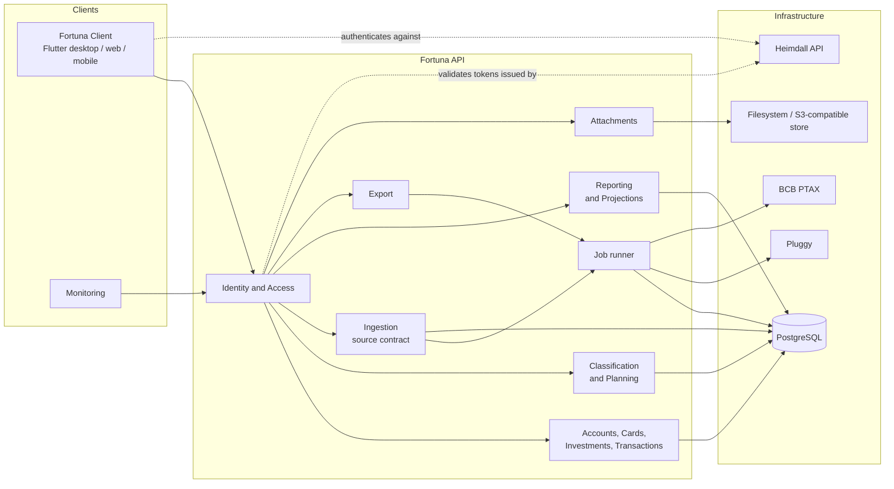
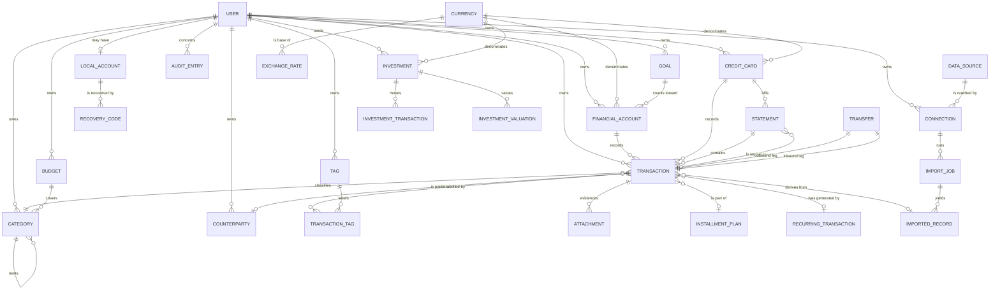
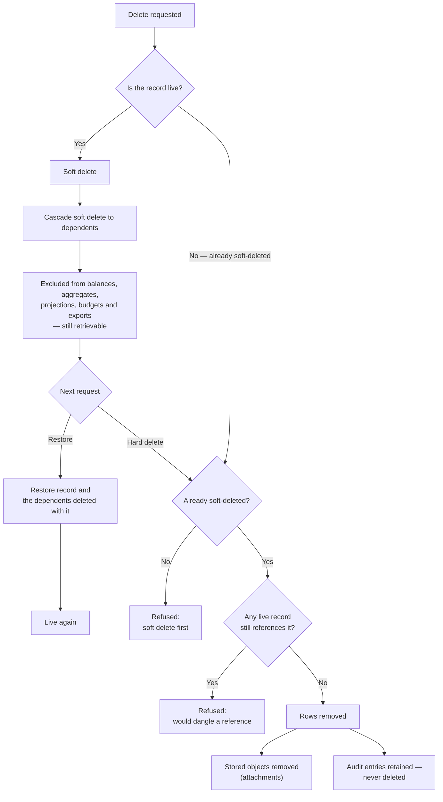

# System Requirements Document — Fortuna API

## 1. Introduction

### 1.1 Purpose

This document specifies the functional and non-functional requirements for the **Fortuna API**.

The concrete technology stack — platform and language versions, libraries, database, and tooling —
is defined in the [Technology Stack Document](Technology%20Stack%20Document.md). This document
states requirements and refers to that one for specific technologies and versions rather than
restating them. The *why* behind these requirements is in the [Vision Document](Vision%20Document.md);
the *how a user reaches them* is in the
[Use Case Specification Document](Use%20Case%20Specification%20Document.md).

Requirements are identified as `FR-<AREA>-xx` for functional requirements, numbered within their
area, and `NFR-xx` for non-functional requirements, numbered across the whole document.
Identifiers are never renumbered: a withdrawn requirement keeps its number and is marked withdrawn.

### 1.2 Scope

The Fortuna API covers: identity and access built on Heimdall-issued tokens plus a desktop-only
local account; multi-currency handling with officially published exchange rates; financial account,
credit card and investment tracking; transaction recording including transfers, installments and
recurring commitments; classification by category, tag and counterparty; budgets and goals;
data ingestion from Pluggy, Excel and supported PDF statement layouts behind one pluggable source
contract; attachments over a pluggable storage abstraction; tabular and aggregated read models with
drill-down; forward projections; export to CSV, Excel and PDF; and a two-stage deletion lifecycle
with an append-only audit trail.

Platform concerns — solution layout, configuration, health checks, logging, deployment — are
specified as `IR-xx` and `FR-HC-xx` in the
[Operations & Infrastructure Document](Operations%20%26%20Infrastructure%20Document.md).

### 1.3 Definitions

Domain vocabulary is defined in [Vision Document §1.3](Vision%20Document.md). The terms below are
specific to this document.

| Term | Definition |
| --- | --- |
| **Acting user** | The user resolved from the authenticated request, whose ownership scopes every operation. |
| **Public identifier** | The GUID by which an entity is addressed from outside the database (§4.0). |
| **Live record** | A record that is neither soft-deleted nor hard-deleted. |
| **Billing cycle** | The period between a credit card's consecutive closing dates. |
| **Display currency** | The currency a caller asks a multi-currency aggregate to be expressed in. |
| **Ingestion source** | An implementation of the source contract: manual, Pluggy, Excel, or a PDF layout. |
| **Job** | A unit of work accepted by the API and executed off the request thread. |
| **Drill-down key** | The value an aggregated bucket carries so a caller can request the finer breakdown behind it. |

---

## 2. System Overview

The dashed edges are the ones worth reading twice: the client authenticates against Heimdall
directly, and Fortuna only *validates* what Heimdall issued. No request path calls Heimdall.

---

## 3. Functional Requirements

### 3.1 Identity and Access — `ID`

| ID | Requirement |
| --- | --- |
| FR-ID-01 | The system shall validate an incoming bearer token's signature, issuer, audience and expiration before any claim it carries is trusted |
| FR-ID-02 | The system shall validate tokens locally, without calling the issuing identity provider on the request path |
| FR-ID-03 | The system shall reject a request bearing a missing, malformed, expired or unverifiable token with `401 Unauthorized` |
| FR-ID-04 | The system shall resolve the acting user from the token's subject claim on every authenticated request |
| FR-ID-05 | The system shall create a local user profile, keyed by the token's subject, on that subject's first authenticated request, without administrator involvement |
| FR-ID-06 | The system shall never store, log or transmit a password or credential belonging to a Heimdall identity |
| FR-ID-07 | The system shall scope every domain operation to the acting user's owned records |
| FR-ID-08 | The system shall refuse an operation targeting a record owned by another user with the same response it returns for a record that does not exist |
| FR-ID-09 | The system shall create a desktop local account with a display name, a secret, and a set of recovery codes returned exactly once in the creation response |
| FR-ID-10 | The system shall store recovery codes only as hashes, and shall never return a recovery code after the response that generated it |
| FR-ID-11 | The system shall authenticate a local account and issue a token bearing the account-owner authority for that installation |
| FR-ID-12 | The system shall accept a recovery code to restore access, and shall invalidate that code once it has been used |
| FR-ID-13 | The system shall regenerate a local account's recovery codes on request, invalidating every previously issued code |
| FR-ID-14 | The system shall expose no password reset and no e-mail-based recovery for a local account |
| FR-ID-15 | The system shall expose the local account endpoints only when local authentication is enabled by configuration, and shall respond to them with `404 Not Found` otherwise |
| FR-ID-16 | The system shall permit an instance administrator to configure the instance and its integrations, and shall deny them read access to any user's financial records |

### 3.2 Currency and Exchange Rates — `CU`

| ID | Requirement |
| --- | --- |
| FR-CU-01 | The system shall maintain a reference set of ISO 4217 currencies, each with its minor-unit precision |
| FR-CU-02 | The system shall represent every monetary amount as an exact decimal value paired with its currency |
| FR-CU-03 | The system shall never represent a monetary amount, at any layer, in binary floating point |
| FR-CU-04 | The system shall refuse to sum, net or compare amounts in different currencies unless an explicit conversion is applied |
| FR-CU-05 | The system shall fetch published exchange rates from the configured official source on a schedule, as a job |
| FR-CU-06 | The system shall derive a cross rate from published parities when the source publishes no direct quote for the requested pair |
| FR-CU-07 | The system shall record, alongside every converted figure, the rate applied and the date that rate was published for |
| FR-CU-08 | The system shall accept a manually entered rate for a currency pair and date, and shall prefer it over the published rate for that pair and date |
| FR-CU-09 | The system shall reject an exchange rate that is zero or negative, or whose base and quote currencies are the same |
| FR-CU-10 | The system shall apply rounding only where a figure is converted or presented, to the target currency's minor-unit precision, half away from zero, and never to an intermediate value |
| FR-CU-11 | The system shall complete a user request using the most recent known rate, marked as of its publication date, when the rate source is unreachable, and shall not fail the request |

### 3.3 Financial Account Management — `AC`

| ID | Requirement |
| --- | --- |
| FR-AC-01 | The system shall create a financial account with a name, institution, account type, currency and opening balance |
| FR-AC-02 | The system shall reject a financial account whose name duplicates another live financial account of the same user |
| FR-AC-03 | The system shall reject any attempt to change a financial account's currency after creation |
| FR-AC-04 | The system shall retrieve a financial account by its public identifier |
| FR-AC-05 | The system shall list a user's financial accounts with filtering, sorting and pagination |
| FR-AC-06 | The system shall update a financial account's name, institution and type |
| FR-AC-07 | The system shall compute a financial account's balance as its opening balance plus every live transaction recorded against it |
| FR-AC-08 | The system shall expose no operation that sets an account balance directly |
| FR-AC-09 | The system shall soft-delete a financial account together with its transactions |
| FR-AC-10 | The system shall restore a soft-deleted financial account together with the transactions soft-deleted with it |
| FR-AC-11 | The system shall hard-delete a financial account only when it is already soft-deleted and no live record references it |
| FR-AC-12 | The system shall report a user's total position across their financial accounts, investments and credit cards, expressed in a requested display currency |

### 3.4 Credit Card and Statement Management — `CC`

| ID | Requirement |
| --- | --- |
| FR-CC-01 | The system shall create a credit card with an issuer, credit limit, currency, closing day and due day |
| FR-CC-02 | The system shall reject a credit card whose limit is not greater than zero, or whose closing or due day falls outside 1–31 |
| FR-CC-03 | The system shall assign each charge to the statement whose billing cycle contains the charge's date, as determined by the card's closing day |
| FR-CC-04 | The system shall open a statement automatically when a charge falls in a cycle that has none |
| FR-CC-05 | The system shall close a statement once its closing date has passed, fixing its total |
| FR-CC-06 | The system shall settle a statement with a payment recorded from a financial account |
| FR-CC-07 | The system shall record a statement settlement as a transfer, and shall exclude it from expense totals |
| FR-CC-08 | The system shall attach a charge arriving after its cycle's statement was settled to the next open statement, marked as late-arriving |
| FR-CC-09 | The system shall reject any change to the composition of a settled statement |
| FR-CC-10 | The system shall report a credit card's used and available limit |
| FR-CC-11 | The system shall retrieve a statement, with its transactions, by its public identifier |
| FR-CC-12 | The system shall list a credit card's statements with filtering, sorting and pagination |
| FR-CC-13 | The system shall update a credit card's issuer, limit, closing day and due day, and shall reject a change to its currency |
| FR-CC-14 | The system shall apply the record lifecycle of §3.14 to a credit card and its statements |

### 3.5 Investment Management — `IV`

| ID | Requirement |
| --- | --- |
| FR-IV-01 | The system shall create an investment with an instrument name, institution, investment type and currency |
| FR-IV-02 | The system shall record an investment movement — contribution, withdrawal, yield or fee — with a date and an amount |
| FR-IV-03 | The system shall record a valuation of an investment on a given date |
| FR-IV-04 | The system shall compute an investment's position from its recorded movements and its most recent valuation, and shall derive no value from market data |
| FR-IV-05 | The system shall retrieve an investment by its public identifier, and list a user's investments with filtering, sorting and pagination |
| FR-IV-06 | The system shall return an investment's valuation history over a requested period |
| FR-IV-07 | The system shall update an investment's instrument name, institution and type, and shall reject a change to its currency |
| FR-IV-08 | The system shall apply the record lifecycle of §3.14 to an investment and its movements and valuations |

### 3.6 Transaction Management — `TX`

| ID | Requirement |
| --- | --- |
| FR-TX-01 | The system shall record a transaction with a date, an amount, a direction, an owning account and a category |
| FR-TX-02 | The system shall reject a transaction whose amount is not strictly greater than zero |
| FR-TX-03 | The system shall record a transaction's direction as expense or earning, and shall carry the sign in the direction rather than in the amount |
| FR-TX-04 | The system shall reject a transaction dated more than one day in the future |
| FR-TX-05 | The system shall reject a transaction whose account or category belongs to another user |
| FR-TX-06 | The system shall denominate a transaction in its owning account's currency |
| FR-TX-07 | The system shall retain the original amount and currency, alongside the converted amount, for a transaction whose source currency differs from its account's |
| FR-TX-08 | The system shall accept an optional description, counterparty and set of tags on a transaction |
| FR-TX-09 | The system shall retrieve a transaction by its public identifier |
| FR-TX-10 | The system shall search transactions by date range, account, credit card, category, tag, counterparty, direction, amount range and free text over the description |
| FR-TX-11 | The system shall sort and paginate any transaction search result |
| FR-TX-12 | The system shall update a transaction's date, amount, direction, category, counterparty, tags and description |
| FR-TX-13 | The system shall record a transfer as a single record producing paired movements in an origin and a destination account, applied atomically |
| FR-TX-14 | The system shall reject a transfer whose origin and destination are the same account |
| FR-TX-15 | The system shall reject a transfer whose origin or destination is not owned by the acting user |
| FR-TX-16 | The system shall exclude transfers from income and expense totals |
| FR-TX-17 | The system shall delete both movements of a transfer when either is deleted |
| FR-TX-18 | The system shall record an installment plan of at least two installments whose amounts sum exactly to the purchase total |
| FR-TX-19 | The system shall assign any rounding remainder of an installment plan to its first installment |
| FR-TX-20 | The system shall schedule each installment of a plan into the successive billing cycles of the card it was purchased on |
| FR-TX-21 | The system shall define a recurring transaction with a frequency, a start date and an optional end date not earlier than the start |
| FR-TX-22 | The system shall materialize a recurring transaction's due occurrences as real transactions, and shall produce no duplicate occurrence when materialization runs more than once |
| FR-TX-23 | The system shall treat a recurring transaction's unmaterialized future occurrences as projection input only, excluded from every balance and actual figure |
| FR-TX-24 | The system shall apply an edit to a recurring transaction to future occurrences only, leaving already-materialized occurrences unchanged |
| FR-TX-25 | The system shall mark a transaction reconciled when it is matched to an imported record, recording which record matched it |
| FR-TX-26 | The system shall apply the record lifecycle of §3.14 to a transaction |

### 3.7 Classification — `CT`

| ID | Requirement |
| --- | --- |
| FR-CT-01 | The system shall create a category with a name and an optional parent category |
| FR-CT-02 | The system shall reject a category whose name duplicates a live sibling under the same parent for the same user |
| FR-CT-03 | The system shall reject a parent assignment that would create a cycle in the category hierarchy |
| FR-CT-04 | The system shall return a user's categories as a tree |
| FR-CT-05 | The system shall update a category's name and parent |
| FR-CT-06 | The system shall reassign every transaction of one category to another category in a single operation |
| FR-CT-07 | The system shall reject the hard deletion of a category while any live transaction references it |
| FR-CT-08 | The system shall create, list, update and delete tags, each with a name unique among that user's live tags |
| FR-CT-09 | The system shall attach and detach any number of tags to and from a transaction |
| FR-CT-10 | The system shall create, list, update and delete counterparties, matching an incoming counterparty name to an existing one by its normalized form before creating a new one |
| FR-CT-11 | The system shall suggest a category for a transaction from the categories most recently used for the same counterparty by that user |
| FR-CT-12 | The system shall apply the record lifecycle of §3.14 to categories, tags and counterparties |

### 3.8 Planning — `PL`

| ID | Requirement |
| --- | --- |
| FR-PL-01 | The system shall define a budget over one or more categories, with an amount greater than zero and a period |
| FR-PL-02 | The system shall report a budget's consumption for a period as the total spent against its categories versus its amount |
| FR-PL-03 | The system shall report whether a budget's consumption has exceeded its amount, and by how much |
| FR-PL-04 | The system shall exclude transfers and soft-deleted transactions from budget consumption |
| FR-PL-05 | The system shall define a goal with a target amount greater than zero, a target date in the future at creation, and the accounts that count toward it |
| FR-PL-06 | The system shall report a goal's progress from the current balances of its linked accounts |
| FR-PL-07 | The system shall apply the record lifecycle of §3.14 to budgets and goals |

### 3.9 Data Ingestion — `IM`

| ID | Requirement |
| --- | --- |
| FR-IM-01 | The system shall define one ingestion-source contract that every data source implements |
| FR-IM-02 | The system shall permit a new ingestion source to be added by implementing that contract alone, with no change to any existing source or to any consumer of imported data |
| FR-IM-03 | The system shall accept an import or synchronization request, persist it as a job, and respond with the job's identifier without performing the work on the request thread |
| FR-IM-04 | The system shall track a job through the states Pending, Running, Completed and Failed |
| FR-IM-05 | The system shall report a job's progress and its per-row outcome — imported, skipped as duplicate, or rejected with a reason |
| FR-IM-06 | The system shall continue processing the remaining rows of an import when one row is rejected |
| FR-IM-07 | The system shall store every record read from a source exactly as received |
| FR-IM-08 | The system shall expose no operation that modifies or deletes a stored imported record |
| FR-IM-09 | The system shall link each imported transaction to the imported record it derives from and to the source that produced it |
| FR-IM-10 | The system shall treat an incoming record as a duplicate when it matches a live transaction on owning account, date and amount, and — where the source supplies one — on the source's own identifier |
| FR-IM-11 | The system shall import no duplicate when a previously imported period is imported again |
| FR-IM-12 | The system shall create a connection to an external source storing only that source's connection reference and access token |
| FR-IM-13 | The system shall never store, log or transmit a credential for a financial institution |
| FR-IM-14 | The system shall synchronize accounts, credit cards and transactions from a Pluggy connection |
| FR-IM-15 | The system shall mark a connection as requiring reauthentication when the external source reports its authorization is no longer valid, and shall surface that state to the user |
| FR-IM-16 | The system shall revoke a connection on request, stopping further synchronization and leaving every already-imported record in place |
| FR-IM-17 | The system shall import transactions from an Excel workbook using a caller-supplied mapping of columns to transaction fields |
| FR-IM-18 | The system shall identify a PDF statement's layout automatically from the document's own content |
| FR-IM-19 | The system shall import a Nubank credit card invoice PDF according to §3.9.1 |
| FR-IM-20 | The system shall reject a PDF whose layout it does not recognize, with a reason naming the supported layouts, and shall import nothing from it |
| FR-IM-21 | The system shall re-queue any job left in Pending or Running when the process restarts |
| FR-IM-22 | The system shall permit a Failed job to be retried, producing no duplicate from the rows its earlier attempt already imported |
| FR-IM-23 | The system shall record every import job, connection change and revocation in the audit trail |

#### 3.9.1 Nubank credit card invoice layout

The first supported PDF layout. Its rules are specified here because they are testable assertions
about a real document, and because they establish the shape every later layout specification
follows. A sample invoice, with the structure below, is the fixture the parser is tested against.

**Document structure.** The invoice carries a cover page, payment-option and charges pages, a
summary page, and one or more transaction pages. Only the summary and transaction sections are
imported; the payment-option and regulatory pages are ignored by design.

| ID | Requirement |
| --- | --- |
| FR-IM-24 | The system shall recognize the layout from the issuer's identifying text and the invoice heading, without the caller declaring it |
| FR-IM-25 | The system shall read the invoice's due date, issue date and billing period from the invoice header, and shall create or match the statement for that period |
| FR-IM-26 | The system shall read the summary section's previous-invoice balance, payments received, purchase total, international transaction tax total and amount due, and shall assert that the imported lines reconcile to the amount due |
| FR-IM-27 | The system shall parse each transaction line as a day-and-month date, an optional masked card number, a description and a signed amount |
| FR-IM-28 | The system shall infer each transaction's year from the invoice's billing period, correctly resolving a period that spans a year boundary |
| FR-IM-29 | The system shall parse amounts in Brazilian format, with `.` as the thousands separator and `,` as the decimal separator |
| FR-IM-30 | The system shall treat both the ASCII hyphen and the Unicode minus sign `U+2212` as marking a negative amount |
| FR-IM-31 | The system shall parse an installment marker of the form `Parcela n/N` in a description, and shall record the transaction as installment `n` of `N` of the same plan |
| FR-IM-32 | The system shall parse a foreign-currency purchase's original amount, original currency and stated conversion rate from the lines following its description, and shall record all three alongside the billed amount |
| FR-IM-33 | The system shall associate an international transaction tax line with the purchase named in it, and shall associate a reversal of that tax with the same purchase as a negative amount |
| FR-IM-34 | The system shall parse a reversal line, recording it as a negative amount against the statement and retaining the original purchase reference the line names |
| FR-IM-35 | The system shall parse a credit adjustment line as a negative amount with no counterparty |
| FR-IM-36 | The system shall parse the payments section's lines as settlements of the previous statement rather than as expenses of this one |
| FR-IM-37 | The system shall ignore the per-cardholder subtotal lines, the page headers repeated on every page, and the regulatory notices, importing none of them as transactions |
| FR-IM-38 | The system shall reject the import, importing nothing, when the parsed lines do not reconcile to the invoice's stated amount due |

### 3.10 Attachments — `AT`

| ID | Requirement |
| --- | --- |
| FR-AT-01 | The system shall attach a file to a transaction owned by the acting user |
| FR-AT-02 | The system shall reject an attachment exceeding the configured maximum size, or whose content type is not in the configured allowed set |
| FR-AT-03 | The system shall store attachment content through a storage abstraction rather than in the relational database |
| FR-AT-04 | The system shall provide a filesystem-backed implementation of that abstraction |
| FR-AT-05 | The system shall provide an S3-compatible object-storage implementation of that abstraction |
| FR-AT-06 | The system shall permit a new storage backing to be added by implementing the same abstraction, with no change to any caller |
| FR-AT-07 | The system shall select the active storage backing from configuration |
| FR-AT-08 | The system shall serve an attachment only to the user who owns the transaction it is filed against |
| FR-AT-09 | The system shall remove the stored object when an attachment is hard-deleted, and shall leave it in place when the attachment is only soft-deleted |
| FR-AT-10 | The system shall never write attachment content to a log or include it in an export |

### 3.11 Reporting and Analytics — `RP`

| ID | Requirement |
| --- | --- |
| FR-RP-01 | The system shall return any record set as a table with caller-supplied filtering, sorting and pagination |
| FR-RP-02 | The system shall aggregate transactions by period, at a caller-chosen granularity of day, week, month, quarter or year |
| FR-RP-03 | The system shall aggregate transactions by category, optionally rolling child categories up into their parent |
| FR-RP-04 | The system shall aggregate transactions by financial account, credit card, counterparty and tag |
| FR-RP-05 | The system shall return, with every aggregated bucket, the drill-down key that identifies the records behind it |
| FR-RP-06 | The system shall resolve a drill-down key into the next finer aggregation, and at the finest level into the individual transactions |
| FR-RP-07 | The system shall exclude soft-deleted records from every aggregate |
| FR-RP-08 | The system shall exclude transfers from income and expense aggregates |
| FR-RP-09 | The system shall express an aggregate spanning several currencies in a caller-chosen display currency, reporting the rate and rate date used for each conversion |
| FR-RP-10 | The system shall report a net position across financial accounts and investments net of credit card balances, in a caller-chosen display currency |
| FR-RP-11 | The system shall return an aggregate over one year of a user's transactions within the bound stated in NFR-04 |

### 3.12 Projections — `PJ`

| ID | Requirement |
| --- | --- |
| FR-PJ-01 | The system shall project cash flow over a caller-supplied horizon from recurring transactions, unbilled installments and scheduled statement settlements |
| FR-PJ-02 | The system shall mark every projected figure as projected, distinguishably from a recorded one, in any result that contains both |
| FR-PJ-03 | The system shall persist no projected figure as a transaction, a balance or any other recorded fact |
| FR-PJ-04 | The system shall report committed obligations — remaining installments and statements not yet settled — with the dates they fall due |
| FR-PJ-05 | The system shall recompute a projection from current data on every request |
| FR-PJ-06 | The system shall include, when the caller requests it, a component estimated from the user's own historical averages, labelled as estimated separately from committed amounts |

### 3.13 Export — `EX`

| ID | Requirement |
| --- | --- |
| FR-EX-01 | The system shall export a tabular query result to CSV |
| FR-EX-02 | The system shall export a tabular query result to Excel |
| FR-EX-03 | The system shall export a tabular query result to PDF |
| FR-EX-04 | The system shall execute an export as a job when its result exceeds the configured synchronous threshold, and shall respond with the job identifier |
| FR-EX-05 | The system shall write every monetary value in an export as an exact decimal with its currency, formatted for the requested locale |
| FR-EX-06 | The system shall include in an export only records owned by the requesting user |
| FR-EX-07 | The system shall exclude soft-deleted records from every export |
| FR-EX-08 | The system shall make an export's produced file available only to the user who requested it |

### 3.14 Record Lifecycle and Audit — `RL`

| ID | Requirement |
| --- | --- |
| FR-RL-01 | The system shall support soft deletion for every user-owned entity |
| FR-RL-02 | The system shall exclude soft-deleted records from every balance, aggregate, projection, budget figure and export, while keeping them retrievable |
| FR-RL-03 | The system shall restore a soft-deleted record on request |
| FR-RL-04 | The system shall permit hard deletion only of a record that is already soft-deleted |
| FR-RL-05 | The system shall reject a hard deletion while any live record references the target |
| FR-RL-06 | The system shall record one audit entry for every attempted write, whether it succeeded or was refused, capturing the acting identity, the operation, the affected entity where one was resolved, the outcome, and on a refusal the reason |
| FR-RL-07 | The system shall draw an audit entry's reason from its own messages, never from caller-supplied input |
| FR-RL-08 | The system shall never modify or delete an audit entry, including when the entity it describes is hard-deleted |
| FR-RL-09 | The system shall return to a user the audit entries concerning their own records |
| FR-RL-10 | The system shall maintain a creation and a last-update timestamp on every entity |
| FR-RL-11 | The system shall fix a record's owner at creation and reject any operation that would change it |

---

## 4. Data Model

### 4.0 Identifier Strategy

Every independently addressable entity carries two identifiers:

- **`Id`** — an auto-incrementing `bigint`, the physical primary key used for storage and every
  foreign key. Never exposed outside the database.
- **`PublicId`** — a GUID generated at creation, used everywhere the entity is addressed from
  outside the database: API path segments, request and response bodies, export contents, and job
  payloads.

Rows that are not independently addressable carry only an internal `Id`: join rows
(`TRANSACTION_TAG`), and rows reached solely through their parent (`RECOVERY_CODE`,
`IMPORTED_RECORD`, `INVESTMENT_VALUATION`). An imported record is addressable through its job, not
by an identifier of its own.

The split keeps record counts and creation order — which a raw auto-increment key reveals — out of
anything a caller can see. For a system holding financial history, "this user has 4,182
transactions" is itself information that need not leak.

### 4.1 Entity Relationship Diagram

### 4.2 User Fields

| Field | Type | Constraints | Description |
| --- | --- | --- | --- |
| Id | `bigint` | PK, identity | Internal key. |
| PublicId | `uuid` | Required, unique | External identifier. |
| ExternalSubject | `text` | Unique, nullable | The Heimdall subject claim this profile was provisioned from. Null for a local-account-only profile. |
| DisplayName | `varchar(200)` | Required | Shown in the client; sourced from the token on provisioning. |
| DisplayCurrencyId | `bigint` | FK → Currency, required | The currency multi-currency aggregates default to. |
| IsDeleted | `boolean` | Required, default false | Soft-deletion flag. |
| CreatedAt / UpdatedAt | `timestamptz` | Required | Lifecycle timestamps. |

### 4.3 Local Account and Recovery Code Fields

| Field | Type | Constraints | Description |
| --- | --- | --- | --- |
| Id | `bigint` | PK | Internal key. |
| PublicId | `uuid` | Required, unique | External identifier. |
| UserId | `bigint` | FK → User, required, unique | The profile this local identity authenticates. |
| Name | `varchar(200)` | Required, unique per installation | Local login name. |
| SecretHash / Salt | `bytea` | Required | The local secret, hashed. Never returned. |
| StorageMode | `smallint` | Required | In-memory, or the operating system credential store. |
| CreatedAt / UpdatedAt | `timestamptz` | Required | Lifecycle timestamps. |

| Recovery Code field | Type | Constraints | Description |
| --- | --- | --- | --- |
| Id | `bigint` | PK | Internal key; a recovery code is never addressed by identifier. |
| LocalAccountId | `bigint` | FK → LocalAccount, required | Owning account. |
| CodeHash | `bytea` | Required | The code, hashed. Returned in the clear only in the response that generates it. |
| UsedAt | `timestamptz` | Nullable | Set when consumed; a code with a value here is spent. |

### 4.4 Currency and Exchange Rate Fields

| Field | Type | Constraints | Description |
| --- | --- | --- | --- |
| Id | `bigint` | PK | Internal key. |
| Code | `char(3)` | Required, unique | ISO 4217 code. |
| Name | `varchar(100)` | Required | Display name. |
| MinorUnitDigits | `smallint` | Required, 0–4 | Decimal places the currency is rounded to. |

| Exchange Rate field | Type | Constraints | Description |
| --- | --- | --- | --- |
| Id | `bigint` | PK | Internal key. |
| BaseCurrencyId / QuoteCurrencyId | `bigint` | FK → Currency, required, different | The pair. |
| Rate | `numeric(19,8)` | Required, > 0 | Units of quote per unit of base. |
| RateDate | `date` | Required | The date the rate is published for. Unique with the pair and source. |
| Source | `smallint` | Required | Published, or manually entered. A manual rate takes precedence (FR-CU-08). |

### 4.5 Financial Account Fields

| Field | Type | Constraints | Description |
| --- | --- | --- | --- |
| Id / PublicId | `bigint` / `uuid` | PK / unique | Identifiers. |
| UserId | `bigint` | FK → User, required | Owner; immutable. |
| Name | `varchar(200)` | Required, unique per live account of the user | Display name. |
| Institution | `varchar(200)` | Nullable | Bank or holder. |
| AccountType | `smallint` | Required | Checking, savings, cash, other. |
| CurrencyId | `bigint` | FK → Currency, required | Immutable after creation. |
| OpeningBalance | `numeric(19,4)` | Required | May be zero or negative. |
| IsDeleted | `boolean` | Required | Soft-deletion flag. |
| CreatedAt / UpdatedAt | `timestamptz` | Required | Lifecycle timestamps. |

There is no balance column. A balance is always computed (FR-AC-07, FR-AC-08).

### 4.6 Credit Card and Statement Fields

| Field | Type | Constraints | Description |
| --- | --- | --- | --- |
| Id / PublicId | `bigint` / `uuid` | PK / unique | Identifiers. |
| UserId | `bigint` | FK → User, required | Owner; immutable. |
| Name | `varchar(200)` | Required, unique per live card of the user | Display name. |
| Issuer | `varchar(200)` | Required | Card issuer. |
| CurrencyId | `bigint` | FK → Currency, required | Immutable after creation. |
| CreditLimit | `numeric(19,4)` | Required, > 0 | Total limit. |
| ClosingDay / DueDay | `smallint` | Required, 1–31 | Billing cycle anchors. |
| LastFourDigits | `char(4)` | Nullable | Used to match imported lines to a card. |
| IsDeleted | `boolean` | Required | Soft-deletion flag. |

| Statement field | Type | Constraints | Description |
| --- | --- | --- | --- |
| Id / PublicId | `bigint` / `uuid` | PK / unique | Identifiers. |
| CreditCardId | `bigint` | FK → CreditCard, required | Owning card. |
| PeriodStart / PeriodEnd | `date` | Required | The billing cycle. Unique per card. |
| ClosingDate / DueDate | `date` | Required | As printed on the invoice. |
| PreviousBalance / PaymentsReceived / PurchaseTotal / ForeignTaxTotal / OtherEntries / AmountDue | `numeric(19,4)` | Required | The summary figures, reconciled against the imported lines (FR-IM-26). |
| Status | `smallint` | Required | Open, Closed, Settled. |
| SettlementTransactionId | `bigint` | FK → Transaction, nullable | The payment that settled it. |

### 4.7 Investment Fields

| Field | Type | Constraints | Description |
| --- | --- | --- | --- |
| Id / PublicId | `bigint` / `uuid` | PK / unique | Identifiers. |
| UserId | `bigint` | FK → User, required | Owner; immutable. |
| Instrument | `varchar(200)` | Required, unique per live investment of the user | What is held. |
| Institution | `varchar(200)` | Nullable | Broker or custodian. |
| InvestmentType | `smallint` | Required | Fixed income, equity, fund, other. |
| CurrencyId | `bigint` | FK → Currency, required | Immutable after creation. |
| IsDeleted | `boolean` | Required | Soft-deletion flag. |

| Investment movement / valuation field | Type | Constraints | Description |
| --- | --- | --- | --- |
| InvestmentId | `bigint` | FK, required | Owning investment. |
| MovementType | `smallint` | Required (movement only) | Contribution, withdrawal, yield, fee. |
| Amount | `numeric(19,4)` | Required, > 0 (movement only) | Direction carried by the type. |
| Value | `numeric(19,4)` | Required (valuation only) | Recorded position value. |
| OccurredOn / ValuedOn | `date` | Required | When it happened, or what date the value is for. |

### 4.8 Transaction Fields

| Field | Type | Constraints | Description |
| --- | --- | --- | --- |
| Id / PublicId | `bigint` / `uuid` | PK / unique | Identifiers. |
| UserId | `bigint` | FK → User, required | Owner; immutable. |
| FinancialAccountId | `bigint` | FK, nullable | Set when the transaction is against an account. |
| CreditCardId | `bigint` | FK, nullable | Set when it is a card charge. Exactly one of the two is set. |
| StatementId | `bigint` | FK → Statement, nullable | The cycle it was billed in. |
| CategoryId | `bigint` | FK → Category, required | Classification. |
| CounterpartyId | `bigint` | FK, nullable | Merchant, payer or payee. |
| Direction | `smallint` | Required | Expense or earning. |
| Amount | `numeric(19,4)` | Required, > 0 | Always positive; the sign lives in `Direction`. |
| CurrencyId | `bigint` | FK → Currency, required | Equal to the owning account's or card's currency. |
| OriginalAmount / OriginalCurrencyId / AppliedRate / RateDate | `numeric(19,4)` / `bigint` / `numeric(19,8)` / `date` | Nullable, all four set together | The foreign-currency original and the conversion that produced `Amount`. |
| OccurredOn | `date` | Required, not more than one day ahead | Transaction date. |
| Description | `varchar(500)` | Nullable | Free text. |
| InstallmentPlanId / InstallmentNumber | `bigint` / `smallint` | Nullable, set together | Which installment of which plan. |
| RecurringTransactionId | `bigint` | FK, nullable | The rule that materialized it. |
| ImportedRecordId | `bigint` | FK, nullable | The raw record it derives from. |
| SourceType | `smallint` | Required | Manual, Pluggy, Excel, PDF. |
| IsReconciled | `boolean` | Required, default false | Matched against an imported record. |
| IsManuallyCorrected | `boolean` | Required, default false | An imported transaction has since been corrected by its owner. |
| IsLateArriving | `boolean` | Required, default false | Attached to a later statement than its date implies (FR-CC-08). |
| IsDeleted | `boolean` | Required | Soft-deletion flag. |

### 4.9 Transfer, Installment Plan and Recurring Transaction Fields

| Transfer field | Type | Constraints | Description |
| --- | --- | --- | --- |
| Id / PublicId | `bigint` / `uuid` | PK / unique | Identifiers. |
| OutboundTransactionId / InboundTransactionId | `bigint` | FK → Transaction, required, different | The paired legs. Created and deleted together. |
| AppliedRate / RateDate | `numeric(19,8)` / `date` | Nullable, set together | The conversion, when the two accounts differ in currency. |

| Installment Plan field | Type | Constraints | Description |
| --- | --- | --- | --- |
| Id / PublicId | `bigint` / `uuid` | PK / unique | Identifiers. |
| CreditCardId | `bigint` | FK, required | Card the purchase was made on. |
| TotalAmount | `numeric(19,4)` | Required, > 0 | Purchase total; the installments sum to it exactly. |
| InstallmentCount | `smallint` | Required, ≥ 2 | Number of parts. |
| PurchasedOn | `date` | Required | Purchase date. |

| Recurring Transaction field | Type | Constraints | Description |
| --- | --- | --- | --- |
| Id / PublicId | `bigint` / `uuid` | PK / unique | Identifiers. |
| Frequency | `smallint` | Required | Weekly, monthly, quarterly, yearly. |
| StartsOn / EndsOn | `date` | Start required; end nullable and not before start | Schedule bounds. |
| LastMaterializedOn | `date` | Nullable | The idempotency anchor for FR-TX-22. |
| Template fields | — | — | Amount, direction, account or card, category, counterparty and description applied to each occurrence. |

### 4.10 Classification and Planning Fields

| Category field | Type | Constraints | Description |
| --- | --- | --- | --- |
| Id / PublicId | `bigint` / `uuid` | PK / unique | Identifiers. |
| UserId | `bigint` | FK, required | Owner. |
| ParentCategoryId | `bigint` | FK → Category, nullable | Parent; no cycles (FR-CT-03). |
| Name | `varchar(200)` | Required, unique among live siblings | Display name. |

`TAG` and `COUNTERPARTY` carry the same identifier, owner, name and soft-deletion shape;
`COUNTERPARTY` additionally holds a `NormalizedName` used for matching (FR-CT-10).
`TRANSACTION_TAG` is a join row with no `PublicId`.

| Budget field | Type | Constraints | Description |
| --- | --- | --- | --- |
| Amount | `numeric(19,4)` | Required, > 0 | The ceiling. |
| CurrencyId | `bigint` | FK, required | Currency of the ceiling. |
| PeriodType / PeriodStart | `smallint` / `date` | Required | Monthly, quarterly, yearly, from a start. |

| Goal field | Type | Constraints | Description |
| --- | --- | --- | --- |
| TargetAmount | `numeric(19,4)` | Required, > 0 | The target. |
| TargetDate | `date` | Required, future at creation | When it is due. |

### 4.11 Ingestion Fields

| Connection field | Type | Constraints | Description |
| --- | --- | --- | --- |
| Id / PublicId | `bigint` / `uuid` | PK / unique | Identifiers. |
| UserId | `bigint` | FK, required | Owner. |
| DataSourceType | `smallint` | Required | Which source this reaches. |
| ExternalReference | `varchar(200)` | Required, unique per user and source | The source's own connection identifier. |
| AccessTokenCipher | `bytea` | Nullable | The source's access token, encrypted at rest. Never a bank credential (FR-IM-13). |
| Status | `smallint` | Required | Active, RequiresReauthentication, Revoked. |

| Import Job field | Type | Constraints | Description |
| --- | --- | --- | --- |
| Id / PublicId | `bigint` / `uuid` | PK / unique | Identifiers. |
| UserId | `bigint` | FK, required | Owner. |
| ConnectionId | `bigint` | FK, nullable | Null for a file import. |
| SourceType | `smallint` | Required | Pluggy, Excel, PDF. |
| Status | `smallint` | Required | Pending, Running, Completed, Failed. |
| PeriodStart / PeriodEnd | `date` | Nullable | The range requested. |
| ImportedCount / DuplicateCount / RejectedCount | `integer` | Required, default 0 | Per-row outcome totals (FR-IM-05). |
| FailureReason | `varchar(1000)` | Nullable | Set when Failed; drawn from application messages only. |

| Imported Record field | Type | Constraints | Description |
| --- | --- | --- | --- |
| Id | `bigint` | PK | Internal key; reached through its job. |
| ImportJobId | `bigint` | FK, required | Producing job. |
| RawPayload | `jsonb` | Required, immutable | Exactly as received (FR-IM-07). |
| ExternalId | `varchar(200)` | Nullable | The source's own record identifier, when it supplies one. |
| Outcome | `smallint` | Required | Imported, Duplicate, Rejected. |
| RejectionReason | `varchar(1000)` | Nullable | Why the row was rejected. |

### 4.12 Attachment and Audit Fields

| Attachment field | Type | Constraints | Description |
| --- | --- | --- | --- |
| Id / PublicId | `bigint` / `uuid` | PK / unique | Identifiers. |
| TransactionId | `bigint` | FK, required | What it evidences. |
| FileName | `varchar(300)` | Required | Original file name. |
| ContentType | `varchar(150)` | Required, in the allowed set | MIME type. |
| SizeInBytes | `bigint` | Required, within the configured maximum | File size. |
| StorageKey | `varchar(500)` | Required | Opaque key in the active store — a path or an object key. |
| IsDeleted | `boolean` | Required | Soft-deletion flag; the object survives until hard deletion (FR-AT-09). |

| Audit Entry field | Type | Constraints | Description |
| --- | --- | --- | --- |
| Id | `bigint` | PK | Internal key. Append-only; no update, no delete. |
| ActorUserId | `uuid` | Nullable, no FK | The acting identity's public identifier, where one was resolved; retained after hard deletion. |
| Operation | `varchar(150)` | Required | What was attempted. |
| EntityType / EntityPublicId | `varchar(100)` / `uuid` | Nullable | The target, where one was resolved. |
| Outcome | `smallint` | Required | Succeeded or Refused. |
| Reason | `varchar(1000)` | Nullable | On refusal, from the application's own messages (FR-RL-07). |
| OccurredAt | `timestamptz` | Required | When. |

---

## 5. API Endpoints Overview

Paths address entities by `PublicId`. Every endpoint requires a valid token except where noted, and
every endpoint is scoped to the acting user (FR-ID-07).

### 5.1 Identity Endpoints

| Method | Path | Description | Requirement |
| --- | --- | --- | --- |
| GET | `/api/me` | The acting user's profile, provisioning it on first call | FR-ID-05 |
| PUT | `/api/me` | Update display name and display currency | FR-ID-05 |
| POST | `/api/local-accounts` | Create the desktop local account, returning its recovery codes once — *desktop mode only, anonymous* | FR-ID-09 |
| POST | `/api/local-accounts/authenticate` | Authenticate a local account — *anonymous* | FR-ID-11 |
| POST | `/api/local-accounts/recover` | Consume a recovery code to restore access — *anonymous* | FR-ID-12 |
| POST | `/api/local-accounts/recovery-codes/regenerate` | Issue a new set of recovery codes | FR-ID-13 |

### 5.2 Currency Endpoints

| Method | Path | Description | Requirement |
| --- | --- | --- | --- |
| GET | `/api/currencies` | The supported currency reference set | FR-CU-01 |
| GET | `/api/exchange-rates` | Rates for a pair over a period | FR-CU-07 |
| POST | `/api/exchange-rates` | Record a manual rate | FR-CU-08 |
| POST | `/api/exchange-rates/sync` | Trigger a rate synchronization job | FR-CU-05 |

### 5.3 Financial Account Endpoints

| Method | Path | Description | Requirement |
| --- | --- | --- | --- |
| POST | `/api/accounts` | Create a financial account | FR-AC-01 |
| GET | `/api/accounts` | List with filter, sort and pagination | FR-AC-05 |
| GET | `/api/accounts/{id}` | Retrieve one | FR-AC-04 |
| GET | `/api/accounts/{id}/balance` | The derived balance | FR-AC-07 |
| PUT | `/api/accounts/{id}` | Update name, institution and type | FR-AC-06 |
| DELETE | `/api/accounts/{id}` | Soft delete, cascading to its transactions | FR-AC-09 |
| POST | `/api/accounts/{id}/restore` | Restore | FR-AC-10 |
| DELETE | `/api/accounts/{id}/hard` | Hard delete | FR-AC-11 |

### 5.4 Credit Card and Statement Endpoints

| Method | Path | Description | Requirement |
| --- | --- | --- | --- |
| POST | `/api/credit-cards` | Create a credit card | FR-CC-01 |
| GET | `/api/credit-cards` | List | FR-CC-14 |
| GET | `/api/credit-cards/{id}` | Retrieve one, with used and available limit | FR-CC-10 |
| PUT | `/api/credit-cards/{id}` | Update | FR-CC-13 |
| DELETE | `/api/credit-cards/{id}` | Soft delete | FR-CC-14 |
| POST | `/api/credit-cards/{id}/restore` | Restore | FR-CC-14 |
| DELETE | `/api/credit-cards/{id}/hard` | Hard delete | FR-CC-14 |
| GET | `/api/credit-cards/{id}/statements` | List the card's statements | FR-CC-12 |
| GET | `/api/statements/{id}` | Retrieve a statement with its transactions | FR-CC-11 |
| POST | `/api/statements/{id}/settle` | Settle with a payment from a financial account | FR-CC-06 |

### 5.5 Investment Endpoints

| Method | Path | Description | Requirement |
| --- | --- | --- | --- |
| POST | `/api/investments` | Create | FR-IV-01 |
| GET | `/api/investments` | List | FR-IV-05 |
| GET | `/api/investments/{id}` | Retrieve one with its computed position | FR-IV-04 |
| PUT | `/api/investments/{id}` | Update | FR-IV-07 |
| DELETE | `/api/investments/{id}` · `/hard` · `POST /restore` | Lifecycle | FR-IV-08 |
| POST | `/api/investments/{id}/movements` | Record a contribution, withdrawal, yield or fee | FR-IV-02 |
| POST | `/api/investments/{id}/valuations` | Record a valuation | FR-IV-03 |
| GET | `/api/investments/{id}/valuations` | Valuation history | FR-IV-06 |

### 5.6 Transaction Endpoints

| Method | Path | Description | Requirement |
| --- | --- | --- | --- |
| POST | `/api/transactions` | Record an expense or earning | FR-TX-01 |
| GET | `/api/transactions` | Search, filter, sort and paginate | FR-TX-10, FR-TX-11 |
| GET | `/api/transactions/{id}` | Retrieve one | FR-TX-09 |
| PUT | `/api/transactions/{id}` | Update | FR-TX-12 |
| DELETE | `/api/transactions/{id}` · `/hard` · `POST /restore` | Lifecycle | FR-TX-26 |
| POST | `/api/transactions/{id}/reconcile` | Mark reconciled against an imported record | FR-TX-25 |
| POST | `/api/transfers` | Record a transfer between own accounts | FR-TX-13 |
| GET · DELETE | `/api/transfers/{id}` | Retrieve, or delete both legs | FR-TX-17 |
| POST | `/api/installment-plans` | Record an installment purchase | FR-TX-18 |
| GET | `/api/installment-plans/{id}` | Retrieve a plan with its installments | FR-TX-20 |
| POST | `/api/recurring-transactions` | Define a recurring rule | FR-TX-21 |
| GET · PUT · DELETE | `/api/recurring-transactions/{id}` | Retrieve, update, delete a rule | FR-TX-24 |
| POST | `/api/recurring-transactions/materialize` | Materialize every due occurrence | FR-TX-22 |

### 5.7 Classification and Planning Endpoints

| Method | Path | Description | Requirement |
| --- | --- | --- | --- |
| POST · GET · PUT | `/api/categories` , `/api/categories/{id}` | Create, list as a tree, update | FR-CT-01, FR-CT-04, FR-CT-05 |
| POST | `/api/categories/{id}/reassign` | Move every transaction to another category | FR-CT-06 |
| DELETE | `/api/categories/{id}` · `/hard` | Lifecycle | FR-CT-07 |
| POST · GET · PUT · DELETE | `/api/tags` , `/api/tags/{id}` | Manage tags | FR-CT-08 |
| POST · DELETE | `/api/transactions/{id}/tags/{tagId}` | Attach and detach a tag | FR-CT-09 |
| POST · GET · PUT · DELETE | `/api/counterparties` , `/api/counterparties/{id}` | Manage counterparties | FR-CT-10 |
| GET | `/api/counterparties/{id}/suggested-category` | The category most recently used for this counterparty | FR-CT-11 |
| POST · GET · PUT · DELETE | `/api/budgets` , `/api/budgets/{id}` | Manage budgets | FR-PL-01 |
| GET | `/api/budgets/{id}/consumption` | Consumption for a period | FR-PL-02, FR-PL-03 |
| POST · GET · PUT · DELETE | `/api/goals` , `/api/goals/{id}` | Manage goals | FR-PL-05 |
| GET | `/api/goals/{id}/progress` | Progress from linked account balances | FR-PL-06 |

### 5.8 Ingestion Endpoints

| Method | Path | Description | Requirement |
| --- | --- | --- | --- |
| GET | `/api/data-sources` | The available ingestion sources | FR-IM-01 |
| POST | `/api/connections` | Create a connection to an external source | FR-IM-12 |
| GET | `/api/connections` · `/api/connections/{id}` | List and retrieve, with status | FR-IM-15 |
| POST | `/api/connections/{id}/sync` | Queue a synchronization job | FR-IM-03, FR-IM-14 |
| POST | `/api/connections/{id}/revoke` | Revoke, keeping imported data | FR-IM-16 |
| POST | `/api/imports/excel` | Queue an Excel import with a column mapping | FR-IM-17 |
| POST | `/api/imports/pdf` | Queue a PDF statement import | FR-IM-18, FR-IM-19 |
| GET | `/api/import-jobs` · `/api/import-jobs/{id}` | List and retrieve jobs with their progress | FR-IM-04, FR-IM-05 |
| GET | `/api/import-jobs/{id}/records` | The per-row outcomes | FR-IM-05 |
| POST | `/api/import-jobs/{id}/retry` | Retry a failed job | FR-IM-22 |

### 5.9 Attachment, Reporting, Projection and Export Endpoints

| Method | Path | Description | Requirement |
| --- | --- | --- | --- |
| POST | `/api/transactions/{id}/attachments` | Attach a file | FR-AT-01 |
| GET | `/api/attachments/{id}` | Download an attachment | FR-AT-08 |
| DELETE | `/api/attachments/{id}` · `/hard` | Lifecycle | FR-AT-09 |
| GET | `/api/reports/aggregate` | Aggregate by period, category, account, card, counterparty or tag | FR-RP-02 … FR-RP-04 |
| GET | `/api/reports/drill-down` | Resolve a drill-down key one level finer | FR-RP-06 |
| GET | `/api/reports/net-position` | Net position in a display currency | FR-RP-10 |
| GET | `/api/projections/cash-flow` | Cash flow over a horizon | FR-PJ-01 |
| GET | `/api/projections/commitments` | Committed obligations and their due dates | FR-PJ-04 |
| POST | `/api/exports` | Request an export in CSV, Excel or PDF | FR-EX-01 … FR-EX-04 |
| GET | `/api/exports/{id}` | Retrieve a completed export's file | FR-EX-08 |
| GET | `/api/audit-entries` | The acting user's own audit entries | FR-RL-09 |

---

## 6. Non-Functional Requirements

| ID | Category | Requirement |
| --- | --- | --- |
| NFR-01 | Technology | The API shall be built on ASP.NET Core over the .NET platform, with the framework, libraries and versions defined in the [Technology Stack Document](Technology%20Stack%20Document.md) |
| NFR-02 | Performance | A single-record read, or one page of a list, shall complete within **200 ms at the 95th percentile** |
| NFR-03 | Performance | A write shall complete within **500 ms at the 95th percentile** |
| NFR-04 | Performance | An aggregation or drill-down over one year of a user's transactions shall complete within **1 second at the 95th percentile** |
| NFR-05 | Performance | An operation executed as a job shall be exempt from NFR-02 to NFR-04; the request that accepts it shall itself meet NFR-03 |
| NFR-06 | Correctness | Monetary values shall be exact decimals end to end. No binary floating-point type shall appear in an entity, a data transfer object, a query projection, an export cell, or an intermediate calculation involving money |
| NFR-07 | Correctness | Monetary columns shall be `numeric(19,4)` and exchange rate columns `numeric(19,8)`; rounding shall occur only at conversion or presentation |
| NFR-08 | Correctness | A computed balance shall equal the sum of its opening balance and its live transactions to the currency's minor unit, and shall be identical across repeated computations |
| NFR-09 | Security | No credential for a financial institution shall be stored, logged or transmitted, under any configuration |
| NFR-10 | Security | Every endpoint shall require a valid token, except the local-account authentication and recovery endpoints, the local-account creation endpoint, and the public liveness check defined in the [Operations & Infrastructure Document](Operations%20%26%20Infrastructure%20Document.md). Each shall be explicitly marked anonymous; no other endpoint may be |
| NFR-11 | Security | An operation targeting a record owned by another user shall be indistinguishable, in status code, body and timing class, from the same operation against a record that does not exist |
| NFR-12 | Security | Internal `bigint` keys shall never appear in an API path, an API response, an export or a job payload; only `PublicId` values shall be exposed |
| NFR-13 | Security | A recovery code shall be stored only as a hash, and an external access token only encrypted at rest; neither shall be returned to a caller after the response that first produces it |
| NFR-14 | Security | Because tokens are validated locally without an issuer round trip (FR-ID-02), a token revoked at Heimdall remains acceptable to Fortuna until it expires. Token lifetime shall therefore be configurable, and shall default to a value short enough to bound that window |
| NFR-15 | Security | Logs shall contain no monetary amount, no account or card identifier, no attachment content and no token |
| NFR-16 | Validation | Every input shall be validated before any processing, and a rejection shall name the failing field |
| NFR-17 | Auditability | Every attempted write shall produce exactly one audit entry, successful or refused, and audit entries shall be append-only |
| NFR-18 | Data Integrity | After any soft deletion, including a cascading one, every foreign key in the schema shall still resolve to an existing row |
| NFR-19 | Data Integrity | A hard deletion shall leave no dangling reference, and shall be refused rather than cascade into a live record |
| NFR-20 | Availability | The API shall hold no state in the process or on a local filesystem that a second instance would need: authentication is validated from token claims with no server-side session, and job state lives in the database |
| NFR-21 | Availability | A job left Pending or Running when the process stops shall be re-queued when it starts again, and re-running it shall import no duplicate |
| NFR-22 | Resilience | An external service being unreachable — the rate source, the aggregator, the object store — shall degrade the affected capability with a stated reason, and shall never surface as a `5xx` on an unrelated user request |
| NFR-23 | Resilience | Calls to an external service shall respect that service's published rate limits and shall back off rather than retry immediately |
| NFR-24 | Extensibility | Adding an ingestion source or an attachment storage backing shall require implementing one contract and registering it, with no modification to existing implementations or their callers |
| NFR-25 | Maintainability | Merged line coverage shall not fall below **90%**, enforced in continuous integration and reproducibly on a developer machine |
| NFR-26 | Portability | One `docker compose` invocation shall bring the instance up on Docker Desktop for Windows, on Docker in WSL Ubuntu, and on a Linux VPS, differing only in the environment file supplied |
| NFR-27 | Privacy | An export, an error message and a log line shall each contain only data the requesting user owns |

---

## 7. Authorization Matrix

| Operation | Account Owner | Local Account | Instance Administrator | Anonymous |
| --- | :---: | :---: | :---: | :---: |
| Read own profile, update own preferences | ✅ | ✅ | ✅ (own only) | ❌ |
| Create, read, update, delete own accounts, cards, investments | ✅ | ✅ | ❌ | ❌ |
| Record, search, update, delete own transactions and transfers | ✅ | ✅ | ❌ | ❌ |
| Manage own categories, tags, counterparties, budgets, goals | ✅ | ✅ | ❌ | ❌ |
| Create and revoke own connections; run imports and synchronizations | ✅ | ⚠️ file imports only — no network source offline | ❌ | ❌ |
| Read reports, projections and exports over own data | ✅ | ✅ | ❌ | ❌ |
| Attach, download and delete own attachments | ✅ | ✅ | ❌ | ❌ |
| Read or modify **another user's** records of any kind | ❌ | ❌ | ❌ | ❌ |
| Hard-delete an own record already soft-deleted | ✅ | ✅ | ❌ | ❌ |
| Read own audit entries | ✅ | ✅ | ❌ | ❌ |
| Read instance-level operational health and job counts | ❌ | ❌ | ✅ | ❌ |
| Configure the instance and its integrations | ❌ | ❌ | ✅ | ❌ |
| Manage user access to the instance | ❌ | ❌ | ⚠️ through Heimdall, not through Fortuna | ❌ |
| Create a local account, authenticate it, consume a recovery code | ❌ | ⚠️ creation once, while none exists | ❌ | ⚠️ desktop mode only |
| Public liveness check | ✅ | ✅ | ✅ | ✅ |

**Legend:** ✅ allowed · ⚠️ allowed under the stated condition · ❌ denied.

The row that matters most is *"Read or modify another user's records"*: it is `❌` in **every**
column, administrators included. There is no role in this system that reads another person's
financial data.

---

## 8. Deletion Strategy

**Cascades on soft deletion.** Deleting a financial account or credit card soft-deletes its
transactions; deleting a credit card soft-deletes its statements; deleting an investment
soft-deletes its movements and valuations; deleting a transaction soft-deletes its attachments, and
— if it is a leg of a transfer — the other leg with it. Restoring reverses exactly the cascade that
the deletion performed, and nothing else: a transaction deleted before its account was deleted stays
deleted when the account is restored.

**Refusals on hard deletion.** A category with live transactions, an account with live transactions,
a currency in use by any live account, and a statement with live transactions are each refused
(FR-RL-05). The remedy is to reassign or delete the dependents first — never a cascade, because a
cascading hard delete is how a year of history disappears from one request.

**Never deleted.** Audit entries (FR-RL-08) and imported records (FR-IM-08) survive the hard
deletion of what they describe. They are the evidence that the deletion happened and that the data
was once real.

---

## 9. Traceability

### 9.1 Feature → Requirements

| Feature | Requirements |
| --- | --- |
| F-01 Financial account tracking | FR-AC-01 through FR-AC-12 |
| F-02 Credit card and statement tracking | FR-CC-01 through FR-CC-14 |
| F-03 Investment tracking | FR-IV-01 through FR-IV-08 |
| F-04 Transaction recording | FR-TX-01 through FR-TX-26 |
| F-05 Classification | FR-CT-01 through FR-CT-12 |
| F-06 Multi-currency | FR-CU-01 through FR-CU-11 |
| F-07 Open-banking ingestion | FR-IM-12, FR-IM-13, FR-IM-14, FR-IM-15, FR-IM-16 |
| F-08 Spreadsheet import | FR-IM-17 |
| F-09 PDF statement import | FR-IM-18, FR-IM-19, FR-IM-20, FR-IM-24 through FR-IM-38 |
| F-10 Pluggable ingestion | FR-IM-01, FR-IM-02 |
| F-11 Tabular queries | FR-RP-01, FR-TX-10, FR-TX-11 |
| F-12 Chart aggregations with drill-down | FR-RP-02 through FR-RP-11 |
| F-13 Forward projections | FR-PJ-01 through FR-PJ-06 |
| F-14 Export | FR-EX-01 through FR-EX-08 |
| F-15 Attachments | FR-AT-01 through FR-AT-10 |
| F-16 Budgets and goals | FR-PL-01 through FR-PL-07 |
| F-17 Identity and isolation | FR-ID-01 through FR-ID-08, FR-ID-16 |
| F-18 Desktop offline account | FR-ID-09 through FR-ID-15 |
| F-19 Asynchronous operations | FR-IM-03, FR-IM-04, FR-IM-05, FR-IM-21, FR-IM-22, FR-CU-05, FR-EX-04 |
| F-20 Two-stage deletion and audit | FR-RL-01 through FR-RL-11, FR-IM-23 |

### 9.2 Business Rule → Requirements

| Business Rule | Realized by |
| --- | --- |
| BR-01 Records belong to exactly one user | FR-ID-07, NFR-27 |
| BR-02 Administrators cannot read financial data | FR-ID-16, §7 |
| BR-03 Owner fixed at creation | FR-RL-11 |
| BR-04 Cross-user access refused as not-found | FR-ID-08, NFR-11 |
| BR-05 Exact decimal money, never floating point | FR-CU-02, FR-CU-03, NFR-06, NFR-07 |
| BR-06 No cross-currency arithmetic without conversion | FR-CU-04 |
| BR-07 Conversions record rate and date | FR-CU-07, FR-TX-07, FR-RP-09 |
| BR-08 One immutable currency per account | FR-AC-01, FR-AC-03, FR-CC-13, FR-IV-07 |
| BR-09 Transaction in its account's currency, original retained | FR-TX-06, FR-TX-07 |
| BR-10 Rounding only at presentation or conversion | FR-CU-10, NFR-07 |
| BR-11 Balances always derived | FR-AC-07, FR-AC-08, NFR-08 |
| BR-12 A card is not an account | FR-CC-06, FR-CC-07 |
| BR-13 Charges fall into the cycle's statement | FR-CC-03, FR-CC-04 |
| BR-14 Settled statements are frozen | FR-CC-08, FR-CC-09 |
| BR-15 Transfers are neither income nor expense, and move atomically | FR-TX-13, FR-TX-16, FR-RP-08, FR-PL-04 |
| BR-16 Transfer origin ≠ destination | FR-TX-14 |
| BR-17 Fortuna records valuations, never prices | FR-IV-03, FR-IV-04 |
| BR-18 Transactions carry date, amount, direction, account, category | FR-TX-01 |
| BR-19 Amount positive, sign in the direction | FR-TX-02, FR-TX-03 |
| BR-20 Installments sum exactly, remainder on the first | FR-TX-18, FR-TX-19 |
| BR-21 A recurring rule is not a movement | FR-TX-23, FR-PJ-01 |
| BR-22 Rule edits affect the future only | FR-TX-24 |
| BR-23 Category hierarchy without cycles | FR-CT-03 |
| BR-24 Imported records immutable | FR-IM-07, FR-IM-08 |
| BR-25 Every transaction records its provenance | FR-IM-09 |
| BR-26 Duplicate detection | FR-IM-10, FR-IM-11 |
| BR-27 Per-row import outcomes | FR-IM-05, FR-IM-06 |
| BR-28 Bank credentials never stored | FR-IM-12, FR-IM-13, NFR-09 |
| BR-29 Revoking a connection keeps imported data | FR-IM-16 |
| BR-30 New sources are additive | FR-IM-01, FR-IM-02, NFR-24 |
| BR-31 Projections are derived, never persisted | FR-PJ-03, FR-PJ-05 |
| BR-32 Projected figures distinguishable | FR-PJ-02, FR-PJ-06 |
| BR-33 Soft-deleted excluded from figures | FR-RL-02, FR-RP-07, FR-EX-07 |
| BR-34 Aggregates resolve to transactions | FR-RP-05, FR-RP-06 |
| BR-35 Fortuna never handles a password | FR-ID-06, FR-ID-01, FR-ID-02 |
| BR-36 Recovery codes are the only local recovery | FR-ID-10, FR-ID-12, FR-ID-13, FR-ID-14, NFR-13 |
| BR-37 Local data stays on its installation | FR-ID-15 |
| BR-38 Soft delete before hard delete | FR-RL-01, FR-RL-04 |
| BR-39 Soft-deleted records restorable | FR-RL-02, FR-RL-03 |
| BR-40 Hard delete refused while referenced | FR-RL-05, NFR-19 |
| BR-41 Audit entries append-only | FR-RL-06, FR-RL-08, NFR-17 |
