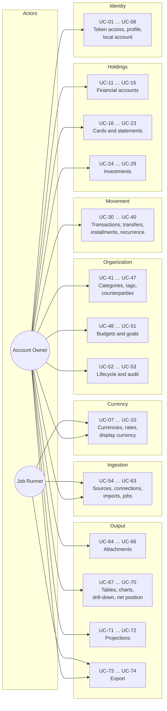
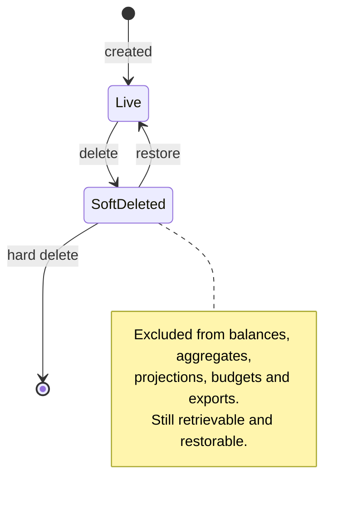
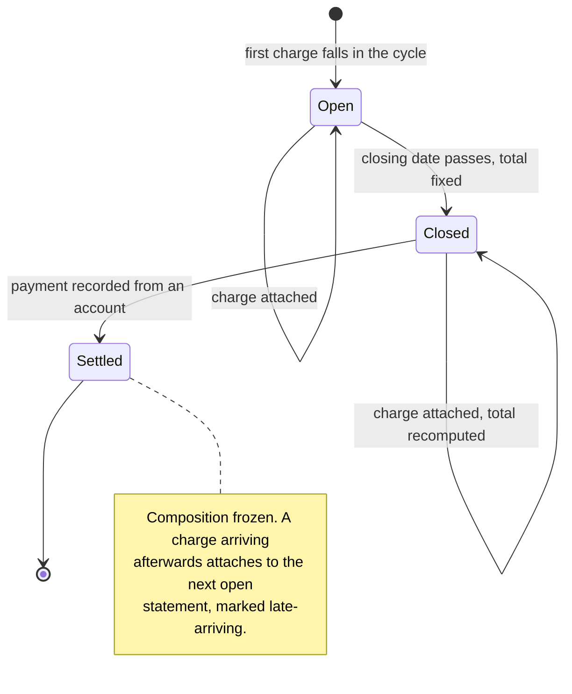
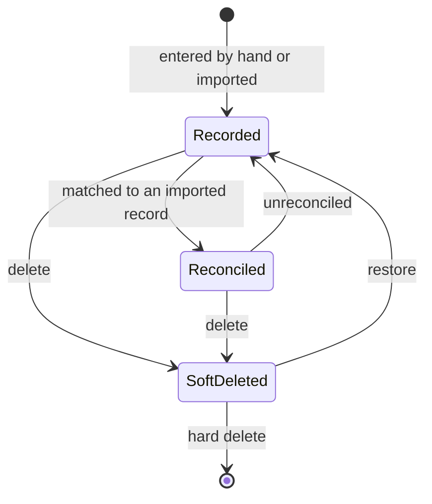
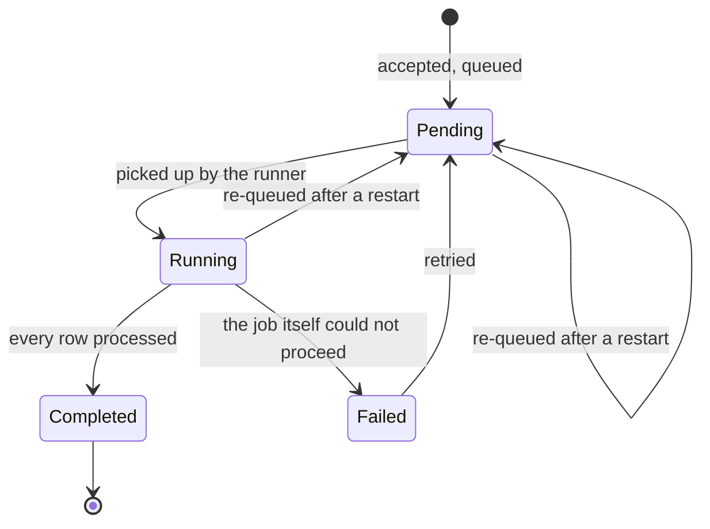
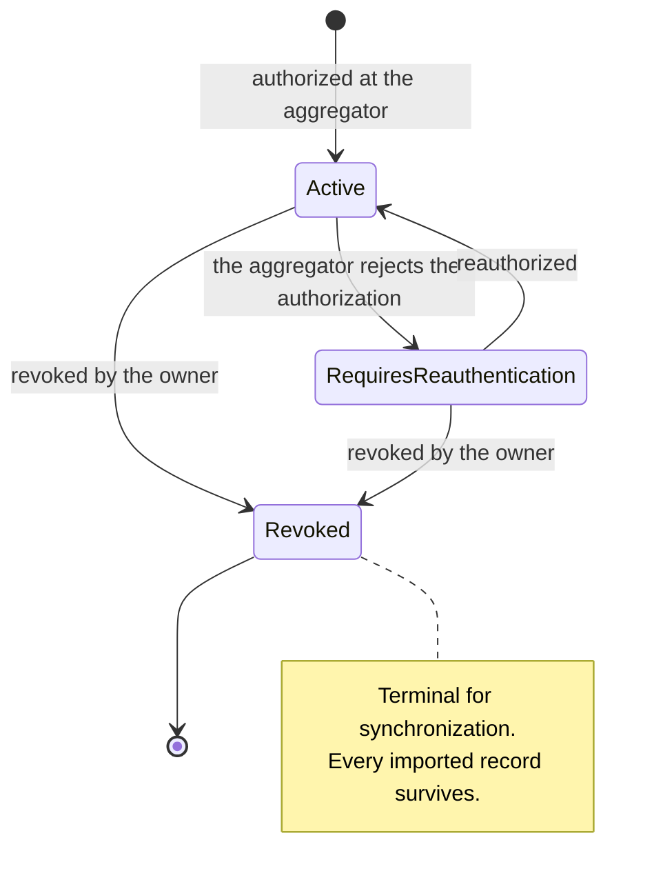
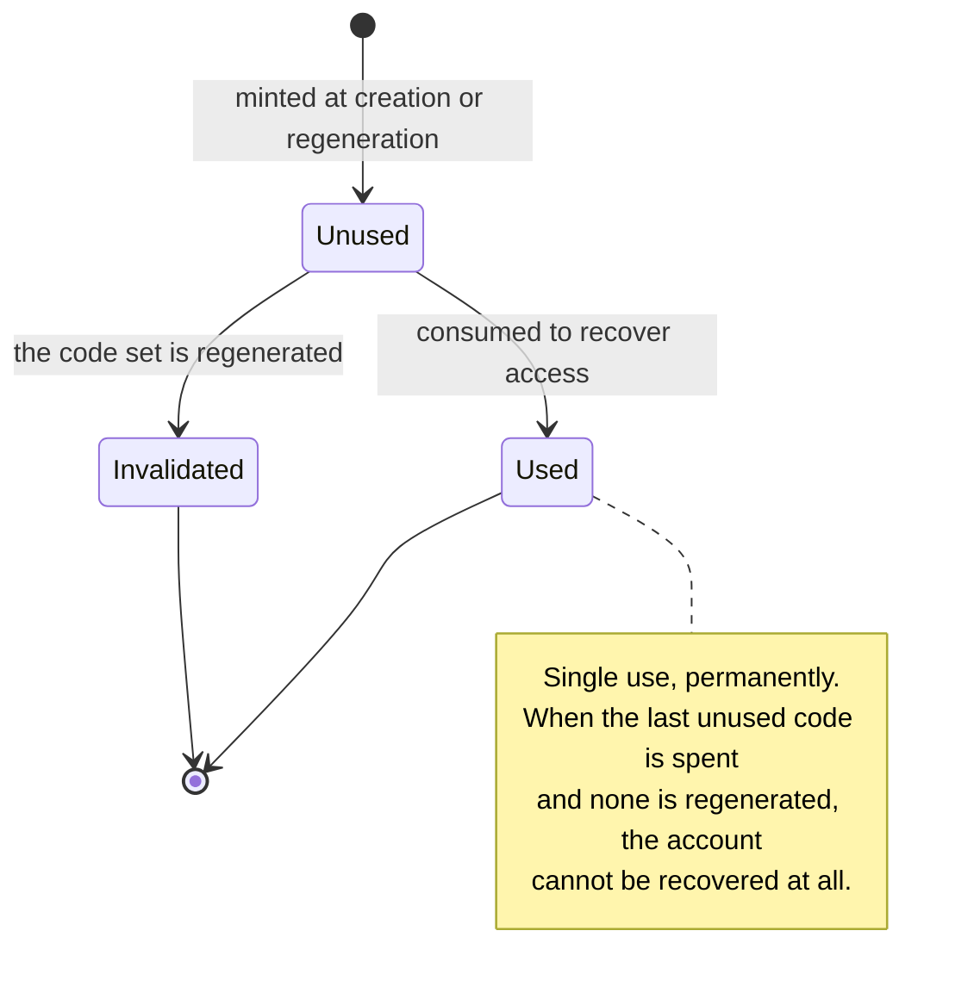

# Use Case Specification Document — Fortuna API

## 1. Introduction

### 1.1 Purpose

This document specifies the use cases for the **Fortuna API**. Each use case describes actor
interactions, preconditions, postconditions, a main flow, and its alternative and exception flows.

Every `{id}` in these flows is the entity's **public identifier** — the GUID described in
[System Requirements Document §4.0](System%20Requirements%20Document.md). Internal keys never appear
in a path, a body or a flow.

Alternative flows are numbered `AF-01` upward **within** each use case, restarting for each.

Three conventions hold across every use case and are therefore not repeated in each one:

- **Authentication.** Every use case except UC-03, UC-04 and UC-05 requires a valid token
  (`FR-ID-01`, `FR-ID-03`). A request without one is refused with `401 Unauthorized`.
- **Isolation.** Every use case operates on the acting user's own records (`FR-ID-07`). A request
  naming a record owned by somebody else is refused with `404 Not Found` — the same response as for
  a record that does not exist (`FR-ID-08`), so that no response reveals what another user holds.
- **Audit.** Every write produces exactly one audit entry, whether it succeeded or was refused
  (`FR-RL-06`).

### 1.2 Actors

| Actor | Description |
| --- | --- |
| **Account Owner** | The human who owns a set of financial records, authenticated by a Heimdall-issued token. The primary actor of nearly every use case. |
| **Local Account Holder** | The same authority, on a desktop installation authenticated by a Fortuna-owned local account rather than by Heimdall. Wherever a use case says "Account Owner", a Local Account Holder may act identically — except where a network source is required. |
| **Instance Administrator** | Operates a shared deployment. Configures the instance and reads operational status; appears in these use cases only as the actor a domain request is **refused** for. |
| **Fortuna Client** | The Flutter application. The caller through which every human actor acts. |
| **Heimdall API** | External. Issues the tokens Fortuna validates. Never called by Fortuna on a request path. |
| **Pluggy** | External. The open-banking aggregator synchronization pulls from. |
| **Banco Central do Brasil (PTAX)** | External. Publishes the exchange rates the rate synchronization job fetches. |
| **Job Runner** | Internal. Executes accepted jobs off the request thread; the actor of the flows that no human triggers directly. |

### 1.3 Use Case Overview

---

## 2. Use Case Specifications

---

### UC-01: Authenticate a Request with a Heimdall Token

| Field | Value |
| --- | --- |
| **ID** | UC-01 |
| **Name** | Authenticate a Request with a Heimdall Token |
| **Actors** | Account Owner, Fortuna Client, Heimdall API |
| **Description** | Establish who is calling, from a token Heimdall issued, without Fortuna calling Heimdall |
| **Preconditions** | The caller holds a token issued by Heimdall for the Fortuna scope |
| **Postconditions** | The acting user is resolved and every subsequent operation in the request is scoped to them; no state is modified |
| **Requirements** | FR-ID-01, FR-ID-02, FR-ID-03, FR-ID-04, FR-ID-07, FR-ID-08, FR-ID-16 |

**Main Flow**

1. The client sends a request carrying the token as a bearer credential.
2. The system verifies the token's signature against the configured signing key.
3. The system verifies the issuer, the audience and the expiration.
4. The system reads the subject, role and scope permission claims.
5. The system resolves the acting user from the subject claim and scopes the request to their records.
6. The request proceeds to its own use case.

**Alternative Flows**

| ID | Condition | Outcome |
| --- | --- | --- |
| AF-01 | No token is presented on an endpoint that requires one | `401 Unauthorized` |
| AF-02 | The token is malformed, or its signature does not verify | `401 Unauthorized`; the reason is logged, not returned |
| AF-03 | The token has expired, or its issuer or audience does not match | `401 Unauthorized` |
| AF-04 | The token is valid but names a record owned by another user | `404 Not Found` — indistinguishable from a record that does not exist |
| AF-05 | The token carries the instance administrator role and the request targets a financial record | `403 Forbidden`; administering the instance confers no access to its contents |
| AF-06 | The signing key is not configured | The API refuses to start rather than accept unverified tokens |

---

### UC-02: Provision a User Profile on First Access

| Field | Value |
| --- | --- |
| **ID** | UC-02 |
| **Name** | Provision a User Profile on First Access |
| **Actors** | Account Owner |
| **Description** | Create the local profile a Heimdall identity's records hang from, the first time that identity calls |
| **Preconditions** | The request is authenticated (UC-01); no profile exists for the token's subject |
| **Postconditions** | A profile exists for that subject, with a display name and a default display currency; subsequent requests reuse it |
| **Requirements** | FR-ID-05, FR-ID-06 |

**Main Flow**

1. The Account Owner calls any authenticated endpoint for the first time.
2. The system finds no profile for the token's subject.
3. The system creates a profile, taking the display name from the token's claims and the display currency from the instance default.
4. The system stores no credential of any kind for that identity.
5. The system proceeds with the original request against the new profile.

**Alternative Flows**

| ID | Condition | Outcome |
| --- | --- | --- |
| AF-01 | A profile already exists for the subject | It is reused; nothing is created |
| AF-02 | Two requests for the same new subject arrive concurrently | Exactly one profile is created; the second request reuses it rather than failing |
| AF-03 | The token carries no subject claim | `401 Unauthorized`; no profile is created |
| AF-04 | The instance default display currency is not configured | The profile is created with the currency of the instance's locale, and the choice is surfaced to the user for confirmation |

---

### UC-03: Create a Desktop Local Account

| Field | Value |
| --- | --- |
| **ID** | UC-03 |
| **Name** | Create a Desktop Local Account |
| **Actors** | Local Account Holder |
| **Description** | Establish an offline identity on a desktop installation, with recovery codes as its only recovery path |
| **Preconditions** | Local authentication is enabled by configuration; no local account exists on this installation |
| **Postconditions** | A local account exists with a hashed secret and a set of hashed recovery codes; the codes are returned in this response and never again |
| **Requirements** | FR-ID-09, FR-ID-10, FR-ID-15 |

**Main Flow**

1. The holder supplies a display name and a secret.
2. The system validates that local authentication is enabled and that no local account exists.
3. The system hashes the secret and stores it with a per-account salt.
4. The system generates a set of recovery codes, stores each one hashed, and returns all of them in the clear exactly once.
5. The system returns the account with a plainly worded statement that these codes are the only way back in, and that losing them means losing the account.

**Alternative Flows**

| ID | Condition | Outcome |
| --- | --- | --- |
| AF-01 | Local authentication is disabled by configuration | `404 Not Found` — the endpoint does not exist in this deployment |
| AF-02 | A local account already exists on the installation | `409 Conflict`; the existing account is not replaced |
| AF-03 | The name or secret fails validation | `400 Bad Request` naming the failing field |
| AF-04 | The credential store is selected but unavailable on this operating system | `400 Bad Request`; the account is not created and the in-memory mode is offered instead |

---

### UC-04: Authenticate with a Local Account

| Field | Value |
| --- | --- |
| **ID** | UC-04 |
| **Name** | Authenticate with a Local Account |
| **Actors** | Local Account Holder |
| **Description** | Obtain a token on a desktop installation with no network and no Heimdall reachable |
| **Preconditions** | A local account exists; local authentication is enabled |
| **Postconditions** | A token bearing the account-owner authority for this installation is issued; no state changes otherwise |
| **Requirements** | FR-ID-11, FR-ID-14 |

**Main Flow**

1. The holder supplies the local account name and secret.
2. The system verifies the secret against the stored hash.
3. The system issues a token carrying the local profile's subject and the account-owner authority.
4. The system returns the token and its expiration.

**Alternative Flows**

| ID | Condition | Outcome |
| --- | --- | --- |
| AF-01 | The name is unknown, or the secret does not verify | `401 Unauthorized` with one message covering both, and the same work performed either way so the response does not reveal which |
| AF-02 | No local account exists | `401 Unauthorized`; the same response as an unknown name |
| AF-03 | Local authentication is disabled | `404 Not Found` |
| AF-04 | A password reset is requested | No such operation exists; the response directs the holder to recovery codes (UC-05) |

---

### UC-05: Recover a Local Account with a Recovery Code

| Field | Value |
| --- | --- |
| **ID** | UC-05 |
| **Name** | Recover a Local Account with a Recovery Code |
| **Actors** | Local Account Holder |
| **Description** | Regain access to a local account whose secret is lost, using one of the codes issued at creation |
| **Preconditions** | A local account exists and holds at least one unused recovery code |
| **Postconditions** | The holder is authenticated, the consumed code is permanently spent, and a new secret has been set |
| **Requirements** | FR-ID-12 |

**Main Flow**

1. The holder supplies the account name, one recovery code, and a new secret.
2. The system verifies the code against the stored hashes of that account's unused codes.
3. The system marks the matched code used, permanently.
4. The system replaces the account's secret with the hash of the new one.
5. The system issues a token and reports how many unused codes remain.

**Alternative Flows**

| ID | Condition | Outcome |
| --- | --- | --- |
| AF-01 | The code does not match any unused code | `401 Unauthorized`; no code is consumed and no secret changes |
| AF-02 | The code matches one already used | `401 Unauthorized`; a spent code is never accepted a second time |
| AF-03 | Every code has been used | `401 Unauthorized`, with the plain statement that the account cannot be recovered |
| AF-04 | The new secret fails validation | `400 Bad Request`; the code is **not** consumed, so the holder may retry with it |

---

### UC-06: Regenerate Local Account Recovery Codes

| Field | Value |
| --- | --- |
| **ID** | UC-06 |
| **Name** | Regenerate Local Account Recovery Codes |
| **Actors** | Local Account Holder |
| **Description** | Replace the recovery code set, for instance after using or misplacing some of it |
| **Preconditions** | The holder is authenticated against the local account |
| **Postconditions** | Every previously issued code is invalid; a new set exists and is returned once |
| **Requirements** | FR-ID-13 |

**Main Flow**

1. The authenticated holder requests regeneration, supplying the current secret.
2. The system verifies the secret.
3. The system invalidates every existing code for the account, used and unused alike.
4. The system generates and stores a new set as hashes.
5. The system returns the new codes in the clear, exactly once.

**Alternative Flows**

| ID | Condition | Outcome |
| --- | --- | --- |
| AF-01 | The supplied secret does not verify | `401 Unauthorized`; the existing codes remain valid |
| AF-02 | The caller is authenticated by Heimdall rather than by a local account | `404 Not Found`; the operation belongs to local accounts only |
| AF-03 | Generation fails partway | Nothing is committed; the previous code set remains valid |

---

### UC-07: List Supported Currencies

| Field | Value |
| --- | --- |
| **ID** | UC-07 |
| **Name** | List Supported Currencies |
| **Actors** | Account Owner |
| **Description** | Retrieve the currency reference set, so a client can offer a currency when creating an account |
| **Preconditions** | The request is authenticated |
| **Postconditions** | None; the operation is read-only |
| **Requirements** | FR-CU-01, FR-CU-02 |

**Main Flow**

1. The Account Owner requests the currency list.
2. The system returns each currency's ISO 4217 code, name and minor-unit precision.

**Alternative Flows**

| ID | Condition | Outcome |
| --- | --- | --- |
| AF-01 | The reference set has not been seeded | `500` is not returned; the system seeds it from its built-in ISO 4217 set on first access and returns it |
| AF-02 | A code is requested that is not in the set | `404 Not Found` |

---

### UC-08: Synchronize Exchange Rates

| Field | Value |
| --- | --- |
| **ID** | UC-08 |
| **Name** | Synchronize Exchange Rates |
| **Actors** | Job Runner, Account Owner, Banco Central do Brasil (PTAX) |
| **Description** | Fetch officially published rates so conversions use dated, attributable figures |
| **Preconditions** | The rate source is configured |
| **Postconditions** | Published rates for the requested dates are stored, each with its publication date; existing manual rates are untouched |
| **Requirements** | FR-CU-05, FR-CU-06, FR-CU-11 |

**Main Flow**

1. The synchronization is triggered on its schedule, or requested by an Account Owner.
2. The system persists the request as a job and responds with the job identifier.
3. The Job Runner requests the published quotations and parities for the configured currencies and dates.
4. The system stores each rate against its publication date, marked as published.
5. The system derives and stores cross rates for pairs the source publishes no direct quote for, using the published parities.
6. The job completes and reports how many rates were stored.

**Alternative Flows**

| ID | Condition | Outcome |
| --- | --- | --- |
| AF-01 | The rate source is unreachable | The job fails with the reason recorded; no user request fails because of it, and conversions continue on the most recent known rate, marked with its date |
| AF-02 | The source publishes no rate for a requested date, such as a weekend or holiday | The most recent prior publication is used, and the figure is attributed to that date rather than the requested one |
| AF-03 | A rate for a pair and date is already stored as published | It is replaced only if the source's value differs; a manual rate for that pair and date is never replaced |
| AF-04 | The source returns a rate that is zero or negative | The rate is rejected and the row reported as rejected; the rest of the job proceeds |
| AF-05 | The source's rate limit is reached | The job backs off and resumes rather than retrying immediately |

---

### UC-09: Record a Manual Exchange Rate

| Field | Value |
| --- | --- |
| **ID** | UC-09 |
| **Name** | Record a Manual Exchange Rate |
| **Actors** | Account Owner |
| **Description** | Supply a rate the official source does not publish, or override one that it does |
| **Preconditions** | The request is authenticated; both currencies exist in the reference set |
| **Postconditions** | A manual rate exists for the pair and date, and takes precedence over any published rate for the same pair and date |
| **Requirements** | FR-CU-08, FR-CU-09 |

**Main Flow**

1. The Account Owner supplies a base currency, a quote currency, a rate and a date.
2. The system validates that both currencies exist and differ, and that the rate is greater than zero.
3. The system stores the rate marked as manual.
4. The system returns the stored rate, noting that it now takes precedence for that pair and date.

**Alternative Flows**

| ID | Condition | Outcome |
| --- | --- | --- |
| AF-01 | The rate is zero or negative | `400 Bad Request` |
| AF-02 | Base and quote are the same currency | `400 Bad Request` |
| AF-03 | Either currency is not in the reference set | `400 Bad Request` naming the unknown code |
| AF-04 | A manual rate already exists for the pair and date | It is replaced, and the replacement is audited |

---

### UC-10: View Figures in a Display Currency

| Field | Value |
| --- | --- |
| **ID** | UC-10 |
| **Name** | View Figures in a Display Currency |
| **Actors** | Account Owner |
| **Description** | Express amounts held in several currencies as one comparable figure, with the conversion made explicit |
| **Preconditions** | The request is authenticated; a rate is available for each pair involved |
| **Postconditions** | None; the operation is read-only and persists no converted figure |
| **Requirements** | FR-CU-03, FR-CU-04, FR-CU-07, FR-CU-10 |

**Main Flow**

1. The Account Owner requests a figure, naming a display currency, or relies on their profile's default.
2. The system groups the underlying amounts by their own currency and totals each group without conversion.
3. The system converts each group's total to the display currency, using the rate for that pair on the figure's own date.
4. The system rounds each converted total once, to the display currency's minor-unit precision, half away from zero.
5. The system returns the total together with, per source currency, the rate applied and the date that rate was published for.

**Alternative Flows**

| ID | Condition | Outcome |
| --- | --- | --- |
| AF-01 | No rate exists for a pair on the figure's date | The most recent prior rate is used and reported with its own date, so the figure remains attributable |
| AF-02 | No rate has ever been stored for a pair | The figure is returned split by currency, unconverted, with the reason stated; it is never silently summed |
| AF-03 | The display currency is not in the reference set | `400 Bad Request` |
| AF-04 | Every underlying amount is already in the display currency | No conversion is performed and no rate is reported |

---

### UC-11: Create a Financial Account

| Field | Value |
| --- | --- |
| **ID** | UC-11 |
| **Name** | Create a Financial Account |
| **Actors** | Account Owner |
| **Description** | Add a bank account or cash holding to be tracked |
| **Preconditions** | The request is authenticated; the chosen currency exists |
| **Postconditions** | The account exists, owned by the acting user, with its currency fixed for its lifetime |
| **Requirements** | FR-AC-01, FR-AC-02, FR-AC-03 |

**Main Flow**

1. The Account Owner supplies a name, institution, account type, currency and opening balance.
2. The system validates that the name does not duplicate another of their live accounts.
3. The system validates that the currency exists in the reference set.
4. The system creates the account owned by the acting user.
5. The system returns the account with its public identifier.

**Alternative Flows**

| ID | Condition | Outcome |
| --- | --- | --- |
| AF-01 | The name duplicates a live account of the same user | `409 Conflict` |
| AF-02 | The name duplicates a **soft-deleted** account | The account is created; a deleted name is free to reuse |
| AF-03 | A required field is missing or the currency is unknown | `400 Bad Request` naming the failing field |
| AF-04 | The opening balance is negative | Accepted — an overdrawn account is a real state |

---

### UC-12: View Financial Accounts

| Field | Value |
| --- | --- |
| **ID** | UC-12 |
| **Name** | View Financial Accounts |
| **Actors** | Account Owner |
| **Description** | Retrieve one account, or list them with filtering, sorting and pagination |
| **Preconditions** | The request is authenticated |
| **Postconditions** | None; the operation is read-only |
| **Requirements** | FR-AC-04, FR-AC-05 |

**Main Flow**

1. The Account Owner requests an account by its identifier, or a page of accounts with filter and sort criteria.
2. The system restricts the query to accounts the acting user owns.
3. The system excludes soft-deleted accounts unless they are explicitly requested.
4. The system returns the account, or the page with its total count.

**Alternative Flows**

| ID | Condition | Outcome |
| --- | --- | --- |
| AF-01 | The identifier matches no account of the acting user | `404 Not Found` |
| AF-02 | The identifier matches an account owned by another user | `404 Not Found` — the same response |
| AF-03 | An unsupported sort field or filter is supplied | `400 Bad Request` naming the field |
| AF-04 | The page size exceeds the configured maximum | It is clamped to the maximum and the applied value is reported |

---

### UC-13: Update a Financial Account

| Field | Value |
| --- | --- |
| **ID** | UC-13 |
| **Name** | Update a Financial Account |
| **Actors** | Account Owner |
| **Description** | Correct an account's descriptive fields, without touching what its history depends on |
| **Preconditions** | The request is authenticated; the account exists and is live |
| **Postconditions** | The account's name, institution and type reflect the request; its currency, owner and opening balance are unchanged |
| **Requirements** | FR-AC-06, FR-AC-03 |

**Main Flow**

1. The Account Owner supplies a new name, institution or type.
2. The system validates the account exists, is live, and is theirs.
3. The system validates the new name does not duplicate another live account of theirs.
4. The system applies the change and updates the last-update timestamp.
5. The system returns the updated account.

**Alternative Flows**

| ID | Condition | Outcome |
| --- | --- | --- |
| AF-01 | The request attempts to change the currency | `400 Bad Request`; changing it would reinterpret every transaction the account holds |
| AF-02 | The request attempts to change the owner | `400 Bad Request` |
| AF-03 | The new name duplicates another live account | `409 Conflict` |
| AF-04 | The account is soft-deleted | `404 Not Found`; restore it first |

---

### UC-14: View an Account Balance

| Field | Value |
| --- | --- |
| **ID** | UC-14 |
| **Name** | View an Account Balance |
| **Actors** | Account Owner |
| **Description** | Obtain an account's balance, derived from its own history rather than stored |
| **Preconditions** | The request is authenticated; the account exists |
| **Postconditions** | None; the operation is read-only and stores no balance |
| **Requirements** | FR-AC-07, FR-AC-08 |

**Main Flow**

1. The Account Owner requests the account's balance, optionally as of a date.
2. The system sums the account's opening balance and every live transaction against it, up to that date.
3. The system performs the sum in exact decimal arithmetic, with no intermediate rounding.
4. The system returns the balance with its currency and the date it was computed as of.

**Alternative Flows**

| ID | Condition | Outcome |
| --- | --- | --- |
| AF-01 | The account holds no transactions | The opening balance is returned |
| AF-02 | Soft-deleted transactions exist against the account | They are excluded; the balance reflects live records only |
| AF-03 | A balance is requested as of a date before the account was opened | The opening balance is returned, with the as-of date echoed |
| AF-04 | The caller attempts to set a balance | No such operation exists; `405 Method Not Allowed` |

---

### UC-15: Delete a Financial Account

| Field | Value |
| --- | --- |
| **ID** | UC-15 |
| **Name** | Delete a Financial Account |
| **Actors** | Account Owner |
| **Description** | Remove an account from view, and eventually from storage, without silently discarding its history |
| **Preconditions** | The request is authenticated; the account exists and is theirs |
| **Postconditions** | The account and its transactions are soft-deleted, restorable, and excluded from every figure; or, from that state, physically removed |
| **Requirements** | FR-AC-09, FR-AC-10, FR-AC-11 |

**Main Flow**

1. The Account Owner deletes the account.
2. The system soft-deletes the account and cascades the soft deletion to its transactions.
3. The system excludes them from balances, aggregates, projections, budgets and exports, while keeping them retrievable.
4. The Account Owner may restore, which reverses exactly the cascade the deletion performed.
5. The Account Owner may hard-delete an already soft-deleted account, after which its rows are removed.

**Alternative Flows**

| ID | Condition | Outcome |
| --- | --- | --- |
| AF-01 | A hard delete is requested for a live account | `409 Conflict`; it must be soft-deleted first |
| AF-02 | A hard delete is requested while a live record still references the account — an unsettled statement, a transfer leg, a goal | `409 Conflict` naming what still references it |
| AF-03 | A restore is requested for an account that was never deleted | `409 Conflict` |
| AF-04 | A transaction was soft-deleted **before** the account was | It stays deleted when the account is restored; the restore reverses only its own cascade |
| AF-05 | The account is hard-deleted | Its audit entries and imported records survive; they are never deleted |

---

### UC-16: Create a Credit Card

| Field | Value |
| --- | --- |
| **ID** | UC-16 |
| **Name** | Create a Credit Card |
| **Actors** | Account Owner |
| **Description** | Add a credit card, with the billing cycle anchors every later statement depends on |
| **Preconditions** | The request is authenticated; the chosen currency exists |
| **Postconditions** | The card exists with its closing and due days set, ready to accumulate charges |
| **Requirements** | FR-CC-01, FR-CC-02 |

**Main Flow**

1. The Account Owner supplies a name, issuer, currency, credit limit, closing day and due day, and optionally the card's last four digits.
2. The system validates the limit is greater than zero and both days fall in 1–31.
3. The system validates the name does not duplicate another live card of theirs.
4. The system creates the card owned by the acting user.
5. The system returns the card with its public identifier.

**Alternative Flows**

| ID | Condition | Outcome |
| --- | --- | --- |
| AF-01 | The credit limit is zero or negative | `400 Bad Request` |
| AF-02 | The closing or due day falls outside 1–31 | `400 Bad Request` naming the field |
| AF-03 | The name duplicates a live card | `409 Conflict` |
| AF-04 | The due day precedes the closing day in the month | Accepted; the due date falls in the following month, which is the normal arrangement |

---

### UC-17: View Credit Cards and Limits

| Field | Value |
| --- | --- |
| **ID** | UC-17 |
| **Name** | View Credit Cards and Limits |
| **Actors** | Account Owner |
| **Description** | Retrieve a card with how much of its limit is used and how much remains |
| **Preconditions** | The request is authenticated |
| **Postconditions** | None; the operation is read-only |
| **Requirements** | FR-CC-10, FR-CC-14 |

**Main Flow**

1. The Account Owner requests a card by its identifier, or a page of cards.
2. The system restricts the query to cards the acting user owns and excludes soft-deleted ones.
3. The system computes the used limit from the live charges not yet settled.
4. The system returns each card with its limit, used amount and available amount.

**Alternative Flows**

| ID | Condition | Outcome |
| --- | --- | --- |
| AF-01 | The identifier matches no card of the acting user | `404 Not Found` |
| AF-02 | Charges exceed the limit | The available amount is reported as zero and the overage stated separately, rather than as a negative available amount |
| AF-03 | The card holds no charges | The full limit is reported as available |

---

### UC-18: Update a Credit Card

| Field | Value |
| --- | --- |
| **ID** | UC-18 |
| **Name** | Update a Credit Card |
| **Actors** | Account Owner |
| **Description** | Change a card's issuer, limit or billing anchors as the issuer changes them |
| **Preconditions** | The request is authenticated; the card exists and is live |
| **Postconditions** | The card reflects the change; already-closed statements keep the cycle they were billed on |
| **Requirements** | FR-CC-13 |

**Main Flow**

1. The Account Owner supplies a new name, issuer, limit, closing day or due day.
2. The system validates the card is theirs and live, and that the new values pass the same checks as at creation.
3. The system applies the change.
4. The system applies a changed closing day to future cycles only, leaving closed and settled statements as billed.
5. The system returns the updated card.

**Alternative Flows**

| ID | Condition | Outcome |
| --- | --- | --- |
| AF-01 | The request attempts to change the currency | `400 Bad Request` |
| AF-02 | The new limit is zero or negative | `400 Bad Request` |
| AF-03 | A changed closing day would move a charge out of a settled statement | The settled statement is unchanged; the new day applies from the next open cycle |
| AF-04 | The card is soft-deleted | `404 Not Found` |

---

### UC-19: Delete a Credit Card

| Field | Value |
| --- | --- |
| **ID** | UC-19 |
| **Name** | Delete a Credit Card |
| **Actors** | Account Owner |
| **Description** | Retire a card, taking its statements and charges out of view without discarding them |
| **Preconditions** | The request is authenticated; the card exists and is theirs |
| **Postconditions** | The card, its statements and its charges are soft-deleted and restorable; or, from that state, removed |
| **Requirements** | FR-CC-14 |

**Main Flow**

1. The Account Owner deletes the card.
2. The system soft-deletes the card, cascading to its statements and their charges.
3. The system excludes them from every figure while keeping them retrievable.
4. The Account Owner may restore, reversing exactly that cascade, or hard-delete from the soft-deleted state.

**Alternative Flows**

| ID | Condition | Outcome |
| --- | --- | --- |
| AF-01 | A hard delete is requested for a live card | `409 Conflict` |
| AF-02 | A hard delete is requested while a live settlement transaction references one of its statements | `409 Conflict` naming the reference |
| AF-03 | The card has an unsettled statement | The deletion proceeds; the outstanding amount is reported in the response so it is not silently forgotten |
| AF-04 | A restore is requested | The card, and only what its deletion cascaded to, return to live |

---

### UC-20: Assign a Charge to a Billing Cycle

| Field | Value |
| --- | --- |
| **ID** | UC-20 |
| **Name** | Assign a Charge to a Billing Cycle |
| **Actors** | Account Owner, Job Runner |
| **Description** | Place every card charge in the statement the issuer would bill it on, whether it was entered by hand or imported |
| **Preconditions** | The charge names a live credit card owned by the acting user |
| **Postconditions** | The charge belongs to exactly one statement, and that statement is open unless the charge arrived late |
| **Requirements** | FR-CC-03, FR-CC-04, FR-CC-08 |

**Main Flow**

1. A charge is recorded against a credit card, by hand or by an import.
2. The system computes the billing cycle containing the charge's date, from the card's closing day.
3. The system finds the statement for that cycle, or opens one if none exists.
4. The system attaches the charge to that statement.
5. The system returns the charge with the statement it was billed to.

**Alternative Flows**

| ID | Condition | Outcome |
| --- | --- | --- |
| AF-01 | The statement for the charge's cycle is already settled | The charge attaches to the next open statement and is marked late-arriving; the settled statement is not altered |
| AF-02 | The statement for the cycle is closed but not settled | The charge attaches to it and the statement's total is recomputed |
| AF-03 | The charge's date precedes the card's earliest cycle | The earliest statement is opened for that cycle and the charge attaches to it |
| AF-04 | The card's closing day exceeds the days in the charge's month | The last day of that month is used as the closing date |

---

### UC-21: Close a Statement

| Field | Value |
| --- | --- |
| **ID** | UC-21 |
| **Name** | Close a Statement |
| **Actors** | Job Runner, Account Owner |
| **Description** | Fix a statement's total once its cycle has ended, so it can be settled against a known amount |
| **Preconditions** | The statement is open and its closing date has passed |
| **Postconditions** | The statement is closed with its total fixed; it accepts no composition change once settled |
| **Requirements** | FR-CC-05, FR-CC-09 |

**Main Flow**

1. The closing date passes, or the Account Owner closes the statement explicitly.
2. The system totals the statement's live charges in the card's currency.
3. The system records the total and moves the statement to closed.
4. The system returns the closed statement with its total and due date.

**Alternative Flows**

| ID | Condition | Outcome |
| --- | --- | --- |
| AF-01 | The closing date has not yet passed and no explicit request was made | The statement stays open |
| AF-02 | The statement is already closed | The request is idempotent; the total is recomputed only while it remains unsettled |
| AF-03 | The statement is settled and a change to its composition is attempted | `409 Conflict`; a settled statement is frozen |
| AF-04 | The statement holds no charges | It closes with a total of zero |

---

### UC-22: View a Statement

| Field | Value |
| --- | --- |
| **ID** | UC-22 |
| **Name** | View a Statement |
| **Actors** | Account Owner |
| **Description** | Read an invoice: its period, its summary figures and every charge on it |
| **Preconditions** | The request is authenticated; the statement belongs to a card the acting user owns |
| **Postconditions** | None; the operation is read-only |
| **Requirements** | FR-CC-11, FR-CC-12 |

**Main Flow**

1. The Account Owner requests a statement by its identifier, or a page of a card's statements.
2. The system verifies the card is theirs.
3. The system returns the statement's period, closing and due dates, status, summary figures and the charges attached to it.
4. The system excludes soft-deleted charges from the listing and from the total.

**Alternative Flows**

| ID | Condition | Outcome |
| --- | --- | --- |
| AF-01 | The statement belongs to another user's card | `404 Not Found` |
| AF-02 | The statement contains late-arriving charges | They are listed and flagged as such |
| AF-03 | The statement contains foreign-currency charges | Each is listed with its original amount, original currency and applied rate alongside the billed amount |

---

### UC-23: Settle a Statement

| Field | Value |
| --- | --- |
| **ID** | UC-23 |
| **Name** | Settle a Statement |
| **Actors** | Account Owner |
| **Description** | Record the invoice payment as what it is — money moving between the owner's own accounts, not a new expense |
| **Preconditions** | The statement is closed; the paying account is live and owned by the acting user |
| **Postconditions** | The statement is settled, linked to the paying transaction, and the payment counts as neither income nor expense |
| **Requirements** | FR-CC-06, FR-CC-07 |

**Main Flow**

1. The Account Owner names the statement, the paying financial account, the amount and the payment date.
2. The system validates the statement is closed and the account is theirs and live.
3. The system records the payment as a transfer from the account to the card.
4. The system excludes the payment from expense totals.
5. The system moves the statement to settled and links it to the paying transaction.

**Alternative Flows**

| ID | Condition | Outcome |
| --- | --- | --- |
| AF-01 | The statement is still open | `409 Conflict`; close it first, so the amount is known |
| AF-02 | The statement is already settled | `409 Conflict` |
| AF-03 | The payment is less than the total | The statement is settled partially, the remainder carries to the next statement as an opening balance, and the response says so |
| AF-04 | The payment exceeds the total | Accepted; the excess appears as a credit on the card |
| AF-05 | The paying account is in a different currency from the card | The conversion is applied and the rate and its date are recorded on the transfer |
| AF-06 | The paying account does not belong to the acting user | `404 Not Found` |

---

### UC-24: Create an Investment

| Field | Value |
| --- | --- |
| **ID** | UC-24 |
| **Name** | Create an Investment |
| **Actors** | Account Owner |
| **Description** | Begin tracking a held instrument |
| **Preconditions** | The request is authenticated; the chosen currency exists |
| **Postconditions** | The investment exists with its currency fixed, ready to receive movements and valuations |
| **Requirements** | FR-IV-01 |

**Main Flow**

1. The Account Owner supplies an instrument name, institution, investment type and currency.
2. The system validates the instrument name does not duplicate another live investment of theirs.
3. The system creates the investment owned by the acting user.
4. The system returns it with its public identifier.

**Alternative Flows**

| ID | Condition | Outcome |
| --- | --- | --- |
| AF-01 | The instrument name duplicates a live investment | `409 Conflict` |
| AF-02 | The currency is unknown | `400 Bad Request` |
| AF-03 | A required field is missing | `400 Bad Request` naming it |

---

### UC-25: Record an Investment Movement

| Field | Value |
| --- | --- |
| **ID** | UC-25 |
| **Name** | Record an Investment Movement |
| **Actors** | Account Owner |
| **Description** | Record a contribution, withdrawal, yield or fee against an investment |
| **Preconditions** | The request is authenticated; the investment exists and is live |
| **Postconditions** | The movement is recorded and the investment's computed position reflects it |
| **Requirements** | FR-IV-02 |

**Main Flow**

1. The Account Owner supplies the movement type, amount and date.
2. The system validates the amount is greater than zero and the type carries its own direction.
3. The system records the movement in the investment's currency.
4. The system returns the movement and the investment's recomputed position.

**Alternative Flows**

| ID | Condition | Outcome |
| --- | --- | --- |
| AF-01 | The amount is zero or negative | `400 Bad Request`; the direction belongs to the type, not the sign |
| AF-02 | The date is more than one day in the future | `400 Bad Request` |
| AF-03 | The investment is soft-deleted | `404 Not Found` |
| AF-04 | A contribution is funded from a financial account | The movement is recorded and the matching outflow is recorded as a transfer, so the money is not counted as an expense |

---

### UC-26: Record an Investment Valuation

| Field | Value |
| --- | --- |
| **ID** | UC-26 |
| **Name** | Record an Investment Valuation |
| **Actors** | Account Owner |
| **Description** | State what an investment was worth on a date, since Fortuna prices nothing itself |
| **Preconditions** | The request is authenticated; the investment exists and is live |
| **Postconditions** | The valuation is recorded and the investment's reported position uses the most recent one |
| **Requirements** | FR-IV-03, FR-IV-04 |

**Main Flow**

1. The Account Owner supplies a value and the date it applies to.
2. The system validates the date and records the valuation in the investment's currency.
3. The system reports the position from the recorded movements and the most recent valuation.
4. The system derives no figure from any market data source.

**Alternative Flows**

| ID | Condition | Outcome |
| --- | --- | --- |
| AF-01 | A valuation already exists for that date | It is replaced, and the replacement is audited |
| AF-02 | The value is negative | Accepted; a position can be worth less than nothing in some instruments |
| AF-03 | No valuation has ever been recorded | The position is reported from movements alone, labelled as not independently valued |
| AF-04 | The date is in the future | `400 Bad Request` |

---

### UC-27: View Investments and Positions

| Field | Value |
| --- | --- |
| **ID** | UC-27 |
| **Name** | View Investments and Positions |
| **Actors** | Account Owner |
| **Description** | Retrieve investments with their computed positions, and one investment's valuation history |
| **Preconditions** | The request is authenticated |
| **Postconditions** | None; the operation is read-only |
| **Requirements** | FR-IV-05, FR-IV-06 |

**Main Flow**

1. The Account Owner requests an investment, a page of investments, or one investment's valuation history over a period.
2. The system restricts the query to investments the acting user owns and excludes soft-deleted ones.
3. The system computes each position from live movements and the most recent valuation.
4. The system returns the result with each amount's currency.

**Alternative Flows**

| ID | Condition | Outcome |
| --- | --- | --- |
| AF-01 | The identifier matches no investment of the acting user | `404 Not Found` |
| AF-02 | The requested history period contains no valuation | An empty series is returned, not an error |
| AF-03 | Investments span several currencies and a display currency is requested | Each currency is converted per UC-10, with the rates reported |

---

### UC-28: Update an Investment

| Field | Value |
| --- | --- |
| **ID** | UC-28 |
| **Name** | Update an Investment |
| **Actors** | Account Owner |
| **Description** | Correct an investment's descriptive fields |
| **Preconditions** | The request is authenticated; the investment exists and is live |
| **Postconditions** | The instrument name, institution and type reflect the request; the currency and owner are unchanged |
| **Requirements** | FR-IV-07 |

**Main Flow**

1. The Account Owner supplies a new instrument name, institution or type.
2. The system validates the investment is theirs and live, and the name does not duplicate another.
3. The system applies the change and returns the updated investment.

**Alternative Flows**

| ID | Condition | Outcome |
| --- | --- | --- |
| AF-01 | The request attempts to change the currency | `400 Bad Request` |
| AF-02 | The new name duplicates a live investment | `409 Conflict` |
| AF-03 | The investment is soft-deleted | `404 Not Found` |

---

### UC-29: Delete an Investment

| Field | Value |
| --- | --- |
| **ID** | UC-29 |
| **Name** | Delete an Investment |
| **Actors** | Account Owner |
| **Description** | Retire an investment together with its movements and valuations |
| **Preconditions** | The request is authenticated; the investment exists and is theirs |
| **Postconditions** | The investment, its movements and its valuations are soft-deleted and restorable; or, from that state, removed |
| **Requirements** | FR-IV-08 |

**Main Flow**

1. The Account Owner deletes the investment.
2. The system soft-deletes it, cascading to its movements and valuations.
3. The system excludes them from positions, net position figures and exports.
4. The Account Owner may restore, or hard-delete from the soft-deleted state.

**Alternative Flows**

| ID | Condition | Outcome |
| --- | --- | --- |
| AF-01 | A hard delete is requested for a live investment | `409 Conflict` |
| AF-02 | A hard delete is requested while a live goal counts the investment toward its target | `409 Conflict` naming the goal |
| AF-03 | A restore is requested | The investment and exactly what its deletion cascaded to return to live |

---

### UC-30: Record a Transaction

| Field | Value |
| --- | --- |
| **ID** | UC-30 |
| **Name** | Record a Transaction |
| **Actors** | Account Owner |
| **Description** | Record one movement of money — the core operation of the system |
| **Preconditions** | The request is authenticated; the named account or card and the category are live and owned by the acting user |
| **Postconditions** | The transaction exists, owned immutably by the acting user, and every balance and aggregate that covers it reflects it |
| **Requirements** | FR-TX-01, FR-TX-02, FR-TX-03, FR-TX-04, FR-TX-05, FR-TX-06, FR-TX-07, FR-TX-08, FR-RL-11 |

**Main Flow**

1. The Account Owner supplies a date, amount, direction, owning account or credit card, and category, and optionally a description, counterparty and tags.
2. The system validates the amount is strictly greater than zero and the date is not more than one day ahead.
3. The system validates the account or card and the category belong to the acting user and are live.
4. The system denominates the transaction in the owning account's or card's currency.
5. The system creates the transaction, fixing its owner, and — if it is a card charge — assigns it to a billing cycle per UC-20.
6. The system returns the transaction with its public identifier.

**Alternative Flows**

| ID | Condition | Outcome |
| --- | --- | --- |
| AF-01 | The amount is zero or negative | `400 Bad Request`; the sign belongs to the direction |
| AF-02 | The date is more than one day in the future | `400 Bad Request`; a future movement is a recurring rule or a projection |
| AF-03 | The account, card or category belongs to another user | `404 Not Found` |
| AF-04 | Both an account and a card are named, or neither is | `400 Bad Request`; exactly one owns the transaction |
| AF-05 | The amount is supplied in a currency other than the owning account's | The system converts it, and records the original amount, original currency, applied rate and rate date alongside the converted amount |
| AF-06 | No rate is available for that conversion | `409 Conflict`; the transaction is not recorded with an invented rate |
| AF-07 | A tag or counterparty named does not exist | It is created for the acting user and attached |
| AF-08 | The request attempts to set the owner | `400 Bad Request`; ownership is fixed at creation |

---

### UC-31: Search Transactions

| Field | Value |
| --- | --- |
| **ID** | UC-31 |
| **Name** | Search Transactions |
| **Actors** | Account Owner |
| **Description** | Find transactions by any combination of criteria, shaped for a spreadsheet-style grid |
| **Preconditions** | The request is authenticated |
| **Postconditions** | None; the operation is read-only |
| **Requirements** | FR-TX-09, FR-TX-10, FR-TX-11 |

**Main Flow**

1. The Account Owner supplies any combination of date range, account, card, category, tag, counterparty, direction, amount range and free text.
2. The system restricts the query to the acting user's transactions and excludes soft-deleted ones.
3. The system applies the sort and pagination requested.
4. The system returns the page, its total count, and the totals for the matched set.

**Alternative Flows**

| ID | Condition | Outcome |
| --- | --- | --- |
| AF-01 | The identifier of a single transaction is requested and matches none of theirs | `404 Not Found` |
| AF-02 | No criterion is supplied | The first page of all their transactions is returned, most recent first |
| AF-03 | An unsupported sort field or filter is supplied | `400 Bad Request` naming it |
| AF-04 | The matched set spans several currencies | Totals are returned per currency unless a display currency is requested, in which case UC-10 applies |
| AF-05 | Soft-deleted transactions are explicitly requested | They are returned, each marked deleted, and excluded from the totals |

---

### UC-32: Update a Transaction

| Field | Value |
| --- | --- |
| **ID** | UC-32 |
| **Name** | Update a Transaction |
| **Actors** | Account Owner |
| **Description** | Correct a recorded movement — most often a category, after an import guessed |
| **Preconditions** | The request is authenticated; the transaction exists, is live and is theirs |
| **Postconditions** | The transaction reflects the change; the imported record it derives from is untouched |
| **Requirements** | FR-TX-12 |

**Main Flow**

1. The Account Owner supplies a new date, amount, direction, category, counterparty, tag set or description.
2. The system validates the transaction is theirs and live, and applies the same field rules as at creation.
3. The system applies the change and, if the date moved a card charge into another cycle, reassigns it per UC-20.
4. The system leaves any imported record the transaction derives from exactly as received.
5. The system returns the updated transaction.

**Alternative Flows**

| ID | Condition | Outcome |
| --- | --- | --- |
| AF-01 | The new amount is zero or negative, or the new date is too far ahead | `400 Bad Request` |
| AF-02 | The transaction belongs to a settled statement and the change would alter that statement's total | `409 Conflict`; a settled statement is frozen |
| AF-03 | The request attempts to change the owning account or card | `400 Bad Request`; delete and re-record instead, so both balances move correctly |
| AF-04 | The transaction is a leg of a transfer | Only the description, category and tags may change; amount, date and accounts change through the transfer |
| AF-05 | The transaction derives from an imported record | The change applies to the transaction and the record stays untouched; the transaction is marked as manually corrected |

---

### UC-33: Delete a Transaction

| Field | Value |
| --- | --- |
| **ID** | UC-33 |
| **Name** | Delete a Transaction |
| **Actors** | Account Owner |
| **Description** | Remove a movement from every figure, reversibly, and eventually for good |
| **Preconditions** | The request is authenticated; the transaction exists and is theirs |
| **Postconditions** | The transaction is soft-deleted and excluded from every figure, or removed from a soft-deleted state |
| **Requirements** | FR-TX-26, FR-TX-17 |

**Main Flow**

1. The Account Owner deletes the transaction.
2. The system soft-deletes it, cascading to its attachments.
3. The system recomputes the balances and statement totals that covered it.
4. The Account Owner may restore it, or hard-delete it from the soft-deleted state.

**Alternative Flows**

| ID | Condition | Outcome |
| --- | --- | --- |
| AF-01 | The transaction is a leg of a transfer | Both legs are deleted together; neither can be deleted alone |
| AF-02 | The transaction belongs to a settled statement | `409 Conflict`; settling froze it |
| AF-03 | The transaction is an installment of a plan | Only the whole plan may be deleted; deleting one installment would break the sum |
| AF-04 | A hard delete is requested for a live transaction | `409 Conflict` |
| AF-05 | The transaction derives from an imported record | The transaction is deleted; the imported record survives and is marked as having no derived transaction |

---

### UC-34: Record a Transfer

| Field | Value |
| --- | --- |
| **ID** | UC-34 |
| **Name** | Record a Transfer |
| **Actors** | Account Owner |
| **Description** | Move money between the owner's own accounts without it counting as income or expense |
| **Preconditions** | The request is authenticated; both accounts are live and owned by the acting user |
| **Postconditions** | Two paired movements exist, applied atomically, excluded from income and expense totals |
| **Requirements** | FR-TX-13, FR-TX-14, FR-TX-15, FR-TX-16 |

**Main Flow**

1. The Account Owner names an origin account, a destination account, an amount and a date.
2. The system validates both belong to them, are live, and are different from each other.
3. The system creates the outbound and inbound movements in a single atomic operation.
4. The system excludes both from income and expense totals.
5. The system returns the transfer with both legs.

**Alternative Flows**

| ID | Condition | Outcome |
| --- | --- | --- |
| AF-01 | Origin and destination are the same account | `400 Bad Request` |
| AF-02 | Either account belongs to another user | `404 Not Found` |
| AF-03 | The two accounts hold different currencies | The conversion is applied, and the rate and its date are recorded on the transfer; both legs keep their own account's currency |
| AF-04 | No rate is available for that pair | `409 Conflict`; the transfer is not recorded with an invented rate |
| AF-05 | One leg fails to persist | Neither is persisted; the transfer is all or nothing |
| AF-06 | The destination is a credit card | Accepted; this is a statement settlement, and UC-23 applies |

---

### UC-35: Delete a Transfer

| Field | Value |
| --- | --- |
| **ID** | UC-35 |
| **Name** | Delete a Transfer |
| **Actors** | Account Owner |
| **Description** | Remove both sides of a movement between own accounts, together |
| **Preconditions** | The request is authenticated; the transfer exists and is theirs |
| **Postconditions** | Both legs are deleted, and both balances reflect it |
| **Requirements** | FR-TX-17 |

**Main Flow**

1. The Account Owner deletes the transfer.
2. The system soft-deletes both legs in one atomic operation.
3. The system recomputes both accounts' balances.
4. The Account Owner may restore, which restores both legs together.

**Alternative Flows**

| ID | Condition | Outcome |
| --- | --- | --- |
| AF-01 | A single leg is deleted directly | The other leg is deleted with it; a half-deleted transfer never exists |
| AF-02 | The transfer settled a statement | `409 Conflict` while the statement remains settled; unsettle it first |
| AF-03 | One leg is already soft-deleted and the other is not | The inconsistency is corrected by deleting both, and the correction is audited |

---

### UC-36: Record an Installment Purchase

| Field | Value |
| --- | --- |
| **ID** | UC-36 |
| **Name** | Record an Installment Purchase |
| **Actors** | Account Owner |
| **Description** | Split a purchase across future card charges whose parts sum exactly to the total |
| **Preconditions** | The request is authenticated; the card is live and theirs |
| **Postconditions** | A plan exists with one transaction per installment, summing exactly to the purchase total, each scheduled into a successive billing cycle |
| **Requirements** | FR-TX-18, FR-TX-19, FR-TX-20 |

**Main Flow**

1. The Account Owner supplies the card, the purchase total, the installment count, the purchase date, a category and optionally a counterparty.
2. The system validates the count is at least two and the total is greater than zero.
3. The system divides the total by the count, rounding each installment to the currency's minor unit.
4. The system assigns the rounding remainder to the first installment, so the parts sum to the total exactly.
5. The system creates one transaction per installment, each assigned to a successive billing cycle per UC-20.
6. The system returns the plan with its installments.

**Alternative Flows**

| ID | Condition | Outcome |
| --- | --- | --- |
| AF-01 | The installment count is less than two | `400 Bad Request`; a single charge is an ordinary transaction |
| AF-02 | The total is zero or negative | `400 Bad Request` |
| AF-03 | The total does not divide evenly by the count | The remainder lands on the first installment; the sum still equals the total exactly |
| AF-04 | An earlier installment's cycle is already settled | That installment attaches to the next open statement, marked late-arriving; later installments follow their own cycles |
| AF-05 | The purchase is in a foreign currency | Each installment records the original amount, currency and applied rate |
| AF-06 | The plan is deleted | Every installment is deleted with it; installments are never deleted individually |

---

### UC-37: Define a Recurring Transaction

| Field | Value |
| --- | --- |
| **ID** | UC-37 |
| **Name** | Define a Recurring Transaction |
| **Actors** | Account Owner |
| **Description** | Describe a commitment that repeats — salary, rent, a subscription — as a rule rather than as a movement |
| **Preconditions** | The request is authenticated; the named account or card and category are live and theirs |
| **Postconditions** | A rule exists; no transaction is created by defining it, and its future occurrences feed projections only |
| **Requirements** | FR-TX-21, FR-TX-23 |

**Main Flow**

1. The Account Owner supplies a frequency, a start date, an optional end date, and the template fields each occurrence will carry.
2. The system validates the end date, if given, is not before the start date.
3. The system validates the template's account or card and category are theirs and live.
4. The system creates the rule and creates no transaction.
5. The system returns the rule and the dates its next occurrences fall on.

**Alternative Flows**

| ID | Condition | Outcome |
| --- | --- | --- |
| AF-01 | The end date precedes the start date | `400 Bad Request` |
| AF-02 | The frequency is not one of the supported values | `400 Bad Request` naming the supported set |
| AF-03 | The start date is in the past | Accepted; occurrences from the start date onward are materialized on the next run of UC-38 |
| AF-04 | A monthly rule starts on a day later months do not have | The last day of the shorter month is used |
| AF-05 | The caller expects a balance to change | No balance changes; unmaterialized occurrences exist only inside projections |

---

### UC-38: Materialize Recurring Occurrences

| Field | Value |
| --- | --- |
| **ID** | UC-38 |
| **Name** | Materialize Recurring Occurrences |
| **Actors** | Job Runner, Account Owner |
| **Description** | Turn a rule's due occurrences into real transactions, without ever producing the same one twice |
| **Preconditions** | At least one rule has an occurrence due on or before today |
| **Postconditions** | Each due occurrence exists exactly once as a transaction, and the rule records how far it has been materialized |
| **Requirements** | FR-TX-22 |

**Main Flow**

1. The run is triggered on its schedule, or requested by an Account Owner.
2. The system finds each live rule with occurrences due since it was last materialized.
3. The system creates one transaction per due occurrence, from the rule's template.
4. The system advances each rule's last-materialized marker.
5. The system reports how many occurrences were created, per rule.

**Alternative Flows**

| ID | Condition | Outcome |
| --- | --- | --- |
| AF-01 | The run executes twice for the same period | No duplicate occurrence is created; the marker makes the operation idempotent |
| AF-02 | A rule's end date has passed | It produces no further occurrences and is reported as complete |
| AF-03 | A rule's template names an account or category that has since been deleted | That rule is skipped, reported with the reason, and does not stop the other rules |
| AF-04 | Materialization of one occurrence fails | The remaining occurrences and rules still process; the failure is reported per rule |
| AF-05 | A materialized occurrence duplicates a transaction already imported from a bank | The occurrence is created and flagged as a possible duplicate for the user to resolve, rather than silently skipped |

---

### UC-39: Update a Recurring Transaction

| Field | Value |
| --- | --- |
| **ID** | UC-39 |
| **Name** | Update a Recurring Transaction |
| **Actors** | Account Owner |
| **Description** | Change a commitment going forward, without rewriting what already happened |
| **Preconditions** | The request is authenticated; the rule exists and is theirs |
| **Postconditions** | Future occurrences follow the new definition; already-materialized occurrences are unchanged |
| **Requirements** | FR-TX-24 |

**Main Flow**

1. The Account Owner changes the rule's amount, frequency, end date, category or other template fields.
2. The system validates the change as at definition.
3. The system applies it to the rule.
4. The system leaves every already-materialized transaction exactly as recorded.
5. The system returns the rule and the dates its next occurrences now fall on.

**Alternative Flows**

| ID | Condition | Outcome |
| --- | --- | --- |
| AF-01 | The caller expects past occurrences to change | They do not; the response states that the change applies from the next occurrence |
| AF-02 | The new end date precedes the last materialized occurrence | Accepted; the rule stops producing, and the already-materialized occurrences stay |
| AF-03 | The rule is deleted | It produces no further occurrences; the transactions it already produced are untouched |

---

### UC-40: Reconcile a Transaction

| Field | Value |
| --- | --- |
| **ID** | UC-40 |
| **Name** | Reconcile a Transaction |
| **Actors** | Account Owner |
| **Description** | Confirm that a recorded movement corresponds to what the institution actually reported |
| **Preconditions** | The request is authenticated; both the transaction and the imported record are theirs |
| **Postconditions** | The transaction is marked reconciled and records which imported record matched it |
| **Requirements** | FR-TX-25 |

**Main Flow**

1. The Account Owner matches a manually recorded transaction to an imported record, or accepts a match the system proposed.
2. The system validates both belong to them, and that the record is not already matched to another transaction.
3. The system marks the transaction reconciled and stores the link.
4. The system returns the transaction with its reconciliation state.

**Alternative Flows**

| ID | Condition | Outcome |
| --- | --- | --- |
| AF-01 | The imported record is already linked to another transaction | `409 Conflict` naming the other transaction |
| AF-02 | The amounts or dates differ beyond the configured tolerance | The match is accepted but flagged as a discrepancy, with both figures reported |
| AF-03 | The transaction is already reconciled | `409 Conflict`; unreconcile first |
| AF-04 | The transaction is unreconciled | The link is removed and the record becomes available to match again |

---

### UC-41: Create a Category

| Field | Value |
| --- | --- |
| **ID** | UC-41 |
| **Name** | Create a Category |
| **Actors** | Account Owner |
| **Description** | Add a classification, optionally nested under an existing one |
| **Preconditions** | The request is authenticated; any parent named is live and theirs |
| **Postconditions** | The category exists in the acting user's tree |
| **Requirements** | FR-CT-01, FR-CT-02, FR-CT-03 |

**Main Flow**

1. The Account Owner supplies a name and optionally a parent category.
2. The system validates the parent is theirs and live.
3. The system validates the name does not duplicate a live sibling under that parent.
4. The system validates the placement creates no cycle.
5. The system creates the category and returns it.

**Alternative Flows**

| ID | Condition | Outcome |
| --- | --- | --- |
| AF-01 | The name duplicates a live sibling | `409 Conflict`; the same name under a different parent is fine |
| AF-02 | The parent belongs to another user | `404 Not Found` |
| AF-03 | The placement would create a cycle | `400 Bad Request` |
| AF-04 | No parent is given | A root category is created |

---

### UC-42: View the Category Tree

| Field | Value |
| --- | --- |
| **ID** | UC-42 |
| **Name** | View the Category Tree |
| **Actors** | Account Owner |
| **Description** | Retrieve the classification hierarchy a client renders and a user picks from |
| **Preconditions** | The request is authenticated |
| **Postconditions** | None; the operation is read-only |
| **Requirements** | FR-CT-04 |

**Main Flow**

1. The Account Owner requests their categories.
2. The system returns them as a tree, each node carrying its children.
3. The system excludes soft-deleted categories unless they are explicitly requested.

**Alternative Flows**

| ID | Condition | Outcome |
| --- | --- | --- |
| AF-01 | The user has no categories | An empty tree is returned, and the system offers to seed a default set |
| AF-02 | Usage counts are requested | Each node carries the number of live transactions classified by it, and by its descendants |
| AF-03 | A single category is requested by identifier and matches none of theirs | `404 Not Found` |

---

### UC-43: Update a Category

| Field | Value |
| --- | --- |
| **ID** | UC-43 |
| **Name** | Update a Category |
| **Actors** | Account Owner |
| **Description** | Rename a category, or move it within the tree |
| **Preconditions** | The request is authenticated; the category exists, is live and is theirs |
| **Postconditions** | The category reflects the change and the tree remains acyclic |
| **Requirements** | FR-CT-05, FR-CT-03 |

**Main Flow**

1. The Account Owner supplies a new name or a new parent.
2. The system validates the new parent is theirs and live, and that the move creates no cycle.
3. The system validates the name does not duplicate a live sibling under the new parent.
4. The system applies the change; transactions classified by the category keep their classification.
5. The system returns the updated category.

**Alternative Flows**

| ID | Condition | Outcome |
| --- | --- | --- |
| AF-01 | The new parent is the category itself, or one of its own descendants | `400 Bad Request`; a cycle is refused |
| AF-02 | The new name duplicates a live sibling | `409 Conflict` |
| AF-03 | The category is moved to the root | Accepted; the parent is cleared |
| AF-04 | The category is soft-deleted | `404 Not Found` |

---

### UC-44: Reassign Transactions Between Categories

| Field | Value |
| --- | --- |
| **ID** | UC-44 |
| **Name** | Reassign Transactions Between Categories |
| **Actors** | Account Owner |
| **Description** | Move every transaction of one category to another, in one operation — the prerequisite for retiring a category |
| **Preconditions** | The request is authenticated; both categories are live and theirs |
| **Postconditions** | No live transaction is classified by the source category any longer |
| **Requirements** | FR-CT-06 |

**Main Flow**

1. The Account Owner names a source category and a target category.
2. The system validates both are theirs, live, and different.
3. The system reassigns every live transaction from the source to the target in one atomic operation.
4. The system reports how many transactions were reassigned.

**Alternative Flows**

| ID | Condition | Outcome |
| --- | --- | --- |
| AF-01 | Source and target are the same category | `400 Bad Request` |
| AF-02 | Either category belongs to another user | `404 Not Found` |
| AF-03 | The source has no transactions | The operation succeeds, reporting zero |
| AF-04 | Descendants of the source are included in the request | Their transactions are reassigned too, and the count says so |
| AF-05 | The reassignment fails partway | Nothing is committed; no transaction is left half-moved |

---

### UC-45: Delete a Category

| Field | Value |
| --- | --- |
| **ID** | UC-45 |
| **Name** | Delete a Category |
| **Actors** | Account Owner |
| **Description** | Retire a classification, refusing to strand the transactions that depend on it |
| **Preconditions** | The request is authenticated; the category exists and is theirs |
| **Postconditions** | The category is soft-deleted, or removed from a soft-deleted state with nothing left referencing it |
| **Requirements** | FR-CT-07, FR-CT-12 |

**Main Flow**

1. The Account Owner deletes the category.
2. The system soft-deletes it; existing transactions keep their classification and continue to report under it.
3. The system removes it from the pickable set for new transactions.
4. The Account Owner may restore it, or hard-delete it once nothing live references it.

**Alternative Flows**

| ID | Condition | Outcome |
| --- | --- | --- |
| AF-01 | A hard delete is requested while live transactions reference the category | `409 Conflict` naming the count; reassign them first (UC-44) |
| AF-02 | The category has live child categories | They are soft-deleted with it, and restored with it |
| AF-03 | A hard delete is requested for a live category | `409 Conflict`; soft-delete first |
| AF-04 | A live budget covers the category | The soft delete proceeds and the budget is reported as covering a deleted category |

---

### UC-46: Manage Tags

| Field | Value |
| --- | --- |
| **ID** | UC-46 |
| **Name** | Manage Tags |
| **Actors** | Account Owner |
| **Description** | Create, list, rename and delete free-form labels, and attach them to transactions |
| **Preconditions** | The request is authenticated |
| **Postconditions** | The tag set reflects the request; attachments to transactions reflect the request |
| **Requirements** | FR-CT-08, FR-CT-09 |

**Main Flow**

1. The Account Owner creates a tag with a name, lists their tags, renames one, or deletes one.
2. The system validates the name is unique among their live tags.
3. The Account Owner attaches a tag to a transaction, or detaches it.
4. The system validates both the tag and the transaction are theirs and live.
5. The system applies the change and returns the result.

**Alternative Flows**

| ID | Condition | Outcome |
| --- | --- | --- |
| AF-01 | The name duplicates a live tag | `409 Conflict` |
| AF-02 | The tag or transaction belongs to another user | `404 Not Found` |
| AF-03 | The tag is already attached to the transaction | The request is idempotent; no duplicate attachment is created |
| AF-04 | A tag is deleted while attached to transactions | The attachments are removed and the count is reported |
| AF-05 | More tags are attached than the configured maximum per transaction | `400 Bad Request` stating the maximum |

---

### UC-47: Manage Counterparties

| Field | Value |
| --- | --- |
| **ID** | UC-47 |
| **Name** | Manage Counterparties |
| **Actors** | Account Owner |
| **Description** | Maintain the merchants and payees transactions are attributed to, and reuse what a past transaction learned about them |
| **Preconditions** | The request is authenticated |
| **Postconditions** | The counterparty set reflects the request; a suggestion draws only on the acting user's own history |
| **Requirements** | FR-CT-10, FR-CT-11 |

**Main Flow**

1. The Account Owner creates, lists, renames or deletes a counterparty.
2. The system normalizes an incoming name and matches it to an existing counterparty before creating a new one.
3. The Account Owner requests a category suggestion for a counterparty.
4. The system returns the category most recently used for that counterparty by that user.

**Alternative Flows**

| ID | Condition | Outcome |
| --- | --- | --- |
| AF-01 | The normalized name matches an existing counterparty | The existing one is reused; no duplicate is created |
| AF-02 | Two counterparties are merged | Their transactions are reattributed to the surviving one, and the count is reported |
| AF-03 | No prior transaction exists for the counterparty | No suggestion is returned, and the response says so rather than guessing |
| AF-04 | The counterparty belongs to another user | `404 Not Found` |

---

### UC-48: Define a Budget

| Field | Value |
| --- | --- |
| **ID** | UC-48 |
| **Name** | Define a Budget |
| **Actors** | Account Owner |
| **Description** | Set a spending ceiling over one or more categories for a repeating period |
| **Preconditions** | The request is authenticated; every category named is live and theirs |
| **Postconditions** | The budget exists and its consumption can be reported for any period it covers |
| **Requirements** | FR-PL-01 |

**Main Flow**

1. The Account Owner supplies an amount, a currency, a period type and start, and the categories the budget covers.
2. The system validates the amount is greater than zero and every category is theirs and live.
3. The system creates the budget.
4. The system returns it with the current period's consumption.

**Alternative Flows**

| ID | Condition | Outcome |
| --- | --- | --- |
| AF-01 | The amount is zero or negative | `400 Bad Request` |
| AF-02 | A category belongs to another user | `404 Not Found` |
| AF-03 | No category is named | `400 Bad Request`; a budget over nothing has no meaning |
| AF-04 | A category is also covered by another budget | Accepted; overlapping budgets are a legitimate way to view the same spending twice |
| AF-05 | Child categories of a named category exist | They are included by default, and the request may opt out |

---

### UC-49: Track Budget Consumption

| Field | Value |
| --- | --- |
| **ID** | UC-49 |
| **Name** | Track Budget Consumption |
| **Actors** | Account Owner |
| **Description** | Report what has been spent against a budget in a period, and whether it has been exceeded |
| **Preconditions** | The request is authenticated; the budget exists and is theirs |
| **Postconditions** | None; the operation is read-only |
| **Requirements** | FR-PL-02, FR-PL-03, FR-PL-04 |

**Main Flow**

1. The Account Owner requests a budget's consumption, optionally for a past period.
2. The system totals the live expense transactions in the budget's categories over that period.
3. The system excludes transfers and soft-deleted transactions from the total.
4. The system returns the amount spent, the ceiling, the remainder, and whether it has been exceeded and by how much.

**Alternative Flows**

| ID | Condition | Outcome |
| --- | --- | --- |
| AF-01 | Spending exceeds the ceiling | The overage is reported as a positive figure alongside a remainder of zero |
| AF-02 | The period contains no matching transactions | Zero spent, the whole ceiling remaining |
| AF-03 | Spending spans several currencies | Each is converted to the budget's currency per UC-10, with the rates reported |
| AF-04 | The period requested precedes the budget's start | An empty result is returned with the reason, not an error |
| AF-05 | An installment charge falls in the period | Only that period's installment counts, not the whole purchase |

---

### UC-50: Define a Goal

| Field | Value |
| --- | --- |
| **ID** | UC-50 |
| **Name** | Define a Goal |
| **Actors** | Account Owner |
| **Description** | Set a savings target with a date and the accounts that count toward it |
| **Preconditions** | The request is authenticated; every account named is live and theirs |
| **Postconditions** | The goal exists and its progress can be reported from actual balances |
| **Requirements** | FR-PL-05 |

**Main Flow**

1. The Account Owner supplies a name, target amount, currency, target date and the accounts or investments that count toward it.
2. The system validates the amount is greater than zero and the date is in the future.
3. The system validates every named account or investment is theirs and live.
4. The system creates the goal and returns it with its current progress.

**Alternative Flows**

| ID | Condition | Outcome |
| --- | --- | --- |
| AF-01 | The target amount is zero or negative | `400 Bad Request` |
| AF-02 | The target date is in the past | `400 Bad Request` |
| AF-03 | An account belongs to another user | `404 Not Found` |
| AF-04 | No account is named | `400 Bad Request`; progress must be measurable against something |

---

### UC-51: Track Goal Progress

| Field | Value |
| --- | --- |
| **ID** | UC-51 |
| **Name** | Track Goal Progress |
| **Actors** | Account Owner |
| **Description** | Report how far a savings target has come, from what is actually in the linked accounts |
| **Preconditions** | The request is authenticated; the goal exists and is theirs |
| **Postconditions** | None; the operation is read-only |
| **Requirements** | FR-PL-06 |

**Main Flow**

1. The Account Owner requests a goal's progress.
2. The system computes the current balance of each linked account and the position of each linked investment.
3. The system converts each to the goal's currency where they differ, per UC-10.
4. The system returns the total, the target, the proportion reached, and the days remaining.

**Alternative Flows**

| ID | Condition | Outcome |
| --- | --- | --- |
| AF-01 | The target has been reached or exceeded | The proportion is reported as at or above one, and the goal is marked reached |
| AF-02 | The target date has passed without the target being reached | The shortfall and the elapsed date are both reported; nothing is deleted |
| AF-03 | A linked account has been soft-deleted | It contributes nothing and is listed as excluded, with the reason |
| AF-04 | The linked balances are negative overall | The progress is reported as zero rather than as a negative proportion |

---

### UC-52: Delete and Restore a Record

| Field | Value |
| --- | --- |
| **ID** | UC-52 |
| **Name** | Delete and Restore a Record |
| **Actors** | Account Owner |
| **Description** | The two-stage deletion every user-owned entity follows, and the restore that reverses its first stage |
| **Preconditions** | The request is authenticated; the record exists and is theirs |
| **Postconditions** | The record is soft-deleted and excluded from every figure, restored to live, or physically removed from a soft-deleted state |
| **Requirements** | FR-RL-01, FR-RL-02, FR-RL-03, FR-RL-04, FR-RL-05, FR-RL-10, FR-CT-12, FR-PL-07, FR-IV-08, FR-CC-14 |

**Main Flow**

1. The Account Owner deletes a record of any user-owned kind.
2. The system marks it deleted and cascades that mark to the dependents its kind defines.
3. The system excludes it from balances, aggregates, projections, budget figures and exports, while keeping it retrievable and listable on request.
4. The Account Owner restores it, reversing exactly the cascade the deletion performed, or hard-deletes it.
5. On a hard delete, the system removes the rows, and any stored object they referenced, permanently.

**Alternative Flows**

| ID | Condition | Outcome |
| --- | --- | --- |
| AF-01 | A hard delete is requested for a live record | `409 Conflict`; there is no single-step path from live to gone |
| AF-02 | A hard delete is requested while a live record still references the target | `409 Conflict` naming what references it; the deletion never cascades into a live record |
| AF-03 | A restore is requested for a record that was never deleted | `409 Conflict` |
| AF-04 | A dependent was soft-deleted before its parent was | It stays deleted when the parent is restored |
| AF-05 | The record is hard-deleted | Its audit entries and any imported records survive it, permanently |
| AF-06 | The record belongs to another user | `404 Not Found` |

---

### UC-53: Read the Audit Trail

| Field | Value |
| --- | --- |
| **ID** | UC-53 |
| **Name** | Read the Audit Trail |
| **Actors** | Account Owner |
| **Description** | Answer "what happened to this record, and who did it" from an append-only history |
| **Preconditions** | The request is authenticated |
| **Postconditions** | None; the operation is read-only, and the trail cannot be modified through any operation |
| **Requirements** | FR-RL-06, FR-RL-07, FR-RL-08, FR-RL-09 |

**Main Flow**

1. The Account Owner requests audit entries, optionally filtered by entity, operation, outcome or period.
2. The system restricts the result to entries concerning their own records.
3. The system returns each entry's operation, target, outcome, reason and timestamp.
4. The system exposes no operation that edits or removes an entry.

**Alternative Flows**

| ID | Condition | Outcome |
| --- | --- | --- |
| AF-01 | Entries are requested for a record that has been hard-deleted | They are returned; the entries outlive the record |
| AF-02 | Entries concerning another user's records are requested | They are excluded; the result is empty rather than forbidden |
| AF-03 | A refused write is looked for | It is present — refusals are audited exactly as successes are — with the reason drawn from the system's own messages |
| AF-04 | A deletion or edit of an entry is attempted | `405 Method Not Allowed`; no such operation exists |

---

### UC-54: Discover Available Data Sources

| Field | Value |
| --- | --- |
| **ID** | UC-54 |
| **Name** | Discover Available Data Sources |
| **Actors** | Account Owner |
| **Description** | Learn which ingestion sources this deployment offers, so the client can present them without hard-coding a list |
| **Preconditions** | The request is authenticated |
| **Postconditions** | None; the operation is read-only |
| **Requirements** | FR-IM-01, FR-IM-02 |

**Main Flow**

1. The Account Owner requests the available sources.
2. The system returns every registered implementation of the ingestion contract, with its kind, its display name and what it requires to run.
3. The system includes, for file-based sources, the supported layouts and formats.

**Alternative Flows**

| ID | Condition | Outcome |
| --- | --- | --- |
| AF-01 | A source is registered but not configured in this deployment | It is listed as unavailable, with the reason, rather than hidden |
| AF-02 | A new source implementation is registered | It appears in this list with no change to the endpoint, the client, or any existing source |
| AF-03 | The installation is offline | Network-backed sources are listed as unavailable; file-based sources remain usable |

---

### UC-55: Connect an Institution through Pluggy

| Field | Value |
| --- | --- |
| **ID** | UC-55 |
| **Name** | Connect an Institution through Pluggy |
| **Actors** | Account Owner, Pluggy |
| **Description** | Establish an open-banking link, holding a reference to it and never a bank credential |
| **Preconditions** | The request is authenticated; the aggregator is configured; the user has completed the aggregator's own authorization |
| **Postconditions** | A connection exists, holding only the aggregator's connection reference and access token |
| **Requirements** | FR-IM-12, FR-IM-13 |

**Main Flow**

1. The Account Owner completes the aggregator's authorization in the client and supplies the resulting connection reference.
2. The system validates the reference against the aggregator.
3. The system stores the reference and the access token, encrypted at rest.
4. The system stores no bank username, password, token or second factor of any kind.
5. The system returns the connection with its status and the institution it reaches.

**Alternative Flows**

| ID | Condition | Outcome |
| --- | --- | --- |
| AF-01 | The reference is not valid at the aggregator | `400 Bad Request`; no connection is created |
| AF-02 | A connection already exists for that reference and user | `409 Conflict`; the existing one is returned |
| AF-03 | The request carries anything resembling a bank credential | It is rejected and never persisted or logged |
| AF-04 | The aggregator is unreachable | `503` for this operation only, with the reason; nothing else in the API is affected |
| AF-05 | The aggregator is not configured in this deployment | `404 Not Found` — the source is not available here |

---

### UC-56: Synchronize from a Connection

| Field | Value |
| --- | --- |
| **ID** | UC-56 |
| **Name** | Synchronize from a Connection |
| **Actors** | Account Owner, Job Runner, Pluggy |
| **Description** | Pull accounts, cards and transactions from an institution without blocking the caller |
| **Preconditions** | The request is authenticated; the connection is active and theirs |
| **Postconditions** | A job exists and, once it completes, new records are imported and duplicates are not |
| **Requirements** | FR-IM-03, FR-IM-14, FR-IM-09, FR-IM-10 |

**Main Flow**

1. The Account Owner requests a synchronization, optionally for a period.
2. The system persists the request as a job and returns its identifier immediately, without doing the work on the request thread.
3. The Job Runner fetches the accounts, cards and transactions from the aggregator.
4. The system stores each fetched entry as an imported record, exactly as received.
5. The system creates a transaction for each entry that is not a duplicate, linked to its record and marked as coming from this source.
6. The job completes and reports the imported, duplicate and rejected counts.

**Alternative Flows**

| ID | Condition | Outcome |
| --- | --- | --- |
| AF-01 | An entry matches a live transaction on account, date, amount and the source's own identifier | It is recorded as a duplicate and no transaction is created |
| AF-02 | The connection needs reauthentication | The job fails with that reason and the connection is marked accordingly (UC-57) |
| AF-03 | The aggregator returns an account Fortuna does not yet track | A financial account or card is created for it, and the response says so |
| AF-04 | An entry cannot be mapped to any account | The row is rejected with a reason and the remaining rows still import |
| AF-05 | A synchronization is already running for the connection | `409 Conflict`; the running job's identifier is returned |
| AF-06 | The aggregator's rate limit is reached | The job backs off and resumes rather than failing |

---

### UC-57: Reauthenticate a Connection

| Field | Value |
| --- | --- |
| **ID** | UC-57 |
| **Name** | Reauthenticate a Connection |
| **Actors** | Account Owner, Pluggy |
| **Description** | Restore a link the institution has invalidated, without losing anything already imported |
| **Preconditions** | The request is authenticated; the connection is theirs and requires reauthentication |
| **Postconditions** | The connection is active again; every previously imported record is untouched |
| **Requirements** | FR-IM-15 |

**Main Flow**

1. The system marks a connection as requiring reauthentication when the aggregator reports its authorization is no longer valid.
2. The system surfaces that state on the connection and on any job that failed for it.
3. The Account Owner completes the aggregator's authorization again and supplies the new reference.
4. The system replaces the stored token and returns the connection to active.
5. The system leaves every imported record and derived transaction exactly as it was.

**Alternative Flows**

| ID | Condition | Outcome |
| --- | --- | --- |
| AF-01 | A synchronization is requested while the connection needs reauthentication | It is refused with that reason, rather than failing obscurely inside a job |
| AF-02 | The new reference is not valid | `400 Bad Request`; the connection stays in the reauthentication state |
| AF-03 | The connection has been revoked | `409 Conflict`; a revoked connection is not reauthenticated, it is replaced |

---

### UC-58: Revoke a Connection

| Field | Value |
| --- | --- |
| **ID** | UC-58 |
| **Name** | Revoke a Connection |
| **Actors** | Account Owner |
| **Description** | Cut an institution link permanently, keeping everything it already brought in |
| **Preconditions** | The request is authenticated; the connection is theirs |
| **Postconditions** | The connection is revoked, no further synchronization runs for it, and every imported record remains |
| **Requirements** | FR-IM-16, FR-IM-23 |

**Main Flow**

1. The Account Owner revokes the connection.
2. The system moves it to revoked and discards the stored access token.
3. The system stops accepting synchronization requests for it.
4. The system leaves every imported record and derived transaction in place.
5. The system records the revocation in the audit trail.

**Alternative Flows**

| ID | Condition | Outcome |
| --- | --- | --- |
| AF-01 | A synchronization is running when the revocation arrives | The running job is stopped and reported as stopped by revocation; what it already imported stays |
| AF-02 | A synchronization is requested afterwards | `409 Conflict`; the connection is revoked |
| AF-03 | The user expects the imported data to be removed | It is not; the response states that revoking is not deleting, and points at the deletion use cases |
| AF-04 | The connection is already revoked | The request is idempotent |

---

### UC-59: Import Transactions from an Excel Workbook

| Field | Value |
| --- | --- |
| **ID** | UC-59 |
| **Name** | Import Transactions from an Excel Workbook |
| **Actors** | Account Owner, Job Runner |
| **Description** | Bring in a spreadsheet of transactions under a caller-declared column mapping |
| **Preconditions** | The request is authenticated; the target account or card is live and theirs |
| **Postconditions** | A job exists; each row becomes an imported record and, unless it is a duplicate or rejected, a transaction |
| **Requirements** | FR-IM-17, FR-IM-07, FR-IM-09, FR-IM-11 |

**Main Flow**

1. The Account Owner uploads a workbook, names the target account or card, and declares which column carries which field.
2. The system validates the file, the mapping and the target, then persists the request as a job and returns its identifier.
3. The Job Runner reads each row, stores it as an imported record exactly as read, and applies the mapping.
4. The system creates a transaction for each row that is neither a duplicate nor rejected.
5. The job completes and reports the imported, duplicate and rejected counts.

**Alternative Flows**

| ID | Condition | Outcome |
| --- | --- | --- |
| AF-01 | A row's date or amount cannot be parsed | That row is rejected with the reason; the remaining rows still import |
| AF-02 | A row matches an existing live transaction | It is recorded as a duplicate; no transaction is created |
| AF-03 | The declared mapping omits a required field | `400 Bad Request` naming it; nothing is imported |
| AF-04 | The file is not a readable workbook, or exceeds the configured size | `400 Bad Request`; nothing is imported |
| AF-05 | A row names a category that does not exist | The category is created for the acting user, or the row is left uncategorized under a default, per the request's option |
| AF-06 | The same workbook is imported twice | The second import creates no duplicate transaction |

---

### UC-60: Import a Nubank Credit Card Invoice PDF

| Field | Value |
| --- | --- |
| **ID** | UC-60 |
| **Name** | Import a Nubank Credit Card Invoice PDF |
| **Actors** | Account Owner, Job Runner |
| **Description** | Read a credit card invoice PDF into a statement and its charges, recognizing the layout without being told which it is |
| **Preconditions** | The request is authenticated; the target card is live and theirs |
| **Postconditions** | A statement exists for the invoice's period with its summary figures, and each parsed line is an imported record and, unless duplicate, a transaction |
| **Requirements** | FR-IM-18, FR-IM-19, FR-IM-20, FR-IM-24, FR-IM-25, FR-IM-26, FR-IM-27, FR-IM-28, FR-IM-29, FR-IM-30, FR-IM-31, FR-IM-32, FR-IM-33, FR-IM-34, FR-IM-35, FR-IM-36, FR-IM-37, FR-IM-38 |

**Main Flow**

1. The Account Owner uploads the invoice and names the target credit card.
2. The system persists the request as a job and returns its identifier.
3. The Job Runner identifies the layout from the document's own content, without the caller declaring it.
4. The system reads the invoice's due date, issue date and billing period, and creates or matches the statement for that period.
5. The system reads the summary section: previous balance, payments received, purchase total, international transaction tax and amount due.
6. The system parses each transaction line into a date, an optional masked card number, a description and a signed amount — inferring the year from the billing period, reading Brazilian number formatting, and accepting either minus character as negative.
7. The system resolves the special line forms: installment markers, foreign-currency purchases with their original amount and stated rate, tax lines and their reversals, reversals of purchases, credit adjustments, and the payments section.
8. The system discards the per-cardholder subtotals, the repeated page headers and the regulatory notices.
9. The system asserts the parsed lines reconcile to the invoice's stated amount due.
10. The system stores each line as an imported record and creates a transaction for each non-duplicate, assigning it to the statement.
11. The job completes and reports the counts and the reconciliation result.

**Alternative Flows**

| ID | Condition | Outcome |
| --- | --- | --- |
| AF-01 | The layout is not recognized | The job fails with a reason naming the supported layouts; nothing is imported |
| AF-02 | The parsed lines do not reconcile to the stated amount due | The job fails and imports nothing; the discrepancy and both figures are reported |
| AF-03 | The billing period spans a year boundary | The year of each line is resolved from the period, not from the invoice date |
| AF-04 | A line carries the Unicode minus sign rather than an ASCII hyphen | It is read as negative; both characters are accepted |
| AF-05 | A description carries an installment marker | The transaction is recorded as that installment of a plan, and matched to an existing plan when its earlier installments are already present |
| AF-06 | A purchase is in a foreign currency | The original amount, original currency and the rate stated on the invoice are all recorded alongside the billed amount |
| AF-07 | A tax line names a purchase that is not in this invoice | It is imported as a standalone charge and flagged as unmatched, rather than rejected |
| AF-08 | The statement for the period is already settled | The invoice's lines import as late-arriving against the next open statement, and the settled statement is not altered |
| AF-09 | The same invoice is imported twice | The second import creates no duplicate transaction, and reports every line as a duplicate |
| AF-10 | The PDF carries no text layer | The job fails with that reason; no character recognition is attempted |
| AF-11 | The uploaded file exceeds the configured maximum size | `400 Bad Request`; nothing is imported |

---

### UC-61: Monitor an Import Job

| Field | Value |
| --- | --- |
| **ID** | UC-61 |
| **Name** | Monitor an Import Job |
| **Actors** | Account Owner |
| **Description** | Watch an accepted job through to its outcome, row by row |
| **Preconditions** | The request is authenticated; the job is theirs |
| **Postconditions** | None; the operation is read-only |
| **Requirements** | FR-IM-04, FR-IM-05, FR-IM-06 |

**Main Flow**

1. The Account Owner requests a job by its identifier, or lists their jobs.
2. The system returns its state, its progress, and its imported, duplicate and rejected counts.
3. The Account Owner requests the per-row outcomes.
4. The system returns each row with its outcome and, for a rejection, its reason.

**Alternative Flows**

| ID | Condition | Outcome |
| --- | --- | --- |
| AF-01 | The job belongs to another user | `404 Not Found` |
| AF-02 | The job is still running | The current progress is returned; the request does not wait for completion |
| AF-03 | The job failed | The failure reason is returned, drawn from the system's own messages, never from file content |
| AF-04 | Some rows were rejected and others imported | Both are reported; a rejection never rolled back the rows around it |

---

### UC-62: Retry a Failed Import Job

| Field | Value |
| --- | --- |
| **ID** | UC-62 |
| **Name** | Retry a Failed Import Job |
| **Actors** | Account Owner, Job Runner |
| **Description** | Run a failed job again once its cause is fixed, without importing anything twice |
| **Preconditions** | The request is authenticated; the job is theirs and failed |
| **Postconditions** | A new attempt runs and imports only what the earlier attempt did not |
| **Requirements** | FR-IM-21, FR-IM-22 |

**Main Flow**

1. The Account Owner retries the failed job.
2. The system queues a new attempt against the same source and period.
3. The Job Runner processes the rows, treating anything the earlier attempt already imported as a duplicate.
4. The job completes and reports what the retry added.

**Alternative Flows**

| ID | Condition | Outcome |
| --- | --- | --- |
| AF-01 | The job did not fail | `409 Conflict`; only a failed job is retried |
| AF-02 | The process restarted while jobs were pending or running | Those jobs are re-queued automatically at startup, with no user action |
| AF-03 | The retry fails for the same reason | It fails again with the same reason recorded; nothing is imported twice |
| AF-04 | The source file of a file-based job is no longer retained | The retry is refused with that reason and the file must be uploaded again |

---

### UC-63: Review Imported Records

| Field | Value |
| --- | --- |
| **ID** | UC-63 |
| **Name** | Review Imported Records |
| **Actors** | Account Owner |
| **Description** | Read the raw evidence an import worked from, to answer why a transaction looks the way it does |
| **Preconditions** | The request is authenticated; the job is theirs |
| **Postconditions** | None; imported records are immutable and no operation modifies them |
| **Requirements** | FR-IM-07, FR-IM-08 |

**Main Flow**

1. The Account Owner requests the records a job produced.
2. The system returns each one exactly as it was received, with its outcome and the transaction it produced, if any.
3. The system exposes no operation that edits or deletes a record.

**Alternative Flows**

| ID | Condition | Outcome |
| --- | --- | --- |
| AF-01 | An edit or deletion of a record is attempted | `405 Method Not Allowed`; corrections are made on the derived transaction (UC-32) |
| AF-02 | The transaction a record produced has since been deleted | The record is returned, marked as having no live derived transaction |
| AF-03 | The job belongs to another user | `404 Not Found` |

---

### UC-64: Attach a Document to a Transaction

| Field | Value |
| --- | --- |
| **ID** | UC-64 |
| **Name** | Attach a Document to a Transaction |
| **Actors** | Account Owner |
| **Description** | File a receipt or document as evidence for a movement, in whichever store this deployment uses |
| **Preconditions** | The request is authenticated; the transaction is live and theirs |
| **Postconditions** | The file is stored in the active backing and the attachment references it |
| **Requirements** | FR-AT-01, FR-AT-02, FR-AT-03, FR-AT-04, FR-AT-05, FR-AT-06, FR-AT-07, FR-AT-10 |

**Main Flow**

1. The Account Owner uploads a file against a transaction.
2. The system validates the transaction is theirs and live, and that the file is within the configured size and allowed content types.
3. The system writes the content through the storage abstraction to whichever backing configuration selects — a filesystem directory, or an S3-compatible object store.
4. The system records the attachment with the file name, content type, size and the opaque storage key.
5. The system returns the attachment, and writes no part of the content to a log.

**Alternative Flows**

| ID | Condition | Outcome |
| --- | --- | --- |
| AF-01 | The file exceeds the configured maximum size | `400 Bad Request` stating the maximum; nothing is stored |
| AF-02 | The content type is not in the allowed set | `400 Bad Request` naming the allowed set |
| AF-03 | The transaction belongs to another user | `404 Not Found` |
| AF-04 | The storage backing is unreachable | `503` for this operation, with the reason; the attachment row is not created, so no record points at a missing object |
| AF-05 | The object is written but the row fails to persist | The object is removed, so the store does not accumulate orphans |
| AF-06 | A different storage backing is configured later | Existing attachments keep their keys and are read from the backing that holds them; new ones go to the newly configured store |

---

### UC-65: Download an Attachment

| Field | Value |
| --- | --- |
| **ID** | UC-65 |
| **Name** | Download an Attachment |
| **Actors** | Account Owner |
| **Description** | Retrieve a filed document, and only for the user whose transaction it evidences |
| **Preconditions** | The request is authenticated; the attachment's transaction is theirs |
| **Postconditions** | None; the operation is read-only |
| **Requirements** | FR-AT-08 |

**Main Flow**

1. The Account Owner requests an attachment by its identifier.
2. The system verifies the transaction it is filed against belongs to them.
3. The system reads the content from the storage backing by its key.
4. The system returns the content with its original file name and content type.

**Alternative Flows**

| ID | Condition | Outcome |
| --- | --- | --- |
| AF-01 | The attachment belongs to another user's transaction | `404 Not Found` |
| AF-02 | The attachment is soft-deleted | `404 Not Found` by default; restoring it makes it retrievable again |
| AF-03 | The stored object is missing from the backing | `404 Not Found` with the discrepancy recorded in the audit trail |
| AF-04 | The storage backing is unreachable | `503` for this operation only |

---

### UC-66: Delete an Attachment

| Field | Value |
| --- | --- |
| **ID** | UC-66 |
| **Name** | Delete an Attachment |
| **Actors** | Account Owner |
| **Description** | Remove a filed document, and remove the stored object only when the removal is final |
| **Preconditions** | The request is authenticated; the attachment is theirs |
| **Postconditions** | The attachment is soft-deleted with its object intact, or hard-deleted with its object removed |
| **Requirements** | FR-AT-09 |

**Main Flow**

1. The Account Owner deletes the attachment.
2. The system soft-deletes it and leaves the stored object in place, so a restore is possible.
3. The Account Owner hard-deletes it from that state.
4. The system removes the row and then the stored object, permanently.

**Alternative Flows**

| ID | Condition | Outcome |
| --- | --- | --- |
| AF-01 | A hard delete is requested for a live attachment | `409 Conflict`; soft-delete first |
| AF-02 | The object cannot be removed from the backing | The row is retained and the operation reported as failed, so no row-less object is left untracked |
| AF-03 | The transaction it evidences is deleted | The attachment is soft-deleted with it, and restored with it |
| AF-04 | The transaction it evidences is hard-deleted | Its attachments are hard-deleted with it, objects included |

---

### UC-67: Query Records as a Table

| Field | Value |
| --- | --- |
| **ID** | UC-67 |
| **Name** | Query Records as a Table |
| **Actors** | Account Owner |
| **Description** | Retrieve any record set in the shape a spreadsheet grid renders — chosen columns, filtered, sorted, paginated |
| **Preconditions** | The request is authenticated |
| **Postconditions** | None; the operation is read-only |
| **Requirements** | FR-RP-01 |

**Main Flow**

1. The Account Owner names a record set, the columns wanted, and the filter, sort and page.
2. The system restricts the query to their own records and excludes soft-deleted ones.
3. The system returns the rows, the column definitions with their types, the total count, and the totals of the numeric columns.

**Alternative Flows**

| ID | Condition | Outcome |
| --- | --- | --- |
| AF-01 | An unknown record set, column, filter or sort field is named | `400 Bad Request` naming it |
| AF-02 | The page size exceeds the configured maximum | It is clamped, and the applied value is reported |
| AF-03 | The result spans several currencies | Numeric totals are returned per currency unless a display currency is requested |
| AF-04 | The result is empty | An empty page with its column definitions is returned, so the grid still renders |

---

### UC-68: Aggregate Transactions for a Chart

| Field | Value |
| --- | --- |
| **ID** | UC-68 |
| **Name** | Aggregate Transactions for a Chart |
| **Actors** | Account Owner |
| **Description** | Produce the buckets a chart is drawn from, each carrying what a click on it should resolve to |
| **Preconditions** | The request is authenticated |
| **Postconditions** | None; the operation is read-only |
| **Requirements** | FR-RP-02, FR-RP-03, FR-RP-04, FR-RP-05, FR-RP-07, FR-RP-08, FR-RP-11 |

**Main Flow**

1. The Account Owner names a dimension — period, category, account, card, counterparty or tag — a period granularity where relevant, and any filters.
2. The system restricts the query to their live transactions and excludes soft-deleted ones.
3. The system excludes transfers from income and expense figures.
4. The system totals each bucket in exact decimal arithmetic.
5. The system returns each bucket with its label, its total, its share, and the drill-down key that identifies the records behind it.

**Alternative Flows**

| ID | Condition | Outcome |
| --- | --- | --- |
| AF-01 | Aggregation is by category and a rollup is requested | Child categories are folded into their parent, and each parent bucket's drill-down key covers the subtree |
| AF-02 | A period contains no transactions | The bucket is returned with a total of zero, so a chart's axis has no gaps |
| AF-03 | The transactions span several currencies | Each bucket is converted to the display currency per UC-10, and the rates used are reported alongside |
| AF-04 | The requested range exceeds the configured maximum span | `400 Bad Request` stating the maximum |
| AF-05 | An unknown dimension or granularity is named | `400 Bad Request` naming the supported set |

---

### UC-69: Drill Into an Aggregation

| Field | Value |
| --- | --- |
| **ID** | UC-69 |
| **Name** | Drill Into an Aggregation |
| **Actors** | Account Owner |
| **Description** | Resolve a chart element into the finer breakdown behind it, and eventually into the transactions themselves |
| **Preconditions** | The request is authenticated; the drill-down key came from an aggregation of their own data |
| **Postconditions** | None; the operation is read-only |
| **Requirements** | FR-RP-06 |

**Main Flow**

1. The Account Owner supplies a drill-down key from a bucket, and optionally the dimension to break it down by.
2. The system validates the key resolves to records they own.
3. The system returns the next finer aggregation over exactly the records that bucket covered, each bucket carrying its own drill-down key.
4. At the finest level, the system returns the individual transactions instead of buckets.

**Alternative Flows**

| ID | Condition | Outcome |
| --- | --- | --- |
| AF-01 | The key is malformed or expired | `400 Bad Request`; the aggregation is requested again |
| AF-02 | The key resolves to records owned by another user | `404 Not Found` |
| AF-03 | The bucket holds a single transaction | That transaction is returned directly |
| AF-04 | No finer dimension remains | The transactions are returned, paginated |
| AF-05 | Records changed between the aggregation and the drill-down | The drill-down reflects current data, and the response reports that the totals may differ from the chart's |

---

### UC-70: View the Net Position

| Field | Value |
| --- | --- |
| **ID** | UC-70 |
| **Name** | View the Net Position |
| **Actors** | Account Owner |
| **Description** | One figure for what the owner is actually worth, across every holding and obligation, in one currency |
| **Preconditions** | The request is authenticated |
| **Postconditions** | None; the operation is read-only and persists nothing |
| **Requirements** | FR-AC-12, FR-RP-09, FR-RP-10 |

**Main Flow**

1. The Account Owner requests their net position, naming a display currency or relying on their profile's default.
2. The system totals the balances of their live financial accounts and the positions of their live investments.
3. The system subtracts the outstanding balances of their live credit cards.
4. The system converts each currency group once, per UC-10, and rounds the result once.
5. The system returns the net figure, its components, and the rate and rate date used for each conversion.

**Alternative Flows**

| ID | Condition | Outcome |
| --- | --- | --- |
| AF-01 | The holdings span several currencies | Each is converted and the conversions are reported; the figure is never summed across currencies without them |
| AF-02 | A rate is missing for a currency | The figure is returned split by currency, with the reason, rather than silently summed |
| AF-03 | The net position is negative | It is returned as a negative figure; that is a real state, not an error |
| AF-04 | The user holds nothing | Zero is returned in the display currency |
| AF-05 | An as-of date is requested | Balances and positions are computed as of that date, and rates are taken for that date |

---

### UC-71: Project Cash Flow

| Field | Value |
| --- | --- |
| **ID** | UC-71 |
| **Name** | Project Cash Flow |
| **Actors** | Account Owner |
| **Description** | Answer "where will I be" from what is already committed, without ever recording the answer as fact |
| **Preconditions** | The request is authenticated |
| **Postconditions** | None; nothing is persisted, and the projection is recomputed on every request |
| **Requirements** | FR-PJ-01, FR-PJ-02, FR-PJ-03, FR-PJ-05, FR-PJ-06 |

**Main Flow**

1. The Account Owner requests a projection over a horizon, in a display currency.
2. The system takes the current balances as the starting point.
3. The system adds the occurrences their recurring rules will produce over the horizon.
4. The system adds the installments not yet charged and the statement settlements not yet made.
5. The system optionally adds a component estimated from their own historical averages, when the request asks for it.
6. The system returns a series per period, with every figure marked as recorded, committed or estimated, and persists none of it.

**Alternative Flows**

| ID | Condition | Outcome |
| --- | --- | --- |
| AF-01 | The user has no recurring rules and no open installments | The projection is a flat line at the current balance, and the response says why |
| AF-02 | The estimated component is requested but there is too little history | It is omitted with the reason, rather than estimated from nothing |
| AF-03 | The horizon exceeds the configured maximum | `400 Bad Request` stating the maximum |
| AF-04 | The projection is requested twice with data changed in between | Both reflect the data at their own moment; nothing was cached as fact |
| AF-05 | The caller expects the projection to appear in balances or exports of actuals | It does not; projected figures are never recorded and never mixed unmarked |

---

### UC-72: View Committed Obligations

| Field | Value |
| --- | --- |
| **ID** | UC-72 |
| **Name** | View Committed Obligations |
| **Actors** | Account Owner |
| **Description** | List what is already owed and when it falls due — the part of the future that is not a forecast |
| **Preconditions** | The request is authenticated |
| **Postconditions** | None; the operation is read-only |
| **Requirements** | FR-PJ-04 |

**Main Flow**

1. The Account Owner requests their commitments over a horizon.
2. The system collects the installments not yet charged, with the cycles they fall in.
3. The system collects the statements closed but not yet settled, with their due dates.
4. The system returns them ordered by due date, with a total per period, in the display currency.

**Alternative Flows**

| ID | Condition | Outcome |
| --- | --- | --- |
| AF-01 | Nothing is committed over the horizon | An empty result with a total of zero |
| AF-02 | A statement is overdue | It is listed first, marked overdue, with the days elapsed |
| AF-03 | Commitments span several currencies | Each is converted per UC-10 and the rates are reported |
| AF-04 | A recurring rule falls in the horizon | It is **not** listed here; a rule is a forecast, not a commitment, and belongs to UC-71 |

---

### UC-73: Export a Data Set

| Field | Value |
| --- | --- |
| **ID** | UC-73 |
| **Name** | Export a Data Set |
| **Actors** | Account Owner, Job Runner |
| **Description** | Render a queried data set to a file the owner can keep, open elsewhere, or archive |
| **Preconditions** | The request is authenticated |
| **Postconditions** | A file exists containing only the requesting user's live records, or a job exists that will produce it |
| **Requirements** | FR-EX-01, FR-EX-02, FR-EX-03, FR-EX-05, FR-EX-06, FR-EX-07 |

**Main Flow**

1. The Account Owner names a query — the same criteria UC-67 accepts — and a format of CSV, Excel or PDF.
2. The system restricts the query to their own live records.
3. The system renders the result, writing every monetary value as an exact decimal with its currency, formatted for the requested locale.
4. The system returns the file directly when the result is small, or a job identifier when it is not.

**Alternative Flows**

| ID | Condition | Outcome |
| --- | --- | --- |
| AF-01 | The result exceeds the configured synchronous threshold | The export becomes a job and the identifier is returned instead of the file (UC-74) |
| AF-02 | An unsupported format is requested | `400 Bad Request` naming the supported formats |
| AF-03 | The result is empty | A file with headers and no rows is produced, rather than an error |
| AF-04 | The result spans several currencies | Each row carries its own currency, and any total is given per currency unless a display currency was requested |
| AF-05 | Soft-deleted records fall in the query range | They are excluded |
| AF-06 | Attachments are referenced by the exported rows | Their names are exported; their contents never are |

---

### UC-74: Retrieve a Completed Export

| Field | Value |
| --- | --- |
| **ID** | UC-74 |
| **Name** | Retrieve a Completed Export |
| **Actors** | Account Owner |
| **Description** | Collect the file an asynchronous export produced |
| **Preconditions** | The request is authenticated; the export job is theirs |
| **Postconditions** | None; the operation is read-only |
| **Requirements** | FR-EX-04, FR-EX-08 |

**Main Flow**

1. The Account Owner requests the export by its identifier.
2. The system verifies the export was requested by them.
3. The system returns its state, and — once complete — the produced file.

**Alternative Flows**

| ID | Condition | Outcome |
| --- | --- | --- |
| AF-01 | The export was requested by another user | `404 Not Found` |
| AF-02 | The export is still running | Its progress is returned; the request does not wait |
| AF-03 | The export failed | The reason is returned, drawn from the system's own messages |
| AF-04 | The produced file has passed its retention period and been removed | `404 Not Found` with the reason, and the export may be requested again |

---

## 3. Use Case — Requirements Traceability

| Use Case | Requirements |
| --- | --- |
| UC-01: Authenticate a Request with a Heimdall Token | FR-ID-01, FR-ID-02, FR-ID-03, FR-ID-04, FR-ID-07, FR-ID-08, FR-ID-16 |
| UC-02: Provision a User Profile on First Access | FR-ID-05, FR-ID-06 |
| UC-03: Create a Desktop Local Account | FR-ID-09, FR-ID-10, FR-ID-15 |
| UC-04: Authenticate with a Local Account | FR-ID-11, FR-ID-14 |
| UC-05: Recover a Local Account with a Recovery Code | FR-ID-12 |
| UC-06: Regenerate Local Account Recovery Codes | FR-ID-13 |
| UC-07: List Supported Currencies | FR-CU-01, FR-CU-02 |
| UC-08: Synchronize Exchange Rates | FR-CU-05, FR-CU-06, FR-CU-11 |
| UC-09: Record a Manual Exchange Rate | FR-CU-08, FR-CU-09 |
| UC-10: View Figures in a Display Currency | FR-CU-03, FR-CU-04, FR-CU-07, FR-CU-10 |
| UC-11: Create a Financial Account | FR-AC-01, FR-AC-02, FR-AC-03 |
| UC-12: View Financial Accounts | FR-AC-04, FR-AC-05 |
| UC-13: Update a Financial Account | FR-AC-03, FR-AC-06 |
| UC-14: View an Account Balance | FR-AC-07, FR-AC-08 |
| UC-15: Delete a Financial Account | FR-AC-09, FR-AC-10, FR-AC-11 |
| UC-16: Create a Credit Card | FR-CC-01, FR-CC-02 |
| UC-17: View Credit Cards and Limits | FR-CC-10, FR-CC-14 |
| UC-18: Update a Credit Card | FR-CC-13 |
| UC-19: Delete a Credit Card | FR-CC-14 |
| UC-20: Assign a Charge to a Billing Cycle | FR-CC-03, FR-CC-04, FR-CC-08 |
| UC-21: Close a Statement | FR-CC-05, FR-CC-09 |
| UC-22: View a Statement | FR-CC-11, FR-CC-12 |
| UC-23: Settle a Statement | FR-CC-06, FR-CC-07 |
| UC-24: Create an Investment | FR-IV-01 |
| UC-25: Record an Investment Movement | FR-IV-02 |
| UC-26: Record an Investment Valuation | FR-IV-03, FR-IV-04 |
| UC-27: View Investments and Positions | FR-IV-05, FR-IV-06 |
| UC-28: Update an Investment | FR-IV-07 |
| UC-29: Delete an Investment | FR-IV-08 |
| UC-30: Record a Transaction | FR-TX-01, FR-TX-02, FR-TX-03, FR-TX-04, FR-TX-05, FR-TX-06, FR-TX-07, FR-TX-08, FR-RL-11 |
| UC-31: Search Transactions | FR-TX-09, FR-TX-10, FR-TX-11 |
| UC-32: Update a Transaction | FR-TX-12 |
| UC-33: Delete a Transaction | FR-TX-17, FR-TX-26 |
| UC-34: Record a Transfer | FR-TX-13, FR-TX-14, FR-TX-15, FR-TX-16 |
| UC-35: Delete a Transfer | FR-TX-17 |
| UC-36: Record an Installment Purchase | FR-TX-18, FR-TX-19, FR-TX-20 |
| UC-37: Define a Recurring Transaction | FR-TX-21, FR-TX-23 |
| UC-38: Materialize Recurring Occurrences | FR-TX-22 |
| UC-39: Update a Recurring Transaction | FR-TX-24 |
| UC-40: Reconcile a Transaction | FR-TX-25 |
| UC-41: Create a Category | FR-CT-01, FR-CT-02, FR-CT-03 |
| UC-42: View the Category Tree | FR-CT-04 |
| UC-43: Update a Category | FR-CT-03, FR-CT-05 |
| UC-44: Reassign Transactions Between Categories | FR-CT-06 |
| UC-45: Delete a Category | FR-CT-07, FR-CT-12 |
| UC-46: Manage Tags | FR-CT-08, FR-CT-09 |
| UC-47: Manage Counterparties | FR-CT-10, FR-CT-11 |
| UC-48: Define a Budget | FR-PL-01 |
| UC-49: Track Budget Consumption | FR-PL-02, FR-PL-03, FR-PL-04 |
| UC-50: Define a Goal | FR-PL-05 |
| UC-51: Track Goal Progress | FR-PL-06 |
| UC-52: Delete and Restore a Record | FR-RL-01, FR-RL-02, FR-RL-03, FR-RL-04, FR-RL-05, FR-RL-10, FR-CC-14, FR-IV-08, FR-CT-12, FR-PL-07 |
| UC-53: Read the Audit Trail | FR-RL-06, FR-RL-07, FR-RL-08, FR-RL-09 |
| UC-54: Discover Available Data Sources | FR-IM-01, FR-IM-02 |
| UC-55: Connect an Institution through Pluggy | FR-IM-12, FR-IM-13 |
| UC-56: Synchronize from a Connection | FR-IM-03, FR-IM-09, FR-IM-10, FR-IM-14 |
| UC-57: Reauthenticate a Connection | FR-IM-15 |
| UC-58: Revoke a Connection | FR-IM-16, FR-IM-23 |
| UC-59: Import Transactions from an Excel Workbook | FR-IM-07, FR-IM-09, FR-IM-11, FR-IM-17 |
| UC-60: Import a Nubank Credit Card Invoice PDF | FR-IM-18, FR-IM-19, FR-IM-20, FR-IM-24 … FR-IM-38 |
| UC-61: Monitor an Import Job | FR-IM-04, FR-IM-05, FR-IM-06 |
| UC-62: Retry a Failed Import Job | FR-IM-21, FR-IM-22 |
| UC-63: Review Imported Records | FR-IM-07, FR-IM-08 |
| UC-64: Attach a Document to a Transaction | FR-AT-01 … FR-AT-07, FR-AT-10 |
| UC-65: Download an Attachment | FR-AT-08 |
| UC-66: Delete an Attachment | FR-AT-09 |
| UC-67: Query Records as a Table | FR-RP-01 |
| UC-68: Aggregate Transactions for a Chart | FR-RP-02, FR-RP-03, FR-RP-04, FR-RP-05, FR-RP-07, FR-RP-08, FR-RP-11 |
| UC-69: Drill Into an Aggregation | FR-RP-06 |
| UC-70: View the Net Position | FR-AC-12, FR-RP-09, FR-RP-10 |
| UC-71: Project Cash Flow | FR-PJ-01, FR-PJ-02, FR-PJ-03, FR-PJ-05, FR-PJ-06 |
| UC-72: View Committed Obligations | FR-PJ-04 |
| UC-73: Export a Data Set | FR-EX-01, FR-EX-02, FR-EX-03, FR-EX-05, FR-EX-06, FR-EX-07 |
| UC-74: Retrieve a Completed Export | FR-EX-04, FR-EX-08 |

Every `FR-<AREA>-xx` defined in [System Requirements §3](System%20Requirements%20Document.md)
appears at least once above. The platform requirements `IR-xx` and the health check requirements
`FR-HC-xx` are traced in the
[Operations & Infrastructure Document](Operations%20%26%20Infrastructure%20Document.md), which also
carries UC-75, the one operational use case.

---

## 4. State Diagrams

### 4.1 Record Lifecycle

Every user-owned entity follows this, without exception.

There is deliberately no edge from `Live` to the terminal state. A record cannot be destroyed in one
step.

### 4.2 Statement Lifecycle

### 4.3 Transaction Lifecycle

A transaction that belongs to a settled statement leaves this diagram: it accepts no transition
until the statement is unsettled.

### 4.4 Import Job Lifecycle

A rejected **row** does not move the job to `Failed`. A job fails only when it cannot proceed at
all — an unrecognized layout, an unreachable source, an invoice that does not reconcile.

### 4.5 Connection Lifecycle

### 4.6 Local Account Recovery Code Lifecycle

