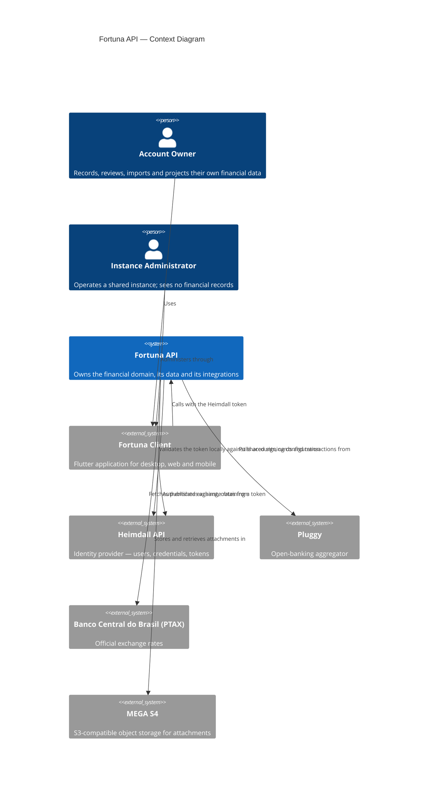
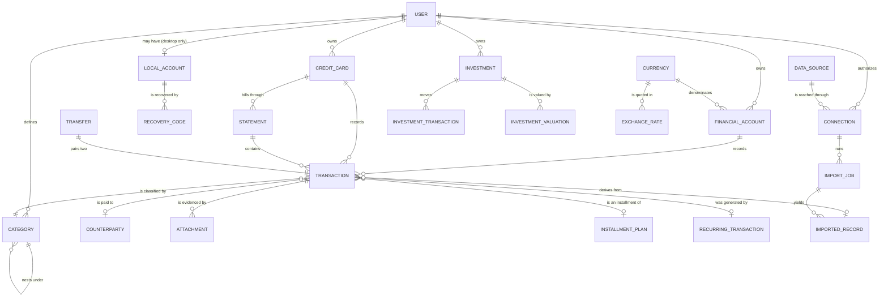
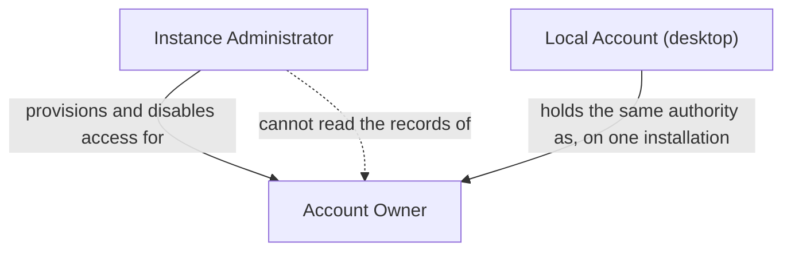

# Vision Document — Fortuna API

## 1. Introduction

### 1.1 Purpose

This document establishes **why the Fortuna API exists, what it is, and what it is not**. It is the
altitude document of the specification set: it names the problem, positions the product, identifies
the stakeholders and actors, enumerates the core features as `F-xx` identifiers that the
[System Requirements Document](System%20Requirements%20Document.md) traces to concrete
requirements, and states the constraints and success criteria everything downstream is measured
against. It names no versions, no endpoints and no field types — those belong to the
[Technology Stack Document](Technology%20Stack%20Document.md) and the System Requirements Document
respectively.

The Fortuna API is the **back end of a personal finance system**: an HTTP API that owns the domain,
the data and the external integrations for one person's — or one household's — complete financial
picture, and serves it to client applications as tabular data, chart aggregations, forward
projections and exported files.

### 1.2 Scope

**In scope.** Tracking bank accounts, credit cards and investments; recording expenses, earnings
and transfers; ingesting data manually, from the Pluggy open-banking aggregator, from Excel
spreadsheets and from defined PDF statement layouts; classification, budgets and goals; multi-currency
handling with official exchange rates; tabular and aggregated read models with drill-down; forward
projections; export to CSV, Excel and PDF; attachments; and the identity integration that isolates
one user's data from another's.

**Out of scope**, deliberately and permanently:

- **Moving money.** No payments, no transfers executed at a financial institution, no trading.
  Fortuna reads and records; it never writes to a bank.
- **Financial advice.** A projection is arithmetic over the user's own data, never a recommendation.
- **Tax filing and accounting compliance.** No tax forms, no business double-entry ledger, no
  fiscal reporting.
- **Storing bank credentials.** Open-banking access lives with Pluggy and is referenced by token.
- **User management.** Identity, credentials, recovery and multi-factor authentication belong to
  the [Heimdall API](https://github.com/artur-rios/heimdall-api). The single exception is the
  desktop offline account, which Fortuna owns because there is no network to reach Heimdall over.
- **The user interface.** The Flutter client — desktop, web and mobile from one code base — is a
  separate repository and a pure consumer of this API.

### 1.3 Definitions and Acronyms

| Term | Definition |
| --- | --- |
| **Account Owner** | The human who owns a set of financial records. The primary actor of nearly every use case. |
| **Instance Administrator** | The operator of a shared deployment. Manages users and configuration; has no access to any user's financial records. |
| **Financial Account** | A bank account or cash holding, with its own currency, opening balance and transaction history. |
| **Credit Card** | A revolving credit facility whose charges accumulate into statements and are settled by a payment from a financial account. Not a Financial Account. |
| **Statement** | One billing cycle of a credit card — the invoice. Has a period, a closing date, a due date, a total and a settlement state. |
| **Investment** | A held instrument, tracked through recorded contributions, withdrawals and valuations. Fortuna records values; it does not price instruments. |
| **Transaction** | One movement of money — an expense or an earning — against a Financial Account or Credit Card. The core entity of the system. |
| **Transfer** | A movement between two of the owner's own accounts. Neither an expense nor an earning. |
| **Installment Plan** | A purchase split across a fixed number of future charges, most often on a credit card. |
| **Recurring Transaction** | A rule that generates transactions on a schedule. A template, never itself a movement. |
| **Category** | A user-defined, optionally nested classification of transactions. |
| **Counterparty** | The merchant, payer or payee on the other side of a transaction. |
| **Data Source** | Where records come from: manual entry, Pluggy, Excel import, or PDF import. The extension point new sources plug into. |
| **Connection** | A live link to an external source — a Pluggy item — holding its reference and access token, never a bank credential. |
| **Import Job** | One execution of an import or synchronization, with its per-row outcomes. |
| **Imported Record** | The raw, unmodified entry an import read from its source. Immutable evidence. |
| **Projection** | A forward-looking computation over current data. Derived on demand, never stored as history. |
| **Drill-down** | Resolving an aggregated figure into the finer aggregation, and ultimately the individual transactions, that produced it. |
| **Local Account** | A desktop-only identity Fortuna owns, with recovery codes as its only recovery path. |
| **Recovery Code** | A single-use, hashed code that is the only way back into a Local Account. |
| **PTAX** | The Banco Central do Brasil's official exchange rate publication, Fortuna's rate source. |
| **Soft delete** | Marking a record deleted: excluded from every figure, still retrievable and restorable. |
| **Hard delete** | Physical removal, permitted only for a record already soft-deleted. |

---

## 2. Problem Statement

A person's financial life is scattered across systems that do not talk to each other. One bank's
app holds the checking account, another bank's PDF holds the statement, a card issuer's invoice
holds last month's spending, a broker's portal holds the investments, and a hand-maintained
spreadsheet tries to hold the rest. Each of them answers a question about its own slice, and none
of them answers a question about the whole.

The result is that the two questions that actually matter cannot be answered without an afternoon
of manual work:

- **Where did the money go?** Answering it means exporting from four places, reconciling formats
  and currencies, deduplicating an overlapping statement period, and classifying several hundred
  rows by hand — every month, because next month it has all changed again.
- **Where will I be in six months?** Answering it means knowing what is already committed:
  the installments still to be charged, the subscriptions that renew, the salary that arrives, the
  card invoice that closes on the 3rd and falls due on the 10th. That information exists, but it is
  spread across the same four places and nothing computes over all of it at once.

The commercial products that do aggregate this data solve it by holding it themselves, on
infrastructure the person does not control, monetized by what can be inferred from it. For the
financial history of one's own life, that is a price some people are not willing to pay — and
having decided not to pay it, they are back to the spreadsheet.

Fortuna is for those people: a system complete enough to replace the spreadsheet and the four apps,
that runs where its owner decides it runs.

---

## 3. Product Position Statement

| Attribute | Description |
| --- | --- |
| **For** | Individuals and households who want a single, complete and trustworthy record of their own financial life. |
| **Who** | Need to see where their money actually goes and what is already committed ahead of them, across every account, card and investment they hold — without surrendering that data to a third party. |
| **The Fortuna API** | Is the back end of a self-hostable personal finance system. |
| **That** | Aggregates every account, card and investment into one exact, multi-currency ledger; ingests automatically from open banking, spreadsheets and statement PDFs; and serves that history as tables, drillable charts and forward projections to desktop, web and mobile clients alike. |
| **Unlike** | A hosted aggregator, which owns the data and the terms on which it is held; or a spreadsheet, which owns nothing but costs an afternoon a month and cannot project, deduplicate or reconcile. |
| **Our product** | Runs on the owner's own machine or server, stores no bank credential at any point, computes money with exact decimal arithmetic rather than floating point, and treats every ingestion source as a plug-in so the system grows without being rebuilt. |

---

## 4. Stakeholders

| Stakeholder | Role | Concern |
| --- | --- | --- |
| **Account Owner** | The end user, and the primary actor of nearly every use case | That the picture is complete and correct, that imports need no cleanup, that the interface responds instantly, and that their data stays theirs. |
| **Instance Administrator** | Operator of a shared deployment | That the instance stays up, that users are isolated from one another, that integrations keep working, and that operating the system does not require reading anybody's records. |
| **Self-hosting owner** | Runs a single-user instance on their own machine or VPS | That deployment is one command, that it works identically on Docker Desktop, WSL and a Linux VPS, and that upgrades do not risk the data. |
| **Fortuna client applications** | The Flutter desktop, web and mobile app | A single, stable, documented API surface that behaves identically for every target, and read models shaped for the views it renders. |
| **Heimdall API** | The identity provider | That Fortuna consumes tokens as issued and never attempts to own identity. |
| **Pluggy** | The open-banking aggregator | That Fortuna respects its API contract and rate limits, and holds only the references it is meant to hold. |
| **Banco Central do Brasil** | Publisher of the PTAX exchange rates | That the public data service is consumed at a reasonable rate and its figures are attributed to their date. |

---

## 5. High-Level Architecture

Two properties of this picture matter more than the boxes:

- **Fortuna never calls Heimdall on a request path.** The client authenticates against Heimdall and
  presents the resulting token to Fortuna, which validates it locally. Heimdall being unreachable
  does not make Fortuna unreachable to a caller who already holds a valid token.
- **A desktop installation can be an island.** In offline mode the client talks to a local Fortuna
  instance authenticated by a Local Account, and none of Heimdall, Pluggy or PTAX is in the picture
  at all.

---

## 6. Core Features

| ID | Feature | Description |
| --- | --- | --- |
| F-01 | Financial account tracking | Create and maintain bank accounts and cash holdings, each with its own currency and opening balance, and see a balance derived from its transactions. |
| F-02 | Credit card and statement tracking | Maintain credit cards with their closing and due days, accumulate charges into billing-cycle statements, and settle a statement with a payment from a financial account. |
| F-03 | Investment tracking | Maintain investments through recorded contributions, withdrawals, yields and valuations. |
| F-04 | Transaction recording | Record expenses and earnings, transfers between the owner's own accounts, installment purchases, and recurring commitments. |
| F-05 | Classification | Organize transactions with a nested category tree, free-form tags and counterparties. |
| F-06 | Multi-currency | Hold amounts in any currency, convert explicitly with dated official rates, and keep both the original and converted figures. |
| F-07 | Open-banking ingestion | Connect an institution through Pluggy and synchronize accounts, cards and transactions automatically. |
| F-08 | Spreadsheet import | Import transactions from an Excel workbook with a mapped column layout. |
| F-09 | PDF statement import | Import a credit card statement from a supported PDF layout, starting with the Nubank invoice. |
| F-10 | Pluggable ingestion | Add a new data source by implementing one contract, without changing any existing source or consumer. |
| F-11 | Tabular queries | Query any record set with filtering, sorting and pagination, shaped for a spreadsheet-style grid. |
| F-12 | Chart aggregations with drill-down | Aggregate by period, category, account or counterparty, and resolve any aggregated figure into the finer breakdown — and ultimately the transactions — behind it. |
| F-13 | Forward projections | Project cash flow and committed obligations forward from recurring rules, open installments and observed history. |
| F-14 | Export | Render any queried data set to CSV, Excel or PDF. |
| F-15 | Attachments | File receipts and documents against a transaction, in filesystem or S3-compatible storage. |
| F-16 | Budgets and goals | Set a spending ceiling per category and period, and a savings target with a date, each measured against actuals. |
| F-17 | Identity and isolation | Authenticate through Heimdall, provision a local profile on first access, and guarantee that one user's data is unreachable by another. |
| F-18 | Desktop offline account | Authenticate a desktop installation against a Fortuna-owned local account whose only recovery path is its recovery codes. |
| F-19 | Asynchronous operations | Accept imports, synchronizations and exports as jobs that execute off the request thread and report progress, so no long operation blocks the API. |
| F-20 | Two-stage deletion and audit | Soft-delete before hard-delete, restore from soft-deleted, and keep an append-only record of every significant action. |

---

## 7. Domain Model Overview

Three relationships in that diagram are not what a first reading suggests:

- **A `TRANSFER` is one record that pairs two `TRANSACTION`s** — one leaving the origin, one
  arriving at the destination. It is modeled this way, rather than as a transaction with two
  accounts, so that both sides move together and neither is counted as income or expense.
- **`IMPORTED_RECORD` is upstream of `TRANSACTION`, not a copy of it.** The raw record is evidence
  and is never edited; corrections happen on the transaction derived from it, which is what makes a
  later reconciliation meaningful.
- **`STATEMENT` owns a slice of a card's transactions by date, not by foreign key alone.** Which
  statement a charge falls into is decided by the card's billing cycle, and once a statement is
  settled its composition is frozen — a late-arriving charge attaches to the next open one.

Entities carry two identifiers: an internal integer key used for storage and joins, and a public
GUID used everywhere the entity is addressed from outside the database. The
[System Requirements Document](System%20Requirements%20Document.md) §4 specifies this and every
field.

---

## 8. Roles Hierarchy

| Role | Relationship | Permissions |
| --- | --- | --- |
| **Account Owner** | Owns every financial record they create or import | Full control over their own accounts, cards, investments, transactions, classifications, connections, imports, exports, projections and attachments — including soft-deleting and then hard-deleting them. No access to any other user's data. |
| **Instance Administrator** | Operates the deployment; owns no financial records | Manages users and their access through Heimdall, configures the instance and its integrations, and reads operational health and import outcomes across the instance — counts and statuses, never record contents. |
| **Local Account** | A desktop-only identity, not a third role | Holds exactly the Account Owner's authority on the installation it belongs to. A local installation has no administrator. |

The dashed edge is the load-bearing one: administering the instance confers no authority to read
what is in it. It is a rule the API enforces, not a convention.

---

## 9. Constraints

- **The platform is mandated.** The back end is built on the runtime, libraries and data stack
  defined in the [Technology Stack Document](Technology%20Stack%20Document.md), matching the
  Heimdall API so that one set of patterns serves both services.
- **Money is exact.** Monetary values are exact decimals end to end. Binary floating point is
  forbidden at every layer — entity, DTO, projection, export cell, intermediate calculation.
  Rounding happens only where a figure is presented or converted, never on an intermediate.
- **A balance is always derived**, never a separately stored, editable number.
- **No bank credential is ever stored, logged or transmitted.** There is no configuration flag and
  no debug mode that relaxes this.
- **Every integration is read-only** with respect to the external system.
- **Identity is Heimdall's**, except for the desktop Local Account, which has no password reset and
  no e-mail channel — its recovery codes are the only way back in, and losing them is terminal.
- **Users are strictly isolated.** An operation touching another user's record is refused as if the
  record did not exist, so that a response cannot reveal what exists.
- **Deletion is two-stage.** Nothing goes from live to gone in one step, and audit entries are
  append-only.
- **No long operation blocks the API.** Imports, synchronizations and exports run as jobs off the
  request thread.
- **Ingestion and storage are extension points.** A new data source or a new attachment backing is
  added by implementing a contract, without modifying what already exists.
- **One deployment shape.** The same `docker compose` invocation must work on Docker Desktop for
  Windows, on Docker in WSL Ubuntu, and on a Linux VPS, differing only in configuration.

---

## 10. Success Criteria

- **Every feature `F-01` … `F-20` is delivered**, and the instance is safe to expose: authenticated,
  isolated per user, storing no credential.
- **Money reconciles exactly.** A balance computed twice gives the same answer, and it equals the
  sum of its non-deleted transactions to the minor unit. An installment plan's parts sum to its
  total exactly.
- **The API is fast enough to feel immediate.** A single record read or a page of a list completes
  within **200 ms** at the 95th percentile; a write within **500 ms**; a chart aggregation or
  drill-down over a year of transactions within **1 second**. Asynchronous jobs are exempt and
  report progress instead.
- **Imports need no cleanup.** A supported statement or spreadsheet lands in the right accounts with
  duplicates detected against what is already stored, without the user correcting it row by row —
  and re-importing an overlapping period changes nothing.
- **No user can reach another user's data** through any endpoint, export, error message, log line,
  or the difference between two response codes.
- **A new ingestion source is additive.** Adding one requires no change to any existing source or
  to any consumer of imported data.
- **Deployment is one command**, working unchanged on all three target environments.
- **The suite proves it.** Every use case ships with unit and functional tests per the
  [Testing Specification Document](Testing%20Specification%20Document.md), and the suite is green
  before anything merges.
